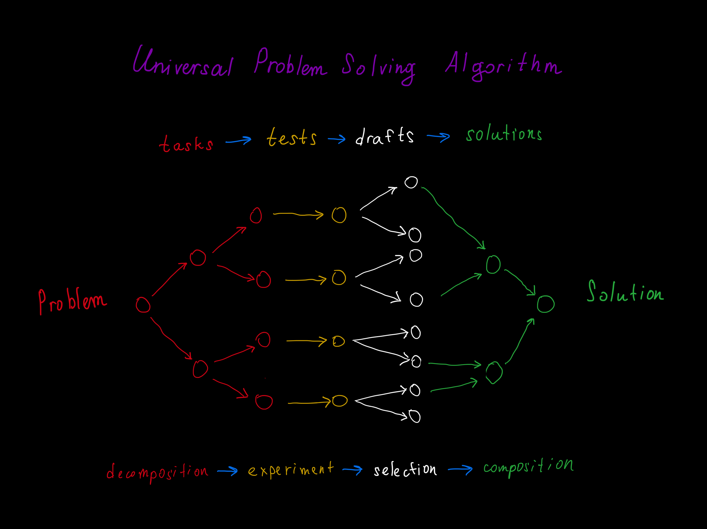

# formal-ai

Formal AI is a Rust implementation of a symbolic, deterministic assistant that exposes OpenAI-shaped interfaces without neural-network inference.

It belongs to the tradition of [symbolic artificial intelligence](https://en.wikipedia.org/wiki/Symbolic_artificial_intelligence) (a.k.a. GOFAI): its knowledge is an inspectable [semantic network](https://en.wikipedia.org/wiki/Semantic_network) of human-readable links rather than hidden neural weights. The case study in [docs/case-studies/issue-451](docs/case-studies/issue-451/README.md) maps the field's best practices onto this associative stack.

The current implementation covers the surface area requested in issue #1:

- library API for symbolic prompt handling
- CLI chat command
- HTTP API server with `/v1/chat/completions` and `/v1/responses`
- Telegram bot CLI with long polling by default and an opt-in webhook server, configured through [`lino-arguments`](https://github.com/link-foundation/lino-arguments)
- human-readable Links Notation knowledge and dataset export through `lino-objects-codec`
- Prepared Docker-in-Docker Telegram bot image published as `ghcr.io/link-assistant/formal-ai:latest` and based on `konard/box-dind:2.1.1`
- GitHub Pages markdown chat demo backed by a Rust-generated WebAssembly worker
- Electron desktop shell that starts the local Rust HTTP API and reuses the web chat
- VS Code extension (desktop **and** web/`vscode.dev`) that embeds the same chat in a Webview around the same HTTP/web boundary

Project direction is tracked in [VISION.md](VISION.md), [GOALS.md](GOALS.md), and [NON-GOALS.md](NON-GOALS.md). Who the project is for, what pain it closes, and the concrete user journeys it supports today (plus the ones it could support next) are documented in [docs/USER-JOURNEYS.md](docs/USER-JOURNEYS.md). Implementation progress against the vision is tracked in [ROADMAP.md](ROADMAP.md). The issue #12 synthesis is in [docs/case-studies/issue-12/README.md](docs/case-studies/issue-12/README.md).

## Install

Every interface has a dedicated landing page on the
[site](https://link-assistant.github.io/formal-ai/) with copy-paste install
instructions, and a single universal installer covers all of them. The script is
published at [`scripts/install.sh`](scripts/install.sh) (POSIX `sh`, for
macOS/Linux) and [`scripts/install.ps1`](scripts/install.ps1) (PowerShell, for
Windows). Pass a target to choose what to install:

```bash
# Desktop app (default), VS Code extension, the CLI, the Telegram bot, or all:
curl -fsSL https://raw.githubusercontent.com/link-assistant/formal-ai/main/scripts/install.sh | sh -s -- desktop
curl -fsSL https://raw.githubusercontent.com/link-assistant/formal-ai/main/scripts/install.sh | sh -s -- vscode
curl -fsSL https://raw.githubusercontent.com/link-assistant/formal-ai/main/scripts/install.sh | sh -s -- cli
curl -fsSL https://raw.githubusercontent.com/link-assistant/formal-ai/main/scripts/install.sh | sh -s -- telegram
curl -fsSL https://raw.githubusercontent.com/link-assistant/formal-ai/main/scripts/install.sh | sh -s -- all
```

The Telegram bot ships inside the CLI, so the `telegram` target installs the CLI;
then run `formal-ai telegram` with a `@BotFather` token (see the
[Telegram page](https://link-assistant.github.io/formal-ai/telegram/)).

```powershell
# Windows PowerShell (set FORMAL_AI_INSTALL_TARGET to pick a target):
$env:FORMAL_AI_INSTALL_TARGET='vscode'; irm https://raw.githubusercontent.com/link-assistant/formal-ai/main/scripts/install.ps1 | iex
```

| Interface | Landing page | Notes |
| --- | --- | --- |
| Desktop app | [`/download/`](https://link-assistant.github.io/formal-ai/download/) | Electron shell with one-click services and a one-click VS Code extension install in Settings. |
| VS Code extension | [`/vscode/`](https://link-assistant.github.io/formal-ai/vscode/) | Not on the Marketplace yet, so install it manually — the one-liner above, a downloaded `.vsix` ("VS Code Extension only" mode), or one click from the desktop app. |
| CLI | [`/cli/`](https://link-assistant.github.io/formal-ai/cli/) | `cargo install formal-ai` or the universal installer. |
| Telegram bot | [`/telegram/`](https://link-assistant.github.io/formal-ai/telegram/) | `telegram` installer target (installs the CLI that powers the bot); needs a `@BotFather` token. |

## Universal Problem-Solving Algorithm

Every prompt — a greeting, a math question, a translation, a "write a program"
request, an agent action, or something the assistant has never seen — walks the
same loop. The skeleton is **decompose the problem into tasks, derive a test
(experiment) for each task, draft candidate solutions, select the smallest
sufficient draft, and compose the drafts back into one solution**:



This is not a separate subsystem bolted onto a catalogue of intents — it is the
main solver path. `src/solver.rs::UniversalSolver` runs the same 11-step loop
for every impulse:

| Diagram stage | Loop steps in `src/solver.rs` |
| --- | --- |
| `Problem` | 1. Impulse, 2. Formalization (Links-Notation intent), 3. Context, 4. History lookup |
| `decomposition → tasks` | 5. Decomposition into sub-impulses (`record_decomposition`) |
| `experiment → tests` | 6. TDD-style validation (`record_validation`) |
| `selection → drafts` | 7. Solution synthesis (`record_candidates`), 8. Combination of the smallest sufficient candidate |
| `composition → solutions → Solution` | 9. Verification, 10. Simplification, 11. Documentation with a `trace:` pointer |

Every step appends its own event to the append-only log, so the chat can answer
"why did you do that?" from the recorded experience. The full algorithm,
including the reasoning-under-unknowns path (`src/solver_unknown_reasoning.rs`)
and intent formalization (`src/intent_formalization.rs`), is documented in
[VISION.md](VISION.md#universal-problem-solving-algorithm) and
[ARCHITECTURE.md](ARCHITECTURE.md). How much of the vision is built versus still
planned — including the open industry-benchmark coverage gap — is tracked in
[ROADMAP.md](ROADMAP.md). Every benchmark suite the repository has ever touched
is catalogued in [docs/benchmarks.md](docs/benchmarks.md), and the grounded
meta-algorithm that reproduces a topic's Rust handler on demand is described in
[docs/meta-algorithm.md](docs/meta-algorithm.md).

## Quick Start

```bash
cargo run -- chat --prompt "Hi"
cargo run -- chat --prompt "Write me hello world program in Rust" --format chat
cargo run -- chat --prompt "What is 8% of $50?"
cargo run -- chat --prompt "Посчитай 1000 рублей в долларах"
cargo run -- dataset
rust-script scripts/mine-hive-mind-dataset.rs --plan
cargo run -- serve --host 127.0.0.1 --port 8080
npm install --prefix desktop
npm run desktop:dev
npm run vscode:test                                                    # VS Code extension node tests
npm run vscode:dev                                                     # run the extension in a web host (vscode-test-web)
TELEGRAM_BOT_TOKEN=123:abc cargo run -- telegram                       # long polling (default)
cargo run -- telegram --mode webhook --host 127.0.0.1 --port 8080      # webhook server (opt-in)
rust-script scripts/download-datasets.rs
experiments/verify-hello-world-examples.sh
```

Example API call:

```bash
curl -s http://127.0.0.1:8080/v1/chat/completions \
  -H 'content-type: application/json' \
  -d '{"model":"formal-symbolic-production","messages":[{"role":"user","content":"Hi"}]}'
```

To require bearer authentication on `/v1/*` routes, set
`FORMAL_AI_API_BEARER_TOKEN` before starting the server and send the matching
header:

```bash
FORMAL_AI_API_BEARER_TOKEN=local-test-token cargo run -- serve --host 127.0.0.1 --port 8080
curl -s http://127.0.0.1:8080/v1/models \
  -H 'authorization: Bearer local-test-token'
```

## Agentic AI Tools

Run the local HTTP server before connecting terminal agents. The server binds
to loopback in these examples and exposes the same symbolic engine through the
OpenAI Chat Completions, OpenAI Responses, and Anthropic Messages envelopes:

```bash
cargo run -- serve --host 127.0.0.1 --port 8080
curl -s http://127.0.0.1:8080/health
curl -s http://127.0.0.1:8080/v1/models
```

If you enabled bearer auth, export the same value for the CLI you connect:

```bash
export FORMAL_AI_API_KEY="local-test-token"
```

When no bearer token is configured, any non-empty API key value is enough for
clients that require one. Keep the server on `127.0.0.1` unless you are
deliberately exposing it behind your own authentication boundary.

### Codex CLI

Codex custom providers use the Responses wire API, so point Codex at the
server's `/v1` base URL and keep `wire_api = "responses"` in
`~/.codex/config.toml`:

```toml
model_provider = "formal-ai"
model = "formal-symbolic-production"

[model_providers.formal-ai]
name = "formal-ai local server"
base_url = "http://127.0.0.1:8080/v1"
env_key = "FORMAL_AI_API_KEY"
wire_api = "responses"
```

```bash
codex "summarize the local reasoning trace"
```

### Claude Code

Claude Code talks to the Anthropic Messages API. formal-ai serves that adapter
at `/v1/messages`, so use the server root as `ANTHROPIC_BASE_URL`:

```bash
export ANTHROPIC_BASE_URL="http://127.0.0.1:8080"
export ANTHROPIC_API_KEY="${FORMAL_AI_API_KEY:-local-test-token}"
claude
```

### OpenCode

OpenCode can call formal-ai through its OpenAI-compatible provider package,
which targets `/v1/chat/completions`. Add a local provider in
`~/.config/opencode/opencode.json`:

```json
{
  "$schema": "https://opencode.ai/config.json",
  "provider": {
    "formal-ai": {
      "name": "formal-ai local server",
      "npm": "@ai-sdk/openai-compatible",
      "options": {
        "baseURL": "http://127.0.0.1:8080/v1",
        "apiKey": "{env:FORMAL_AI_API_KEY}"
      },
      "models": {
        "formal-symbolic-production": {
          "name": "formal-symbolic-production"
        }
      }
    }
  },
  "model": "formal-ai/formal-symbolic-production"
}
```

```bash
opencode
opencode run --model formal-ai/formal-symbolic-production --format json \
  "summarize the local graph"
```

### Link Assistant Agent CLI

The Link Assistant Agent CLI accepts OpenCode-style provider/model selection.
Use the same OpenAI-compatible provider shape in
`~/.config/link-assistant-agent/opencode.json`, then select the
`formal-ai/formal-symbolic-production` model:

```json
{
  "$schema": "https://opencode.ai/config.json",
  "provider": {
    "formal-ai": {
      "name": "formal-ai local server",
      "npm": "@ai-sdk/openai-compatible",
      "options": {
        "baseURL": "http://127.0.0.1:8080/v1",
        "apiKey": "{env:FORMAL_AI_API_KEY}"
      },
      "models": {
        "formal-symbolic-production": {
          "name": "formal-symbolic-production"
        }
      }
    }
  },
  "model": "formal-ai/formal-symbolic-production"
}
```

```bash
agent --model formal-ai/formal-symbolic-production -p \
  "explain the last formal-ai trace"
```

Run autonomous coding CLIs only in a repository, VM, or container where their
file and shell actions are acceptable. formal-ai's local server answers model
requests; it does not sandbox the client process that is driving tools.

Example Telegram webhook update:

```bash
curl -s http://127.0.0.1:8080/telegram/webhook \
  -H 'content-type: application/json' \
  -d '{"update_id":1,"message":{"message_id":7,"date":1,"chat":{"id":42,"type":"private"},"text":"Write me hello world program in Rust"}}'
```

Docker-in-Docker Telegram bot image:

```bash
TELEGRAM_BOT_TOKEN=123:abc docker compose up

docker run --rm --privileged \
  -e TELEGRAM_BOT_TOKEN=123:abc \
  -v formal-ai-telegram-docker:/var/lib/docker \
  ghcr.io/link-assistant/formal-ai:latest

# Local build fallback:
docker build -t formal-ai .
docker run --rm --privileged \
  -e TELEGRAM_BOT_TOKEN=123:abc \
  -v formal-ai-telegram-docker:/var/lib/docker \
  formal-ai

# Preferred when Sysbox is available:
docker run --rm --runtime=sysbox-runc \
  -e TELEGRAM_BOT_TOKEN=123:abc \
  -v formal-ai-telegram-docker:/var/lib/docker \
  formal-ai
```

Prebuilt image quick start: the released image is
`ghcr.io/link-assistant/formal-ai:latest`, so the only required setting for a
polling Telegram bot is `TELEGRAM_BOT_TOKEN`. The root `compose.yaml` uses that
image by default and preserves the inner Docker daemon under the named
`formal-ai-telegram-docker` volume. Set `FORMAL_AI_DOCKER_IMAGE` to run a locally
built image or an optional Docker Hub mirror with the same compose file.

The same image and compose file also run the **OpenAI-compatible API server** for
agentic mode and the idle **Agent CLI environment**, under opt-in Compose
profiles so `docker compose up` keeps starting only the Telegram bot:

```bash
TELEGRAM_BOT_TOKEN=123:abc docker compose up -d   # Telegram bot only (default)
docker compose --profile server up -d             # OpenAI-compatible server on 127.0.0.1:8080
docker compose --profile agent up -d              # agent + agent-commander environment
docker compose --profile all up -d                # all services
```

All three containers (`formal-ai-telegram`, `formal-ai-server`, and
`formal-ai-agent`) are the **exact same ones the desktop app manages with one
click** — see
[One-click services and agent environment](docs/desktop/service-control.md) for
the full desktop + server walkthrough.

The root image is intentionally the only supported Docker runtime: it inherits
from `konard/box-dind:2.1.1`, starts `/usr/local/bin/dind-entrypoint.sh`, and
defaults to `formal-ai telegram --mode polling`. Do not bind-mount the host
`/var/run/docker.sock`; the image expects its own inner Docker daemon and uses
`/var/lib/docker` for that daemon's storage.

Verify the container contract and the `start-command` Docker isolation wrapper:

```bash
docker run --rm --privileged formal-ai verify-formal-ai-dind
docker run --rm --privileged formal-ai bash -lc \
  '$ --isolated docker --auto-remove-docker-container -- echo formal-ai-dind-ok'
```

The static demo lives in `src/web/index.html`. Serve it from a local web server or GitHub Pages so the WebAssembly worker can be fetched by the browser. The demo starts with a user greeting, renders markdown in messages, previews markdown input, and includes a randomized dialog mode for hello-world prompts across several programming languages. Rust/WASM owns parity-sensitive worker primitives such as prompt normalization, language detection, arithmetic evaluation, stable ids, intent-route matching, unknown-answer variation, and web-search fusion; JavaScript remains responsible for UI state, seed fetching, browser fetch/CORS orchestration, and no-WASM fallbacks. Browser JavaScript dependencies are prebundled with Bun into `src/web/vendor.bundle.js`; run `bun install` once and `bun run build:web` after changing web dependencies. The companion connectivity diagnostics page lives in `src/web/tests/index.html` and is deployed at `/formal-ai/tests/`; it checks direct browser fetches, public knowledge APIs, iframe embeddability, and a configurable local `web-capture` proxy.

### Desktop app

The desktop app lives in [`desktop/`](desktop/) and follows the same boundary as the browser and HTTP server. Electron starts a loopback `formal-ai serve` process, serves `src/web/` from a local static server, and loads the existing chat UI with a preload bridge that reports the API, graph, memory, and permission status.

```bash
npm install --prefix desktop
cargo build
npm run desktop:dev
npm run desktop:smoke
```

In desktop mode, prompt sends use `POST /v1/chat/completions` on the local Rust API, and the network link points to `GET /v1/graph`. The same **Export memory** and **Import memory** controls read and write the full `formal_ai_bundle`; no separate desktop memory format exists. Agent mode remains off by default, and the desktop sidebar shows whether agent/tool-call actions are permission-gated or explicitly opted in.

Packaging starts from the same shell:

```bash
cargo build --release
npm --prefix desktop run build
```

Set `FORMAL_AI_DESKTOP_BINARY=/path/to/formal-ai` before packaging to bundle a specific binary. Release builds copy the web assets and seed mirror into `desktop/dist-web/`, copy the binary into `desktop/bin/` when available, and produce OS artifacts under `desktop/release/`.

#### One-click services and agent environment

The desktop sidebar has a **Services** panel that starts, stops, or installs the
prepared Docker containers with a single click:

- **Telegram bot** (`formal-ai-telegram`) — runs the image's default polling bot.
  An inline field captures `TELEGRAM_BOT_TOKEN`; the bot will not start without it.
- **OpenAI-compatible server** (`formal-ai-server`) — runs `formal-ai serve` for
  agentic mode and publishes `http://127.0.0.1:8080`.
- **Agent environment** (`formal-ai-agent`) — pulls the prepared image, recreates
  an idle container, and health-checks `formal-ai --version`, `agent --version`,
  and `start-agent --help` inside the container.

Each row shows a live Docker-backed indicator and **Start**/**Stop** or
**Install agent environment** controls. The lifecycle logic lives in the testable
[`desktop/lib/service-control.cjs`](desktop/lib/service-control.cjs) module, wired
into the Electron main process over IPC (`formalAiDesktop:serviceStatus` /
`startService` / `installAgentEnvironment` / `stopService`) and exposed to the
renderer through the preload bridge. Docker is required; the panel disables
itself with a clear note when Docker is unavailable.

The **same containers** run on a server from the root `compose.yaml` with one
line (`docker compose --profile all up -d`). Autonomous tools are run only inside
the Formal-AI container path; the desktop provider never invokes host
`agent`/`claude`/`codex` binaries. The complete desktop + server walkthrough —
configuration, raw `docker run` equivalents, health checks, and the isolation
model — is in
[docs/desktop/service-control.md](docs/desktop/service-control.md).

### VS Code extension

The VS Code extension lives in [`vscode/`](vscode/) and embeds the same web chat in a Webview around the same HTTP/web boundary as the browser, the HTTP server, and the desktop shell. It ships **two hosts from one manifest** so the same extension runs on the desktop and in the browser:

- **Desktop / remote (Node) host** — [`src/extension.node.cjs`](vscode/src/extension.node.cjs) reports `shell: "VS Code"`. With the opt-in `formal-ai.server.enabled` setting it starts a loopback `formal-ai serve` process and routes prompt sends through `POST /v1/chat/completions`, just like the desktop shell; it can also drive Docker code execution (`formal-ai.docker.image`). It reuses the desktop tool-router and memory-sync helpers.
- **Web (Web Worker) host** — [`src/extension.web.cjs`](vscode/src/extension.web.cjs) reports `shell: "VS Code Web"` and runs on `vscode.dev` / `github.dev`. The Web Worker host cannot spawn a process, open a socket, or touch `child_process`/`fs`, so it stays on the in-process WebAssembly symbolic engine — no local server, no Docker — while exposing the same chat, network, memory, and permission surfaces.

```bash
npm run vscode:test     # node:test unit suite + static smoke check (no install needed)
npm run vscode:dev      # launch in a browser host via @vscode/test-web
npm run vscode:smoke    # static manifest/contract smoke check
npm run vscode:package  # produce a .vsix (runs prepare-resources first)
```

The web app labels both hosts **"VS Code"** in the status line and sidebar, and only routes to the local server when it is genuinely ready (`apiReady && apiBase`); otherwise it falls back to the in-process engine and reads `VS Code - in-process`. The same **Export memory** / **Import memory** controls read and write the full `formal_ai_bundle`; agent mode is off by default and tool calls are permission-gated until the user opts in. Settings (`formal-ai.server.*`, `formal-ai.docker.image`, `formal-ai.tools.allowByDefault`, `formal-ai.agent.defaultOn`) map directly onto that status shape.

Packaging mirrors the desktop flow: `prepare-resources` copies `src/web/` into `vscode/dist-web/` (with the seed mirror at `vscode/dist-web/seed/`) and the desktop `lib/` helpers into `vscode/src/lib/vendor/`; both generated trees are git-ignored. See [docs/vscode/extension.md](docs/vscode/extension.md) for the full architecture, the Webview sandbox reconciliation (CSP nonce, same-origin Worker bootstrap, seed rebasing), and the honest list of what is and isn't verifiable inside the test sandbox.

### Full-memory export and import

Every interface produces the same self-contained Links Notation document by default. In the browser, the **Export memory** topbar button writes `formal-ai-memory.lino` as a complete `formal_ai_bundle` — the entire seed (rules, concepts, tools, multilingual responses), UI preferences, environment metadata, and the full append-only event log — so a single click is enough to reconstitute the session. **Import memory** auto-detects bundle vs legacy `demo_memory` files and surfaces migration suggestions when the imported seed version differs from the running app's. The CLI matches:

Native Rust builds now select `doublets-rs` by default through the
`doublets-native` feature. Links Notation stays the recovery and migration
projection: existing `demo_memory` logs and full `formal_ai_bundle` exports
import into the native store, export back to deterministic `.lino`, and can
still be handled by compiling with `--no-default-features` when a pure
`MemoryStore` projection is needed.

```bash
cargo run -- memory export --from memory.lino --path full.lino           # default: full bundle
cargo run -- memory export --from memory.lino --path events.lino --events-only  # legacy demo_memory
cargo run -- memory import --path full.lino --into memory.lino           # accepts either format
cargo run -- memory purge-deleted --path memory.lino --backup before-purge.lino --confirm
cargo run -- memory reset --path memory.lino --backup before-reset.lino --confirm
cargo run -- bundle export --path bundle.lino --memory memory.lino
cargo run -- bundle import --path bundle.lino --into memory.lino
```

Memory normally remains append-only: deleting a conversation first records a
`conversation_deleted` event and hides the thread. The explicit
`purge-deleted` maintenance action physically removes every event for those
soft-deleted conversations, and `reset` clears the event log completely. Both
browser actions show an export-first prompt and then an irreversible
confirmation prompt. The CLI refuses both destructive commands unless
`--confirm` is present, and `--backup` writes a full `formal_ai_bundle` before
the memory file is changed.

The Rust library re-exports the same helpers — `export_memory_full`, `import_memory_full`, `suggest_memory_migrations`, `BundleInfo`, `ParsedBundle` — so embedders writing their own surface get the same defaults. The prefilled **Report issue** link records the dialog as a single compact `U:`/`A:` code block and points to [`docs/upload-memory.md`](docs/upload-memory.md) for attaching the full memory export (GitHub Gist or `.zip` workflow, plus redaction reminders) instead of repeating those instructions inline.

### Teaching behavior in chat

The chat surface can explain and modify behavior rules without leaving the dialog. Behavior is surfaced as a series of `When X then Y` (or `When X do Y`) statements grouped by topic, and the same grammar can also update the dialog:

```text
List behavior rules
Покажи правила
Show behavior rule unknown
List all facts you know about yourself
When `Какая у тебя модель личности?` then `У меня символьная модель личности.`
When I say `Какая у тебя модель личности?`, answer `У меня символьная модель личности.`
```

`List behavior rules` shows the current built-in routing rules, grouped by topic (Greetings, Farewells, Identity, Capabilities, Hello-world programs, Unknown fallback) and rendered as `When X then Y` statements. `Show behavior rule unknown` renders one rule as Links Notation with its topic, intent, match condition, response, source, and the canonical `when_then` statement. The `When X then Y` and `When X do Y` forms (and the explicit `When I say ... answer ...` form) record an append-only, dialog-local override, so the same prompt can answer differently in that conversation. The grammar is recognized in English (`When ... then ...`, `When ... do ...`, `If I ask ... reply ...`), Russian (`Когда ... тогда ...`, `Когда ... делай ...`, `Если ... то ...`), Hindi (`जब ... तब ...`, `जब ... तो ...`), and Chinese (`当 ... 时 ...`, `当 ... 则 ...`). Use **Export memory** to preserve that rule message with the session, or **Report issue** when the fact or rule should become part of the built-in seed.

## Telegram Bot

The `formal-ai telegram` subcommand defaults to long polling and keeps the webhook server available as an opt-in mode. The CLI is configured through [`lino-arguments`](https://github.com/link-foundation/lino-arguments) (a clap-compatible derive), so every flag also reads from the matching environment variable and from `.lenv`/`.env` files in the working directory.

### Long polling (default)

```bash
export TELEGRAM_BOT_TOKEN=123:abc
cargo run -- telegram                                                   # polling by default
cargo run -- telegram --mode polling \
  --timeout 30 --limit 100 \
  --allowed-updates message,edited_message
```

The polling client shells out to `curl`, calls Telegram's `getUpdates`, advances the offset after each batch, and replies through `sendMessage` with HTML formatting. The same `FormalAiEngine` used by the library, HTTP API, and web demo is reused, so polling answers match the other surfaces.

The Docker image uses this polling command as its default `CMD`, so the
container starts the bot as soon as `TELEGRAM_BOT_TOKEN` is set. Commands that
need nested containers should run through the bundled `$` wrapper with
`--isolated docker`; `start-command` records command output and metadata under
`/tmp/start-command/logs/`. Issue #195 called this `--isolation docker`; the
current Link Foundation Start CLI documents the flag as `--isolated docker`.

### Webhook (opt-in)

```bash
cargo run -- telegram --mode webhook --host 127.0.0.1 --port 8080
# or equivalently for backwards compatibility:
cargo run -- serve --host 127.0.0.1 --port 8080

# Docker override for webhook mode:
docker run --rm --privileged -p 8080:8080 \
  -e TELEGRAM_BOT_TOKEN=123:abc \
  formal-ai formal-ai telegram --mode webhook --host 0.0.0.0 --port 8080
```

Expose the server through HTTPS and register the endpoint with Telegram:

```bash
curl -s "https://api.telegram.org/bot${TELEGRAM_BOT_TOKEN}/setWebhook" \
  -d "url=https://example.com/telegram/webhook"
```

The webhook accepts Telegram `message`, `edited_message`, `channel_post`, and `edited_channel_post` updates. It returns a direct Telegram `sendMessage` response for both private chats and group/channel chat IDs, using Telegram HTML formatting so code blocks survive the chat surface. This implementation does not store a bot token or perform outbound Telegram API calls from the webhook path; large file attachments require an outbound bot-client layer.

## Rust Library

```rust
use formal_ai::{create_chat_completion, ChatCompletionRequest, ChatMessage, MessageContent};

let request = ChatCompletionRequest {
    model: None,
    messages: vec![ChatMessage {
        role: String::from("user"),
        content: MessageContent::Text(String::from("Hi")),
    }],
    stream: false,
    temperature: None,
};

let completion = create_chat_completion(&request);
assert_eq!(
    completion.choices[0].message.content.plain_text(),
    "Hi, how may I help you?"
);
```

## Current Symbolic Behavior

The engine normalizes a prompt, selects a deterministic symbolic rule, and returns the rule output with evidence link identifiers and indented Links Notation. It can also consume an explicit `ProbabilityStore`: append-only Bayesian-style evidence and Markov transition evidence rank symbolic candidate IDs before the temperature / clarify-vs-guess policy runs. This stays non-neural; evidence is Links Notation data with provenance, timestamps, cached-source fingerprints, and deterministic replay.

Seed rules currently cover:

- greetings and polite follow-ups: `Hi`, `Hello`, `Hey`, `I am fine, thank you`, `thanks`
- hello world requests for Rust, Python, JavaScript, TypeScript, Go, and C
- open-ended software artifact requests such as extensions, plugins, bots, apps, and tools, first returning a Links Notation meaning record with a requirement graph, subtasks, delivery mode, approval gates, reasoning, and plan steps, then returning language-aware starter domain code after the user approves the plan
- calculator-parsable math, unit, currency, percentage, and datetime prompts through `link-calculator`, with the local arithmetic evaluator retained for unsupported word-operator and binary-modulo syntax
- URL requests such as `Navigate to github.com`, `fetch example.com`, and `Сделай запрос к google.com`; navigation prompts check CORS-readable frame-policy metadata and render an iframe only when `X-Frame-Options` and CSP `frame-ancestors` do not block embedding, while explicit fetch prompts attempt a browser `fetch()` first and use the same frame-policy check before any embedded fallback
- web-search, information-search, and implicit research prompts such as `Search the web for Nikola Tesla`, `Найди яблоко в интернете`, `Найди информацию о Rust программировании`, `Rust programming के बारे में जानकारी खोजो`, `查找关于 Rust 编程的信息`, and `What is the most popular dataset for translation quality validation?`; the browser demo queries DuckDuckGo, Internet Archive, Wikipedia, Wikidata, and Wiktionary, then returns reciprocal-rank-fused links
- merged definition prompts such as `Merge Wikipedia definitions of IIR`, which combine localized definition blocks for the same seed/Wikidata concept, deduplicate repeated facts, and cite every source language; use `--definition-fusion auto`, `FORMAL_AI_DEFINITION_FUSION=auto`, or the browser Settings control to make plain prompts like `What is IIR?` use the same fusion path
- generic project lookups for GitHub/GitLab/Bitbucket repository URLs plus default-on promotion for matching `link-assistant`, `link-foundation`, and `linksplatform` projects such as `What is Hive Mind?`, `Что такое Hive Mind?`, and `What is link-cli?`; promoted answers are generated from `data/seed/projects.lino` through the deterministic `formalize → summarize → deformalize` pipeline in `src/summarization/` (split into `mod.rs`, `markdown.rs`, and `dialog.rs`), which also drives README ingestion, multi-turn dialog summaries, and chat-title generation (see [ARCHITECTURE.md § 7.1](ARCHITECTURE.md#71-project-lookups-and-summarization))
- behavior-rule inspection and dialog-local rule updates through `List behavior rules` (grouped by topic, each rendered as a `When X then Y` statement), `Show behavior rule unknown`, and the multilingual `When ... then ...` / `When ... do ...` / `When I say ... answer ...` grammar
- unknown prompts, which return a larger learnable-rule fallback with exact commands for inspecting rules, teaching the current dialog, exporting memory, or reporting a missing built-in rule

Hello-world answers include execution metadata. Rust, Python, JavaScript, Go, and C examples are compiled or syntax-checked and run by the issue-8 local verification harness with captured output. TypeScript is returned with an explicit warning because `tsc` is not configured in the current repository runtime.

No GPU, neural network, remote model, or random sampling is used.

## Dataset Seeds

Issue #1 source indexes and seed prompts are stored as indented Links Notation in `data/`.

```bash
rust-script scripts/download-datasets.rs
rust-script scripts/check-file-size.rs
```

The generator writes source, greeting, hello-world, and demo-dialog records. `.lino` files are kept below 1500 lines and validated by the unit tests.

## Hive Mind Dataset Mining

Issue #115 adds an operator script for mining GitHub evidence from
`link-assistant/hive-mind` pull requests, issues, reviews, diffs, and Actions
logs into a case-study dataset. Keep this outside the seed tool registry; it is
a repository maintenance command, not an in-agent reasoning tool.

```bash
rust-script scripts/mine-hive-mind-dataset.rs --plan
rust-script scripts/mine-hive-mind-dataset.rs --collect
```

The script wraps `formal-ai github-logs plan|collect` with the focused Hive
Mind defaults used by `docs/case-studies/issue-115/`.

## Development

```bash
cargo fmt --all -- --check
cargo clippy --all-targets --all-features
cargo test --all-features --verbose
cargo test --doc --verbose
rust-script scripts/check-file-size.rs
```

Decode an overlong prefilled GitHub issue URL into readable Markdown during
report-link triage:

```bash
rust-script scripts/decode-github-issue-url.rs --url 'https://github.com/link-assistant/formal-ai/issues/new?...'
```

See [REQUIREMENTS.md](REQUIREMENTS.md) for the cumulative requirement matrix (now alongside [VISION.md](VISION.md)) and [docs/case-studies/issue-1/README.md](docs/case-studies/issue-1/README.md) for the collected research and implementation plan.
