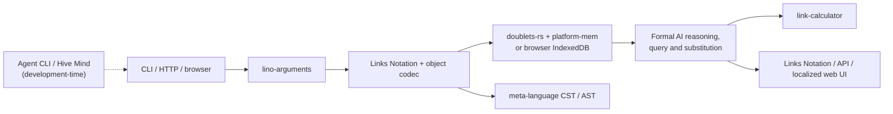

# Associative technology stack

Formal AI stores inspectable knowledge as a links network with Links Notation as its portable text representation.

This guide names the upstream associative components, explains what each one
provides, and states exactly where Formal AI uses it.

“Associative” here means that knowledge is represented as addressable links
between other links or values. It does not mean that every repository in the
same ecosystem is compiled into Formal AI. The sections below distinguish:

- a **direct dependency** declared in `Cargo.toml` or `package.json`;
- a protocol, compatibility target, or in-repository implementation informed
  by another project; and
- a development-time tool that operates Formal AI without becoming part of the
  shipped runtime.

## How data moves through the stack

1. `lino-arguments` turns command-line, environment, and `.lenv` settings into
   Formal AI configuration.
2. `links-notation` and `lino-objects-codec` parse human-readable `.lino`
   documents and serialize portable memories, datasets, traces, and packages.
3. A native default build mirrors those records into `doublets-rs`, backed by
   `platform-mem`. Browser builds keep the same reducible link shape in
   IndexedDB and advertise `doublets-web` only when that runtime is present.
4. Formal AI's in-repository reasoning, query, and substitution engines operate
   on the links. `meta-language` supplies CST and AST networks for program and
   document structure, while `link-calculator` handles supported calculations.
5. Results return through the CLI or API, can be serialized back to Links
   Notation, and are localized in the web UI through `lino-i18n`.

## Direct runtime components

These components are current direct dependencies. The manifest and source-path
references are the source of truth for how each is integrated.

### `doublets`

Repository: [linksplatform/doublets-rs](https://github.com/linksplatform/doublets-rs)

`doublets-rs` is the Rust implementation of the Links Platform doublet store:
each link has a source and a target, and links can point to other links. Formal
AI's default `doublets-native` Cargo feature selects it as the physical native
link-store backend. `src/link_store.rs` reduces memory events to stable
`Type → SubType → Value` link graphs, mirrors them into the store, and preserves
Links Notation as the reviewable import/export projection.

### `platform-mem`

Repository: [linksplatform/mem-rs](https://github.com/linksplatform/mem-rs)

The `platform-mem` crate supplies memory allocation primitives to the native
doublet store. It appears in `Cargo.toml` under the local dependency name `mem`
and is enabled with `doublets-native`; `src/link_store.rs` combines
`mem::Global` with the `doublets` store. It is storage infrastructure, not a
separate semantic or reasoning layer.

### `links-notation`

Repository: [link-foundation/links-notation](https://github.com/link-foundation/links-notation)

Links Notation is the portable, human-readable syntax for nested links
networks. Formal AI uses the parser crate when reading `.lino` input and keeps
the notation as the durable interchange format for seeds, memory, datasets,
packages, and reasoning traces. This is why stored knowledge remains
inspectable independently of the native or browser backend.

### `lino-objects-codec`

Repository:
[link-foundation/lino-objects-codec](https://github.com/link-foundation/lino-objects-codec)

This codec parses and formats object-shaped data expressed in Links Notation.
Formal AI uses it at strict import boundaries and for canonical structured
serialization, including associative packages and memory/substitution data.
For example, `src/link_store.rs` and `src/associative_package.rs` use the
codec's indented-format parser before accepting input.

### `meta-language`

Repository: [link-foundation/meta-language](https://github.com/link-foundation/meta-language)

`meta-language` represents source text and documents as a mutable links
network. In `src/coding/cst.rs`, Formal AI uses its real grammars to parse
generated programs, inspect the concrete syntax tree (CST), project AST-like
structure, verify a full match, and confirm lossless text reconstruction.
`src/document_formats.rs` uses the same network for supported markup and
document conversions. It is an optional Cargo feature but is enabled by
default.

### `link-calculator`

Repository: [link-assistant/calculator](https://github.com/link-assistant/calculator)

This component evaluates calculator-shaped expressions and returns the value,
steps, and a Links Notation trace. `src/calculation.rs` delegates supported
calculation input to `link-calculator` first, then uses Formal AI's local
fallback for syntax or word-problem normalization the component does not
support.

### `lino-arguments`

Repository:
[link-foundation/lino-arguments](https://github.com/link-foundation/lino-arguments)

`lino-arguments` is the configuration boundary for the executable. `src/main.rs`
initializes it before parsing commands, allowing Formal AI's CLI options to be
populated consistently from command-line arguments, environment variables, and
`.lenv` files. It configures the system; it does not perform reasoning.

### `lino-i18n`

Repository: [link-foundation/lino-i18n](https://github.com/link-foundation/lino-i18n)

This JavaScript package parses Links Notation translation catalogs and resolves
localized messages. It is declared in `package.json`, bundled for browser use,
and loaded by `src/web/i18n.js`. Its boundary is web internationalization; it is
not part of the Rust solver.

## Architecture and protocol components

These repositories explain protocol lineage, compatibility, or design context.
Unless a component is explicitly described as a direct dependency above, it is
not linked into the Formal AI runtime.

### Browser storage: `doublets-web`

Repository: [linksplatform/doublets-web](https://github.com/linksplatform/doublets-web)

`doublets-web` is the browser-side Links Platform store and a compatibility
target, not a bundled JavaScript dependency. `src/web/memory.js` uses an
IndexedDB implementation with the same event-to-doublets projection and reports
the `doublets-web` backend when a compatible global runtime is available. This
keeps browser data portable without claiming that the upstream package is
always loaded.

### Query dialect: `link-cli`

Repository: [link-foundation/link-cli](https://github.com/link-foundation/link-cli)

`link-cli` defines familiar link query and substitution command conventions.
Formal AI adapts those conventions in its in-repository implementation in
`src/links_query.rs` and `src/links_substitution_query/`. It neither launches
the external CLI nor depends on its package at runtime.

### Reasoning model: `relative-meta-logic`

Repository:
[link-foundation/relative-meta-logic](https://github.com/link-foundation/relative-meta-logic)

Relative Meta Logic models claims relative to contexts instead of forcing one
global truth value. Formal AI has an in-repository implementation in
`src/relative_meta_logic.rs`, integrated with `src/world_model.rs` for
context-relative facts, contradictions, and queries. The upstream repository
is the architectural reference, not a linked crate.

### Conceptual model: `meta-theory`

Repository: [link-foundation/meta-theory](https://github.com/link-foundation/meta-theory)

Meta Theory is a conceptual foundation for describing languages and theories as
data. It informs Formal AI's data-first approach to rules, syntax, and
reasoning, but there is no `meta-theory` runtime dependency in the manifests.

### Transformation model: `transformer`

Repository: [link-foundation/transformer](https://github.com/link-foundation/transformer)

Transformer is a related model for graph transformations. Formal AI's current
substitution engine is an in-repository implementation in
`src/substitution.rs`, where `.lino` rules match and rewrite link patterns on
CRUD events. The repository is useful for comparison and vocabulary, but its
code is not linked into the Formal AI runtime.

## Development and orchestration components

These tools exercise or coordinate the system during development. They are not
end-user runtime libraries.

### Agent CLI

Repository: [link-assistant/agent](https://github.com/link-assistant/agent)

The Agent CLI is an external development-time client for OpenAI-compatible
model endpoints. Contributors use it against a running Formal AI server to
prove that the symbolic agent loop can inspect a worktree, call tools, edit
files, and verify its result through the same public protocol used by other
clients.

### Hive Mind

Repository: [link-assistant/hive-mind](https://github.com/link-assistant/hive-mind)

Hive Mind is development-time orchestration around issue-solving agents and
pull requests. It supplies tasks and coordinates repository work; Formal AI is
the system being driven. Hive Mind does not participate in knowledge storage,
parsing, reasoning, or responses in a shipped Formal AI process.

## Keeping this map accurate

When an integration changes, update this guide from executable evidence:

- `Cargo.toml` and its feature table define Rust runtime dependencies;
- `package.json` defines the web bundle's direct packages;
- `src/link_store.rs`, `src/coding/cst.rs`, `src/document_formats.rs`,
  `src/calculation.rs`, `src/main.rs`, and `src/web/i18n.js` show the integration
  boundaries; and
- compatibility or conceptual repositories must remain in the architecture
  section until their code becomes an actual manifest dependency.

The project catalog in `data/seed/projects.lino` records a wider ecosystem for
discovery. Catalog membership alone is not evidence that a component executes
inside Formal AI.
