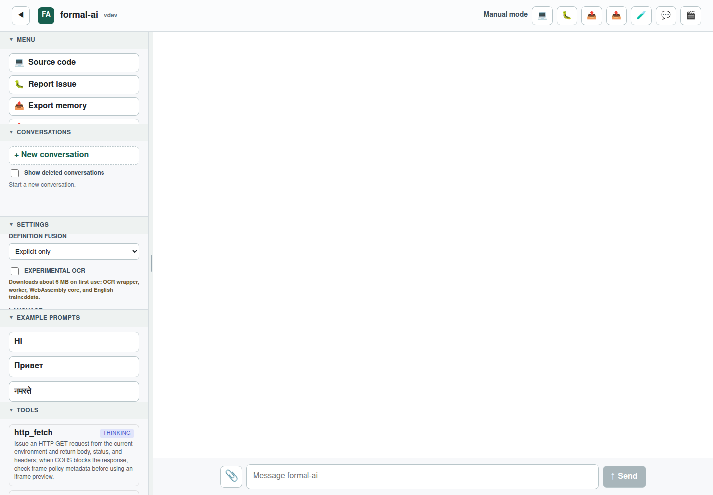

# Issue #205: Optional Tesseract.js OCR Attachments

## Summary

Issue: https://github.com/link-assistant/formal-ai/issues/205

Pull request: https://github.com/link-assistant/formal-ai/pull/206

This case study records the investigation and implementation for optional
experimental browser OCR through `naptha/tesseract.js`. The feature is gated by
the `experimentalOcr` preference, warns about first-use downloads, keeps OCR out
of the initial vendor bundle, and stores attached image data as base64 inside
the exported Links memory log.

## Requirements

| Requirement | Status | Notes |
| --- | --- | --- |
| Optional experimental support for `https://github.com/naptha/tesseract.js` | Done | `tesseract.js@7.0.0` is installed and wrapped by `src/web/ocr-entry.js`. |
| Only works if enabled in settings | Done | Settings panel has `Experimental OCR`, persisted as `experimentalOcr`; image bytes are read only when enabled. |
| Warn user how much data will be downloaded | Done | The setting warns that first use downloads about 6 MB. |
| Separate optional bundle | Done | `bun run build:web` produces `src/web/ocr.bundle.js` separately from `vendor.bundle.js`; app lazy-loads it on OCR use. |
| Support attaching images when enabled | Done | Image attachments are read as data URLs when `experimentalOcr` is on. |
| Encode images as base64 inside Links memory | Done | User message events can export an `attachments` JSON field containing `data:image/...;base64,...`. |
| Compile data under this case-study directory | Done | Raw GitHub data, package metadata, size probes, and final screenshot are stored here. |

## Online Research

Raw research artifacts are in `raw-data/`; a short narrative summary is in
`raw-data/online-research.md`.

Key facts used for the implementation:

- Tesseract.js exposes `createWorker`, and its documented browser architecture
  uses an API layer that opens a web worker, which then loads the WebAssembly
  core and language data.
- `corePath` should point at a directory rather than a single `.js` file so
  Tesseract.js can choose the appropriate core build for the current device.
- The fast English traineddata endpoint is available at
  `https://tessdata.projectnaptha.com/4.0.0_fast/eng.traineddata.gz`.
- Measured first-use network payload for the selected path is about
  `6.06 MB` decimal (`5.78 MiB`): wrapper `62,961` bytes, worker `111,307`
  bytes, SIMD LSTM core `3,899,472` bytes, and English fast traineddata
  `1,984,273` bytes.
- The installed OCR app bundle itself is smaller because it excludes the worker,
  core, and language data: `src/web/ocr.bundle.js` builds to about `18.57 KB`.

## Design Options

### Option A: Do Nothing

This would avoid bundle and runtime risk but leave image attachments as metadata
only. It fails every issue requirement except avoiding default downloads.

### Option B: Add Tesseract.js To The Default Vendor Bundle

This is the simplest integration, but it would load OCR code for every user even
when they never attach images. It also makes it easier to accidentally perform
the first-use worker/core/language downloads without clear user intent.

### Option C: Optional App Bundle With Runtime Assets (Chosen)

The app builds `src/web/ocr.bundle.js` as a separate optional artifact, then
injects the script only when `experimentalOcr` is enabled and an image
attachment is sent. The wrapper uses Tesseract.js defaults for worker/core
selection and sets `langPath` to the fast English tessdata endpoint. This keeps
the initial page path unchanged while satisfying the attachment and memory
requirements.

### Option D: Fully Self-Hosted Worker/Core/Language Assets

This would make runtime dependencies more predictable but would add large binary
artifacts to the repository or release process. The installed
`tesseract.js-core@7.0.0` package reports `45,262,431` bytes unpacked, and the
browser still needs language data. This is better treated as a later packaging
task if offline OCR becomes a non-experimental feature.

### Option E: Server-Side OCR

Server-side OCR would avoid browser downloads but conflicts with the static demo
architecture and creates upload/privacy concerns. It also does not satisfy the
request for `tesseract.js` browser support.

## Implementation Notes

- `src/web/app.js` owns the `experimentalOcr` preference, settings control,
  lazy script injection, image data URL conversion, OCR result capture, and
  prompt augmentation.
- `src/web/ocr-entry.js` is intentionally small: it creates one cached
  Tesseract worker and exposes `window.FormalAiOcr.recognizeImage`.
- `src/web/memory.js` adds `attachments` as an additive export/import field.
  Old memory logs continue to parse because unknown or absent fields remain
  optional.
- The worker prompt receives OCR text and attachment metadata, but not the
  base64 payload. The base64 payload is stored in memory only.
- The Playwright test uses a test double for `window.FormalAiOcr` so regression
  coverage does not download OCR assets during CI.

## Verification

- `node --check src/web/app.js`
- `node --check src/web/memory.js`
- `node --check src/web/ocr-entry.js`
- `node --check tests/e2e/tests/issue-205.spec.js`
- `npm run --prefix tests/e2e check:i18n`
- `bun run build:web`
- `npx --prefix tests/e2e playwright test --config=tests/e2e/playwright.local.config.js tests/e2e/tests/issue-205.spec.js`

Final UI evidence:

