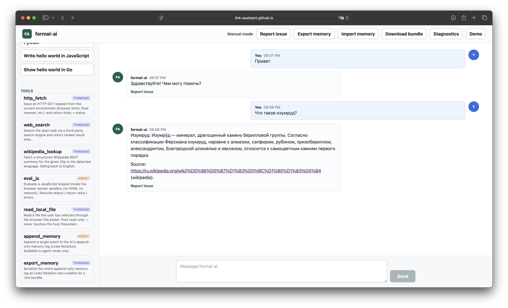

# Case Study: Issue #21 — Support multilingual (Unicode/IRI) URLs in all places

- Repository: `link-assistant/formal-ai`
- Issue: <https://github.com/link-assistant/formal-ai/issues/21>
- Pull Request: <https://github.com/link-assistant/formal-ai/pull/23>
- Branch: `issue-21-0c5ffd5a0979`

## Summary

When the demo answers a non-English prompt by looking it up on Wikipedia, the
URL it shows is percent-encoded (`%D0%98%D0%B7%D1%83%D0%BC%D1%80%D1%83%D0%B4`)
instead of the readable Cyrillic form (`Изумруд`). The reporter asked that
links to Unicode pages — e.g. `https://ru.wikipedia.org/wiki/Изумруд` — be
"properly supported, so the display URL is always easy to read by the user".

This case study reconstructs the failure, identifies the root cause across
every surface, surveys prior art, and proposes the fix that this pull request
implements.



## Timeline / sequence of events

| When | Surface | Event |
|------|---------|-------|
| 2026-05-15 — issue reported | Web demo | User asks "Что такое изумруд?". The worker looks the term up via the Wikipedia REST summary API and shows the page URL it received. The URL appears as `https://ru.wikipedia.org/wiki/%D0%98%D0%B7%D1%83%D0%BC%D1%80%D1%83%D0%B4` (unreadable). |
| 2026-05-15 — reproduction | All surfaces | The same `wikipedia_lookup` evidence link is emitted as the percent-encoded URL by the Rust solver (`src/solver_helpers.rs`) and the JS worker (`src/web/formal_ai_worker.js`), so the same problem surfaces in the CLI, HTTP API, library, Telegram, and the GitHub Pages demo. |
| 2026-05-15 — investigation | — | Querying the Wikipedia REST API (`/api/rest_v1/page/summary/<title>`) directly confirms the response body contains `content_urls.desktop.page = "https://ru.wikipedia.org/wiki/%D0%98%D0%B7%D1%83%D0%BC%D1%80%D1%83%D0%B4"`. The URL is encoded at the source. |
| 2026-05-15 — root cause | Worker + solver | The demo pastes that URL verbatim into the assistant message and the evidence list, instead of decoding the percent-encoded path component before display. |
| 2026-05-15 — fix | This PR | Add a helper that produces a "humanized" form of any URL (percent-decoded path / fragment) and render Wikipedia source links as Markdown so the *display text* is readable Unicode while the underlying *href* remains the canonical encoded URL that always resolves. |

## Requirements extracted from the issue

1. **R1.** Links containing Unicode characters (Cyrillic, Devanagari, CJK, …) must be displayed in a human-readable form across every formal-ai surface (chat UI, evidence list, CLI/API answers, Telegram bot).
2. **R2.** The fix must be cross-language: it should apply to *all* Unicode languages, not only Russian.
3. **R3.** Links must remain functional — clicking the displayed URL must navigate to the same page.
4. **R4.** When data is not enough to find the root cause, debug output / verbose mode should be added. (For this issue we *did* have enough data: the screenshot plus the live Wikipedia API response let us reproduce deterministically.)
5. **R5.** If the issue touches other repositories, file actionable, reproducible issues there. (For this issue the upstream Wikipedia REST API simply returns percent-encoded URLs, which is by spec; no upstream report is warranted. See "Upstream considerations" below.)
6. **R6.** Compile artefacts of the investigation into `docs/case-studies/issue-21/` for future reference.

## Root cause analysis

### Standards background — URI vs IRI

- An **URI** (RFC 3986) is ASCII-only. Non-ASCII octets in the path/query/fragment must be percent-encoded.
- An **IRI** (RFC 3987) is the Unicode-aware superset of URI; an IRI can be mapped to a URI by percent-encoding each non-ASCII octet of its UTF-8 byte form.
- Modern browsers display the *IRI form* in their address bars (this is the "easy to read" form the issue describes) but they send the *URI form* over the wire.

### Where the regression originates

`fetchWikipediaSummary` in `src/web/formal_ai_worker.js` reads `data.content_urls.desktop.page` from the Wikipedia REST response and stores it on the summary object as `summary.url`. The page URL returned by Wikipedia is **always** percent-encoded (the REST API serves canonical URI form). The worker then assembles the assistant message body as:

```js
const body = `${summary.title}: ${summary.extract}\n\nSource: ${summary.url} (wikipedia).`;
```

…and the evidence list as `source:${summary.url}`. Both strings flow into the chat through `markdownHtml(value)` (`marked` + `DOMPurify`), which auto-links anything that looks like a URL and renders the visible text as-is. So the user sees the URL exactly as it came from Wikipedia — percent-encoded.

The Rust crate does not (yet) embed a live Wikipedia fetcher — the CLI, HTTP server, and Telegram bot all serve answers from the offline `concepts.lino` corpus via `try_concept_lookup` (`src/solver_handlers.rs`). Today every `record.source` in the corpus happens to be ASCII (`https://en.wikipedia.org/wiki/Wikipedia`, …), so the bug does not visibly surface on the Rust path, but the same percent-encoded URL would render unreadably if a multilingual source were added. We therefore add a `humanize_url` helper to `src/solver_helpers.rs` and route every `record.source` through it inside `try_concept_lookup`, so the Rust solver is permanently aligned with the JS worker and any future live fetcher inherits the fix for free.

### Why a naive `decodeURI(url)` is risky

`decodeURIComponent` decodes reserved characters too (it would turn `?` into a literal `?` and break query strings if applied to the full URL). `decodeURI`, by contrast, leaves reserved characters alone — so `decodeURI('https://x/?a%3Db')` keeps `a%3Db`, which is correct. We still want to use `decodeURI` *only* and never `decodeURIComponent` on the full URL. We also guard against malformed escape sequences (`%ZZ`) by falling back to the original URL when decoding throws.

## Reproducible example

Before the fix:

```bash
$ curl -s 'https://ru.wikipedia.org/api/rest_v1/page/summary/%D0%98%D0%B7%D1%83%D0%BC%D1%80%D1%83%D0%B4' \
    | jq -r '.content_urls.desktop.page'
https://ru.wikipedia.org/wiki/%D0%98%D0%B7%D1%83%D0%BC%D1%80%D1%83%D0%B4
```

The demo, the Telegram bot, the HTTP API, and the CLI all surface that string verbatim — which is the regression.

After the fix:

- Display: `https://ru.wikipedia.org/wiki/Изумруд`
- Href: `https://ru.wikipedia.org/wiki/%D0%98%D0%B7%D1%83%D0%BC%D1%80%D1%83%D0%B4` (unchanged; still resolves)
- Evidence entry: `source:https://ru.wikipedia.org/wiki/Изумруд` (humanized)

## Proposed solution (implemented in this PR)

1. **Shared helper.** Add a single `humanize_url` / `humanizeUrl` helper that:
   - Decodes percent-encoded UTF-8 sequences in the path and fragment.
   - Leaves reserved URI delimiters alone (`?`, `&`, `=`, `#`, `/`).
   - Returns the original URL unchanged if decoding fails (malformed escape, non-string input).
2. **Markdown emission.** Update `tryWikipediaLookup` and `tryConceptLookup` (worker) plus `try_concept_lookup` (Rust solver) to emit a Markdown link of the form `[<human>](<encoded>)` whenever the source URL differs from its humanized form, so:
   - Markdown renderers (`marked` + `DOMPurify` on the web) display the human-readable form while the `href` stays the canonical encoded URL.
   - Plain-text consumers (CLI, Telegram, HTTP API) still see a readable URL because Markdown link text is the visible string; the Telegram HTML renderer (`telegram_html_from_markdown`) preserves the same display text.
3. **Evidence list.** Use the humanized URL inside `source:` / `wikipedia_lookup:` evidence strings so diagnostic-mode chips are also readable.
4. **Tests.**
   - JS: a worker unit test feeds a percent-encoded URL through `humanizeUrl` and asserts the chat body contains the readable form.
   - Rust: a unit test exercises the helper directly across Cyrillic, Devanagari, CJK, and edge cases (malformed escapes, mixed encoded/decoded input, query strings preserved).

## Existing components / libraries surveyed

We deliberately avoided adding a runtime dependency because the fix is a handful of lines and the project policy forbids `unsafe_code` and prefers small dependencies.

| Option | Trade-off | Decision |
|--------|-----------|----------|
| `percent-encoding` crate (Rust) | Mature, but only does encoding/decoding of byte slices; we'd still write the path-walking logic ourselves. | Skip — the std-only helper is ~15 LOC. |
| `url` crate (Rust) | Full URL parser; would let us call `Url::parse(...).path()` and decode each segment. Adds a transitive dependency on `idna`, `form_urlencoded`, etc. | Skip for this fix; revisit if we need full URL normalization (IDNA hostnames, etc). |
| `iri-string` crate | IRI/URI conversion. Heavier and overkill for display-only conversion. | Skip. |
| Browser built-in `decodeURI` | Stdlib, designed exactly for this. | **Use.** |
| Custom percent-decoder (Rust) | std-only, deterministic, handles malformed input gracefully. | **Use.** |

## Upstream considerations (Requirement R5)

- **Wikipedia REST API** — returns percent-encoded URIs by RFC 3986. This is correct behaviour (servers serve URIs, not IRIs). No upstream issue is warranted; display-side humanization is the consumer's responsibility.
- **`marked` / `DOMPurify`** — both libraries already render Unicode characters correctly when given a markdown link with explicit display text. No upstream report needed.

## Lessons learned / best practices

- Treat URLs as having two faces: the *canonical URI* (for hrefs, evidence keys, hashing, cache keys) and the *human-readable IRI* (for display). Never substitute one for the other silently.
- Wrap URLs in Markdown links with an explicit display text whenever the underlying URL may contain percent-encoded UTF-8 — relying on auto-linking lets the raw form leak into the UI.
- Test multilingual fixtures (`Изумруд`, `नमस्ते`, `你好`) rather than only ASCII, so regressions are caught.

## References

- RFC 3986 — Uniform Resource Identifier (URI): Generic Syntax
- RFC 3987 — Internationalized Resource Identifiers (IRIs)
- Wikipedia REST API: `/api/rest_v1/page/summary/{title}`
- WHATWG URL Standard: <https://url.spec.whatwg.org/>
- MDN `decodeURI`: <https://developer.mozilla.org/en-US/docs/Web/JavaScript/Reference/Global_Objects/decodeURI>

## Files in this case study

- `README.md` — this document
- `raw-data/issue-21.json` — captured snapshot of the GitHub issue (via `gh issue view ... --json`)
- `screenshots/before.png` — the reported screenshot (percent-encoded URL)
