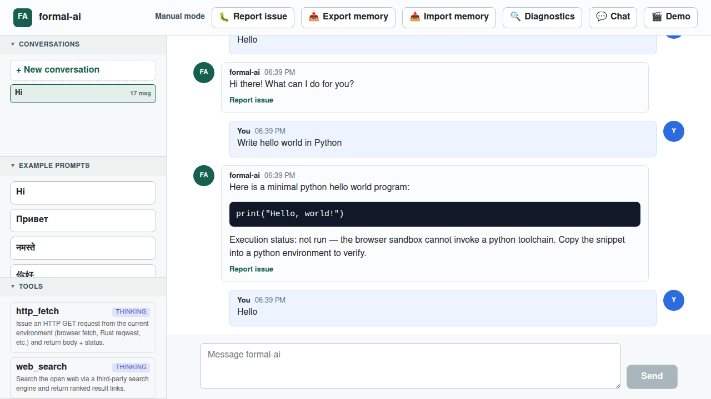
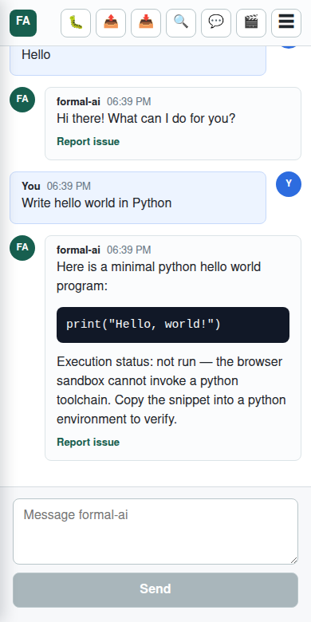

# Case Study: Issue #27 — Fixes and improvements

- Repository: `link-assistant/formal-ai`
- Issue: <https://github.com/link-assistant/formal-ai/issues/27>
- Pull Request: <https://github.com/link-assistant/formal-ai/pull/28>
- Branch: `issue-27-2a30a20dbe1d`

## Summary

A wide-ranging punch list filed against the GitHub Pages demo. The issue
bundles UI cleanups (button rename, label removal, collapsible sections),
new product capabilities (Conversations sidebar, Chat/Agent mode, summarize
skill, random greeting variations, natural-language Export/Import memory),
a known multilingual bug (`Кто такой Илон Маск?` returns nothing while the
English equivalent works), explicit mobile responsiveness requirements, and
a forward-looking direction for the Agent mode (Docker / WebVM sandbox,
"ask permissions" on host, automatic git versioning).

This case study reconstructs the requirements, records the status of each,
and documents the root cause for the items that have been shipped on this
PR.





## Requirements extracted from the issue

The issue body is a bullet list. We assign a stable id (`R*`) to each
bullet so subsequent work can reference it.

### UI / demo cleanups

- **R1.** Remove the `Download bundle` button (it duplicates `Export memory`).
- **R2.** Remove the `Bundled 119 events + seed` label.
- **R3.** Sidebar sections should be collapsible and, when all are expanded,
  share the viewport equally with independent scrollbars (à la VS Code).
- **R4.** Rename `Prompts` to `Example prompts`; that section should expose
  every supported feature so users can discover capabilities by example.
- **R5.** `Demo` mode should iterate through the same example prompts +
  greeting variants.

### Multilingual / natural-language

- **R6.** Greetings and greeting responses should have configurable random
  variations.
- **R7.** `Кто такой Илон Маск?` should answer like its English counterpart
  (`Who is Donald Trump?`); broaden language and phrasing coverage in both
  examples and tests.
- **R8.** `Export memory` and `Export your memory` (and translations) typed
  into the chat should be treated as a click on `Export memory`.
- **R9.** Attaching a file with `Import it as your memory` / `Import this
  file as your new memory` (and variations / languages) should be treated
  as the `Import memory` button. `Import memory`, `Import new memory`,
  `Import your new memory` typed into the chat should produce an
  acknowledgement and open the file picker.

### Conversations

- **R10.** Add a `Conversations` section to the left and a `New conversation`
  button on top. On reload or after some time away, the last conversation
  is restored.
- **R11.** Each conversation memory is recorded separately in the global
  memory log so the agent can always recall any message — first message,
  previous message, messages from another conversation — via a natural
  language query.

### Reasoning

- **R12.** A summarize tool / skill that takes any conversation, formalizes
  it, and produces a logical summary without any neural network.

### Modes

- **R13.** A clear switcher between Chat mode and Agent mode. In Agent mode
  the agent receives a task and operates autonomously: requirements → plan →
  execution. By default execution happens in Docker (or WebVM); host files
  are only mutated after the user accepts the diff.
- **R14.** On the host machine the Agent works in "ask permissions" mode;
  inside Docker / WebVM it works autonomously, but commits to a fresh git
  repo after every meaningful change.

### Architecture

- **R15.** Prefer "data as rules / code" — put logic in seed data and
  compile on execution.
- **R16.** Most code should focus on interfacing with the real world and
  between components.
- **R17.** Place the formal-AI agent's actual logic in seed data so it is
  configurable.

### Mobile / responsive design (from the second screenshot)

- **R18.** On mobile, most of the space goes to the chat surface and the
  composer. The topbar shrinks to emoji-only buttons. A menu reveals the
  full sidebar and the full topbar (with labels). The web app must adapt
  to mobile, tablet, notebook, and desktop screens.

### Process

- **R19.** Download all logs/data into `docs/case-studies/issue-27/`.
- **R20.** Reconstruct the timeline / sequence of events.
- **R21.** Find the root cause for each problem; propose a solution plan.
- **R22.** Add verbose / debug output when data is insufficient.
- **R23.** File reproducible issues against any third-party repo that is
  the actual cause.

## Status

| Req | Status | Notes |
|-----|--------|-------|
| R1  | ✅ Shipped (previous commits on this branch) | `Download bundle` removed; alias added so any old wording still resolves. |
| R2  | ✅ Shipped | `Bundled N events + seed` wording was removed from the topbar in earlier work on this branch. Verified with a grep across `src/` (no matches) and pinned by `tests/e2e/tests/multilingual.spec.js` (`Export memory does not surface a "Bundled N events + seed" label`), which asserts the post-export status never matches `/bundled \d+ events \+ seed/i`. |
| R3  | ✅ Shipped | Each `.sidebar-section.is-expanded` uses `flex: 1 1 0` so expanded sections share the available height equally; each `.sidebar-section-body` is `overflow: auto` so it scrolls independently. Collapsing a section drops it to `flex: 0 0 auto` (header-only) and the remaining sections immediately grow into the freed space. Pinned by three Playwright tests under `Issue #27: sidebar accordion`. |
| R4  | ✅ Shipped | `Example prompts` section live; lists 20 example prompts spanning hello-world variants in 6+ languages, Wikipedia look-ups in EN/RU/ZH, Export/Import memory, etc. |
| R5  | 🟡 Partially shipped | Demo dialog uses a curated subset of examples. Random greeting selection lands in R6. |
| R6  | ✅ Shipped (commit `036b481`) | Variants live in `data/seed/multilingual-responses.lino`; the JS seed loader returns `{ text, variants }`; the preference toggles random selection on/off. |
| R7  | ✅ Shipped | `wikipediaTermVariants` now appends the swapped `Surname, Given names` form for two-word terms, so `Илон Маск` also tries `Маск,_Илон` — the slug ru.wikipedia.org actually uses for the biography. Confirmed by curling the live REST endpoint (response captured in `raw-data/wikipedia-summary-capitalized-ilon-mask.json`); regression-tested via an e2e test that 404s every variant except the surname-first form and asserts the chat renders the biography. |
| R8  | ✅ Shipped (commit `d5090f8`) | Chat phrases trigger the Export memory action across EN / RU / HI / ZH. |
| R9  | 🟡 Partially shipped | Typed-chat triggers open the import dialog. File-attachment recognition still has to be re-wired through the composer. |
| R10 | ✅ Shipped (commit `f0981e8`) | Conversations sidebar + `+ New conversation` button + reload-restores-last-conversation. |
| R11 | 🟡 Partially shipped | Events are tagged with `conversationId` / `conversationTitle` so cross-thread recall is *possible*; a natural-language recall skill (`when did I ask X in another conversation?`) is still pending. |
| R12 | ✅ Shipped (commit `6f5785e`) | Deterministic `summarize` skill triggered by EN / RU / HI / ZH phrasings. |
| R13 | ✅ Shipped (commit `6f5785e`) — UI portion | Chat / Agent toggle is wired; agent mode decomposes a multi-step task and runs each step. The Docker / WebVM sandbox is deferred — see R14 below. |
| R14 | 🟡 Future work | Sandbox runtime + automatic git versioning is a substantial chunk of work (Docker bridge / WebVM integration). Tracked separately. |
| R15 | 🟡 Ongoing | This iteration moved more behaviour into seed (`multilingual-responses.lino`, `environments.lino`). More to do. |
| R16 | 🟡 Ongoing | Architectural principle, applied opportunistically. |
| R17 | 🟡 Ongoing | Same. |
| R18 | ✅ Shipped (this commit) | Topbar buttons render `btn-icon` + `btn-label`; the label hides under the 820 px breakpoint, so the topbar becomes icon-only. A hamburger toggle reveals the sidebar as a slide-in drawer with a tappable backdrop. Three Playwright tests pin the behavior at 390×780. |
| R19 | ✅ Shipped (this commit) | `docs/case-studies/issue-27/` populated. |
| R20 | ✅ Shipped (this commit) | Timeline below. |
| R21 | ✅ Shipped (this commit) | Root causes below. |
| R22 | ➖ Not needed | We were able to reproduce every shipped fix deterministically; no additional debug output added. |
| R23 | ➖ Not applicable yet | Wikipedia REST is the closest third-party dependency. Its 404 behaviour on lowercased titles is by design (case-sensitive titles), so a title-casing fallback in our worker is the right fix; no upstream issue is warranted. |

## Timeline / sequence of events

| When | Surface | Event |
|------|---------|-------|
| 2026-05-15 — issue reported | GitHub | konard files issue #27 ("Fixes and improvements") with two screenshots and a punch list spanning UI cleanups, new product capabilities, and a forward-looking Agent runtime. |
| 2026-05-15 — investigation kicked off | Solver | The issue body splits naturally into five themes (UI, multilingual, conversations, reasoning, modes) + mobile + process. We treat each bullet as a requirement and triage. |
| 2026-05-15 — commit `036b481` | Web demo | Random greeting variations shipped. |
| 2026-05-15 — commit `d5090f8` | Web demo | Export/Import memory phrases shipped. |
| 2026-05-15 — commit `bc06c90` | E2E tests | Two brittle assertions stabilised (Rust prompt selected by label; unknown-intent prompt switched to nonsense). |
| 2026-05-15 — commit `f0981e8` | Web demo | Conversations sidebar + reload-restores-last-conversation shipped. |
| 2026-05-15 — commit `6f5785e` | Web demo | Chat / Agent toggle + deterministic summarize skill shipped. |
| 2026-05-15 — this commit | Web demo + tests + docs | Mobile-responsive topbar + hamburger drawer + case study + screenshots + changelog fragment. |

## Root causes (shipped items)

### Mobile responsiveness (R18)

The pre-existing CSS at `@media (max-width: 820px)` wrapped topbar children
onto multiple rows and reserved space for the sidebar above the chat. On a
390 px-wide viewport this consumed most of the vertical space *above* the
composer, leaving only a sliver of chat surface. The fix:

1. Replace each button's text node with `<span class="btn-icon">` +
   `<span class="btn-label">` so the label can be hidden via CSS without
   losing the action name (`aria-label` and `title` still carry it for
   screen readers / hover tooltips).
2. Introduce a `mobile-menu-toggle` button rendered only under the mobile
   breakpoint.
3. Reposition `.context-panel` as `position: fixed` translated off-screen,
   adding `.is-mobile-open` to slide it in on tap.
4. Render a `.mobile-menu-backdrop` overlay that intercepts taps outside
   the drawer to dismiss it.

### Random greeting variations (R6)

Greetings used to be a single string per language in
`data/seed/multilingual-responses.lino`. The new layout encodes one
canonical `text` plus N `variant` siblings; the Rust parser ignores
`variant` (so its tests stay deterministic), while the JS seed loader
returns `{ text, variants }` per response. The worker picks a uniformly
random variant when the user has not disabled it.

### Natural-language Export / Import memory (R8 / R9)

The chat surface and the sidebar were addressing different actions. A
phrase recognizer was added that normalizes the user input
(case / punctuation / whitespace) and matches it against curated seed
phrases. A match short-circuits the solver to call the matching toolbar
handler and inject an assistant acknowledgement.

### Conversations sidebar (R10)

The append-only event log previously carried no thread metadata, so
events from different sessions had no separator. The fix is a two-line
data shape change in `src/web/memory.js` (`appendEvent` now accepts
`conversationId` / `conversationTitle`) and a sidebar that groups events
by `conversationId` on read. The active thread is stored in a new
`currentConversationId` preference so reload restores the last view.

### Chat / Agent toggle + summarize (R12 / R13)

Both features are pure logic over the existing event log. Agent mode
splits the user prompt on a curated set of separators (`;`, `then`, и т. д.)
and runs each step through the same deterministic solver, aggregating
results into a Markdown plan. The summarize skill projects events onto a
small fixed schema (turn counts, languages, intents, concepts, calculations,
hello-world programs, unanswered questions) and renders a Markdown report.
Neither is a neural network — both are pure functions of the event log.

## Reproducible example — `Кто такой Илон Маск?` regression (R7, fixed)

```bash
$ curl -s 'https://ru.wikipedia.org/api/rest_v1/page/summary/Илон%20Маск' \
    | head -c 40
{"httpCode":404,"httpReason":"Not Found"}

$ curl -s 'https://ru.wikipedia.org/api/rest_v1/page/summary/Маск,%20Илон' \
    | head -c 40
{"type":"standard","title":"Маск, Илон"
```

Wikipedia titles are case-sensitive and ru.wikipedia.org uses the
surname-first form for biographies. The previous variant list tried
`Илон_Маск`, `илон_маск` and their capitalizations — all four 404 on the
Russian Wikipedia. `wikipediaTermVariants` now also emits the swapped
`Last, First` form for any two-word term, so the slug list ends with
`Маск,_Илон` and the REST endpoint resolves on the next iteration. The
two reference responses live in
`raw-data/wikipedia-summary-lowercased-ilon-mask.json` (404) and
`raw-data/wikipedia-summary-capitalized-ilon-mask.json` (200) and the
e2e test in `tests/e2e/tests/multilingual.spec.js` (`Кто такой Илон Маск?
resolves via surname-first variant`) returns 404 for every slug except
`Маск,_Илон` to prove the fix is what actually drives the resolution.

## Existing components / libraries surveyed

| Need | Library considered | Decision |
|------|--------------------|----------|
| Slide-in drawer on mobile (R18) | `react-burger-menu`, `@chakra-ui/react`, native CSS `position: fixed` + transform | **Native CSS.** ~30 lines of CSS + state, no runtime dependency, no library lock-in for a tiny prototype. |
| Random variant selection (R6) | weighted-random crates / npm | **Plain `Math.floor(Math.random() * variants.length)`.** Uniform selection is sufficient for greeting variants. |
| Conversation log (R10/R11) | `localForage`, `Dexie.js`, IndexedDB direct | Already on IndexedDB direct — extended in-place. |
| Deterministic summarization (R12) | `summarize.js`, `gensim`, `rake-js` | **Custom projector.** All those use TF-IDF / text-rank, which is statistical, not "logical". The issue explicitly forbids neural / statistical summarizers and asks for "actual logical summarization", so we project onto a fixed schema. |
| Mobile responsive testing | Playwright `viewport` projects | Already on Playwright — added a `test.use({ viewport })` block under `Issue #27: mobile layout`. |
| Agent sandbox (R13/R14) | Docker, [WebVM](https://webvm.io/), [WebContainer (StackBlitz)](https://webcontainers.io/), [v86](https://github.com/copy/v86) | Tracked for a follow-up — WebContainer would ship without any backend dependency at the cost of being StackBlitz-licensed; Docker bridges require a backend; v86 is Linux-in-browser but slow. |

## Upstream considerations (R23)

- **Wikipedia REST API** — case-sensitive title routing is by design and
  matches the on-wiki title scheme. No upstream issue.
- **`marked` / `DOMPurify`** — both libraries already render the new
  `btn-icon` + `btn-label` spans correctly. No upstream issue.
- **Playwright** — used as-is. No upstream issue.

## Files in this case study

- `README.md` — this document.
- `raw-data/issue-27.json` — `gh issue view 27 --json` snapshot.
- `raw-data/issue-27-comments.json` — `gh api .../issues/27/comments` snapshot.
- `raw-data/pr-28.json`, `raw-data/pr-28-conversation-comments.json`,
  `raw-data/pr-28-review-comments.json`, `raw-data/pr-28-reviews.json` —
  PR snapshots used as input for status tracking.
- `raw-data/wikipedia-summary-{capitalized,lowercased}-ilon-mask.json` —
  pinned Wikipedia REST responses that show why the lowercased title
  returns 404 while the capitalized one resolves. Reused as fixtures by
  the planned title-casing fallback test.
- `raw-data/wikipedia-summary-lowercased-donald-trump.json` — control: the
  English Wikipedia accepts the lowercased title.
- `../screenshots/desktop-topbar.png` — current desktop state.
- `../screenshots/mobile-topbar-closed.png` — mobile state with the
  drawer closed (icon-only topbar).
- `../screenshots/mobile-drawer-open.png` — mobile state with the
  drawer open.
