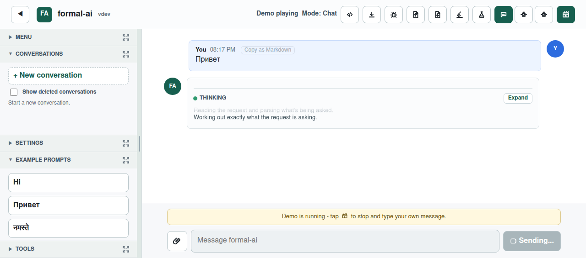
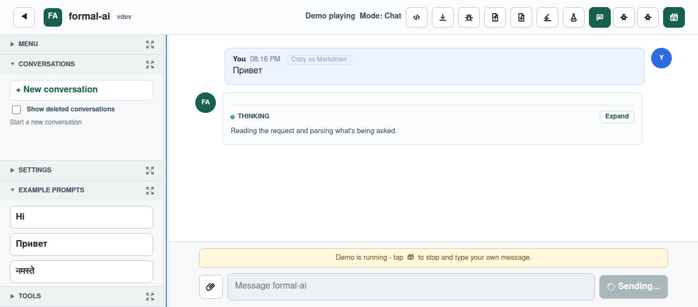

# Issue 447 case study: a splitter that looked like a scrollbar

## Executive summary

The report said that the left-hand buttons were not all visible and the panel could not be scrolled with the mouse. The attached animation and screenshots explain the mismatch: the sidebar itself already contained independently scrollable accordion bodies, but the adjacent resize control was drawn as a 10 px solid track with a short rounded vertical thumb. That is the visual vocabulary of a scrollbar, so a user naturally tried to scroll it.

The implementation now separates visual size from interaction size. The existing 10 px full-height resize target remains easy to acquire, but it is transparent and draws only a full-height 1 px divider. Hover, keyboard focus, and active drag turn only that divider into a 2 px blue sash. The real sidebar scroll areas remain unchanged and do not overlap the target.

## Evidence and timeline

- 2026-05-19: issue #136 requested a resizable sidebar. Commit `a6dcafec` introduced both the behavior and the original track/thumb styling.
- 2026-06-13 14:11 UTC: issue #447 was filed from Firefox 151 on Windows, viewport 1280×565, in Russian: “the left part with buttons is not fully visible; the mouse does not let me scroll it.”
- 2026-06-13 14:29 UTC: the reporter attached a Gyazo animation.
- 2026-06-13 14:32 UTC: two complete screenshots were added; the maintainer asked to verify that the splitter does not conflict with left-panel scrolling and noted Safari did not reproduce the confusion.
- 2026-07-05: the maintainer identified likely splitter/scrollbar confusion and proposed a VS Code-like thin line without a middle handle.
- 2026-07-10: the original geometry was reproduced in Chromium at 1280×565, a failing browser test was recorded, the sash treatment was implemented, and the same tests passed.

Raw GitHub JSON, the original PNGs, the Gyazo page/GIF, related issue #136, VS Code's sash CSS, and SHA-256 checksums are retained in [`raw-data/`](raw-data/). Magic bytes were checked before the images were inspected.

## Root-cause analysis

The panel's accordion bodies use `overflow-y: auto`; they are the actual scrolling surfaces. The splitter is the next grid column and does not overlay them. The defect was therefore primarily a false affordance, not absent scrolling:

1. The resize target occupied a visibly filled 10 px strip for the full workspace height.
2. Its `::before` pseudo-element was only 34 px tall, 2 px wide, and fully rounded.
3. Hover painted the whole strip, reinforcing a track-and-thumb interpretation.
4. A `col-resize` cursor was the only contrary signal, and cursor glyphs vary across browsers and platforms.

This also explains why the report was Windows-specific while Safari could not reproduce it: the CSS geometry was common, but cursor rendering, scrollbar conventions, and user expectations are platform-dependent.

## External research and existing solutions

- The current [VS Code sash source](https://github.com/microsoft/vscode/blob/main/src/vs/base/browser/ui/sash/sash.css) separates a narrow sash hit area from a pseudo-element that becomes the hover border. Its vertical sash uses horizontal-resize cursors and a full-height visual. A snapshot is retained at `raw-data/vscode-sash.css`.
- The [WAI-ARIA Window Splitter pattern](https://www.w3.org/WAI/ARIA/apg/patterns/windowsplitter/) specifies a focusable `separator`, value range, accessible name, and arrow/Home/End keyboard behavior. The existing component already had these essentials, so the change preserves them.
- [MDN's cursor reference](https://developer.mozilla.org/docs/Web/CSS/cursor) describes `col-resize` and `ew-resize` as horizontal resizing cues. `ew-resize` is used here because it directly communicates movement in both directions.

Known split-pane libraries such as `react-resizable-panels` could provide resize state and accessibility, but replacing an already working, tested implementation would add dependency and migration risk without addressing the core styling problem more directly. Reusing VS Code's visual architecture in the existing component is the smallest complete solution.

## Options considered

| Option | Benefits | Costs / decision |
|---|---|---|
| Remove resizing | Eliminates ambiguity. | Reject: removes an explicitly requested feature from issue #136. |
| Shrink the entire target to 1–2 px | Visually clear. | Reject: unnecessarily makes mouse and touch acquisition difficult. |
| Keep the track and add arrows or a tooltip | More explicit once noticed. | Reject: adds clutter and still resembles a scrollbar before interaction. |
| Adopt a split-pane library | Mature abstraction for complex layouts. | Reject for this scope: state, pointer, persistence, keyboard, and mobile behavior already work. |
| Transparent 10 px target with a thin full-height sash | Clear divider, generous target, no overlay, minimal code change. | Selected. |

## Implementation and verification plan

1. Preserve the grid column, pointer logic, preferences, ARIA attributes, and keyboard handlers.
2. Render a transparent target and a 1 px full-height divider.
3. Highlight only the divider on hover/focus/drag; provide themed blue feedback.
4. Test geometry at the exact reported viewport, hover styling, pointer resize, sidebar scroll CSS, and keyboard semantics.
5. Capture before/after screenshots from the same viewport and state.

## Visual evidence

Before: the full gray strip and short centered thumb read as a scrollbar.

After: the divider is a thin full-height sash; this capture holds the pointer over it to show the blue resize affordance.

## Reproduction and automated proof

At 1280×565, open the app and place the pointer on the divider between the sidebar and chat. Before the change, the divider is a filled track with a short thumb. After the change, its resting visual is a 1 px boundary and hover produces a 2 px blue line while dragging still resizes the sidebar.

`tests/e2e/tests/issue-447.spec.js` is the minimum browser regression. Against the original CSS, its visual-geometry and hover tests fail because the target background is opaque (`rgb(238, 242, 241)` resting and `rgb(223, 232, 229)` hovered). With the fix, all three tests pass.

See [`requirements.md`](requirements.md) for the requirement-to-proof matrix.
