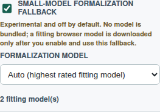

# Issue 483 Case Study

Issue [#483](https://github.com/link-assistant/formal-ai/issues/483)
asked for an experimental small-model fallback that can help formalization
choose among already generated options while keeping Formal AI formal-first:
the model must never synthesize the authoritative formalization, it must be off
by default, and no model runtime or weights may be bundled or downloaded before
explicit user opt-in.

Pull request: [#644](https://github.com/link-assistant/formal-ai/pull/644)

## 1. Collected Data

- Issue snapshot: `raw-data/issue-483.json`.
- Issue comments: `raw-data/issue-483-comments.json` (empty at collection time).
- Prepared PR snapshot: `raw-data/pr-644.json`.
- PR conversation, review-comment, and review snapshots:
  `raw-data/pr-644-conversation-comments.json`,
  `raw-data/pr-644-review-comments.json`, and
  `raw-data/pr-644-reviews.json` (empty at collection time).
- Related repository metadata:
  `raw-data/model-in-browser-repo.json`.
- Hugging Face API captures for the short-listed WebLLM models:
  `raw-data/hf-smollm2-360m.json`,
  `raw-data/hf-qwen2.5-0.5b.json`,
  `raw-data/hf-smollm2-1.7b.json`, and
  `raw-data/hf-phi3.5-mini-1k.json`.
- Online source notes: `raw-data/online-research.md`.
- Reproducing/passing test logs: `raw-data/failing-test.log`,
  `raw-data/rust-formalization-tests.log`,
  `raw-data/cargo-test-all-features.log`, and
  `raw-data/playwright-issue-483.log`.
- Formatting, lint, build, and static-check logs:
  `raw-data/cargo-fmt-check.log`, `raw-data/cargo-clippy.log`,
  `raw-data/check-file-size.log`, `raw-data/build-web.log`,
  `raw-data/check-i18n.log`, `raw-data/check-web-tdz.log`, and
  `raw-data/check-web-hardcoded-ui.log`.
- UI evidence:
  `screenshots/formalization-model-settings.png`.



## 2. Requirements Trace

| ID | Requirement | Implementation |
| --- | --- | --- |
| R483-1 | Add an experimental fallback for formalization using small models. | `src/translation/model_fallback.rs` adds the formalization model catalog, prompt builder, advice parser, candidate reranker, and selection entry point. |
| R483-2 | The model receives options and only selects the best existing match. | `build_formalization_model_prompt` lists `option_N` records with Links Notation; `apply_formalization_model_advice` ignores unknown outputs and never creates a new candidate. |
| R483-3 | Unit tests must confirm model selection behavior. | `tests/unit/specification/formalization.rs` covers default-off behavior, bounded-option selection, normal selection integration, hardware filtering, and prompt shape. |
| R483-4 | Default off; no model loaded or downloaded unless explicitly enabled in settings. | `src/web/app/main.jsx` defaults `experimentalFormalizationModelFallback` to `false`; `tests/e2e/tests/issue-483.spec.js` checks initial load has no model runtime scripts. |
| R483-5 | Only show models that fit the user's hardware. | Rust and browser catalogs filter by WebGPU availability, `shader-f16` support, and device memory. |
| R483-6 | Sort displayed models by public ratings. | The catalog stores public ratings from captured Hugging Face metadata and sorts descending. |
| R483-7 | Everything downloaded on demand only; nothing included in the package or web UI. | The PR adds metadata, settings, and tests only. It does not add WebLLM, Transformers.js, model files, or bundled weights. |
| R483-8 | LLMs remain advisory, never in control. | Advice can only reorder existing `FormalizationCandidate` values before the normal selector runs; symbolic candidate generation and final decision policy remain authoritative. |
| R483-9 | Compile the data and solution analysis under `docs/case-studies/issue-483`. | This directory contains raw data, requirements, solution plans, research notes, verification logs, and the settings screenshot. |

## 3. Root Cause

The formalization layer already generated competing candidates for ambiguous
phrasing such as `apple is a fruit`: one candidate can map the predicate to
`wikidata:P31` and another to `wikidata:P279`. The existing selector could ask
a clarification question or choose deterministically/probabilistically, but
there was no narrow advisory boundary where a small browser model could help
choose among those exact candidates.

The missing boundary mattered more than the model runtime. If a browser LLM
were allowed to emit arbitrary Links Notation, it would violate the issue's
"never at steering wheel" constraint. If a model or runtime were bundled, it
would violate the default-off and on-demand constraints. The safe missing
piece was therefore a candidate-selection contract, plus a settings/catalog
surface that makes opt-in and hardware filtering explicit.

## 4. Implemented Design

The chosen design is an advisory picker:

1. Formal AI builds the candidate list with the existing deterministic
   formalizer.
2. `build_formalization_model_prompt` renders only those candidates as
   `option_1`, `option_2`, and so on, including their compact summaries and
   Links Notation.
3. A small model may return JSON naming one option and a confidence.
4. `apply_formalization_model_advice` accepts the advice only when the
   fallback is enabled, the confidence is finite and high enough, and the
   selected option maps to an existing candidate id, summary, or probability
   target.
5. `select_formalization_candidate_with_model_advice` passes the reranked
   candidate slice back through the normal formalization selector.

This makes the model output advisory evidence, not an executable
formalization. Bad, low-confidence, or synthetic output is ignored.

The browser UI adds a settings row for the experimental fallback. It is
unchecked by default, warns that no model is bundled, and only enables the
model selector after opt-in. The selector is built from a small WebGPU catalog
and filtered against the detected browser hardware profile.

## 5. Model Shortlist

The initial catalog favors small WebLLM-compatible quantized models that fit
typical browser WebGPU limits. Public rating is the captured Hugging Face
downloads plus likes when a model page is available.

| Model | Runtime | VRAM gate | Required feature | Public rating | Source |
| --- | --- | ---: | --- | ---: | --- |
| SmolLM2 360M Instruct q4f16 | WebLLM | 377 MB | `shader-f16` | 80,150 | `hf-smollm2-360m.json` |
| Qwen2.5 0.5B Instruct q4f16 | WebLLM | 945 MB | none | 34,924 | `hf-qwen2.5-0.5b.json` |
| SmolLM2 1.7B Instruct q4f16 | WebLLM | 1,775 MB | `shader-f16` | 503 | `hf-smollm2-1.7b.json` |
| Phi-3.5 mini Instruct q4f16 1k | WebLLM | 2,521 MB | none | 0 | WebLLM low-resource alias; the captured HF alias query was unavailable |

## 6. Verification

Development started with failing tests:

```text
cargo test --test unit experimental_model_formalization_fallback_is_off_by_default
```

The captured failure is in `raw-data/failing-test.log`; it failed because the
new fallback API did not exist yet.

Final checks recorded in this case study:

```text
cargo fmt --check
cargo clippy --all-targets --all-features
rust-script scripts/check-file-size.rs
cargo test --test unit formalization
cargo test --all-features
npm --prefix tests/e2e run check:i18n
npm --prefix tests/e2e run check:web-tdz
npm --prefix tests/e2e run check:web-hardcoded-ui
bun run build:web
cd tests/e2e && npx playwright test --config=playwright.local.config.js tests/issue-483.spec.js
```

The Playwright regression verifies both important browser states: initial page
load leaves the setting off and does not load a model runtime, while opt-in on a
mock 1 GB WebGPU profile shows only the two fitting models sorted by public
rating.

## 7. Boundary

This PR intentionally does not vendor a runtime such as WebLLM or
Transformers.js, nor any model weights. The implemented contract is the
formalization-safe boundary a browser model must satisfy: after explicit opt-in,
it can advise by selecting one existing option, and Formal AI can ignore that
advice without losing any symbolic behavior.
