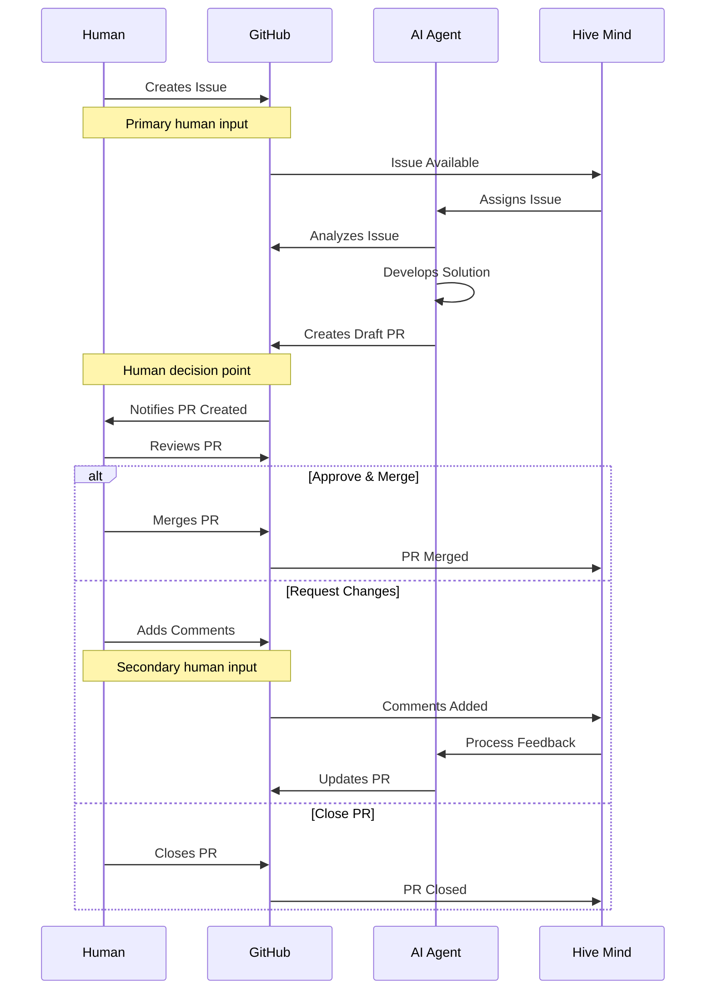
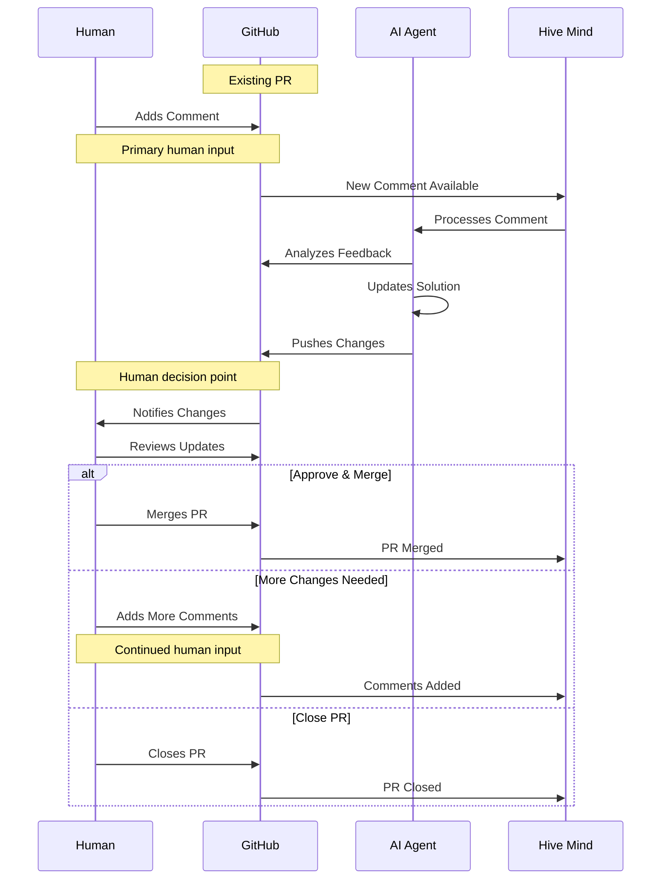

[](https://npmjs.com/@link-assistant/hive-mind)
[](https://github.com/link-assistant/hive-mind/blob/main/LICENSE)
[](https://github.com/link-assistant/hive-mind/stargazers)

[](https://gitpod.io/#https://github.com/link-assistant/hive-mind)
[](https://github.com/codespaces/new?hide_repo_select=true&ref=main&repo=link-assistant/hive-mind)

# Hive Mind 🧠 (languages: en • [zh](README.zh.md) • [hi](README.hi.md) • [ru](README.ru.md))

**The master mind AI that controls hive of AI.** The orchestrator AI that controls AIs. The HIVE MIND. The SWARM MIND.

It is also possible to connect this AI to collective human intelligence, meaning this system can communicate with humans for requirements, expertise, feedback.

[](https://github.com/konard/problem-solving)

Inspired by [konard/problem-solving](https://github.com/konard/problem-solving)

## Why Hive Mind?

**Hive Mind is the most autonomous, cloud-ready AI issue solver that eliminates developer babysitting while maintaining human oversight on critical decisions.**

Hive Mind is a **generalist AI** (mini-AGI) capable of working on a wide range of tasks - not just programming. Almost anything that can be done with files in a repository can be automated.

| Feature                      | What It Means For You                                                                                                                                                      |
| ---------------------------- | -------------------------------------------------------------------------------------------------------------------------------------------------------------------------- |
| **No Babysitting**           | Full autonomous mode with sudo access. AI has creative freedom like a real programmer.                                                                                     |
| **Cloud Isolation**          | Runs on dedicated VMs or Docker. Easy to restore if broken.                                                                                                                |
| **Full Internet + Sudo**     | AI can install packages, fetch docs, and configure the system as needed.                                                                                                   |
| **Pre-installed Toolchain**  | 25GB+ ready: 10 language runtimes, 2 theorem provers, build tools. Can install more.                                                                                       |
| **Token Efficiency**         | Routine tasks automated in code, so AI tokens focus on creative problem-solving.                                                                                           |
| **Time Freedom**             | What takes humans 2-8 hours, AI completes each working session in 10-25 minutes. Mass execution of tasks in repository is possible. "The code is written while you sleep." |
| **Scale with Orchestration** | Parallel workers feel like a team of developers. Pair Claude MAX and ChatGPT Pro ($200 each) for two independent unlimited budgets.                                        |
| **Human Control**            | AI creates draft PRs - you decide what merges. Quality gates where they matter.                                                                                            |
| **Any Device Programming**   | Manage AI from any device with `/solve` and `/hive` via Telegram bot. No PC, IDE, or laptop required.                                                                      |
| **100% Open Source**         | Unlicense (public domain). Full transparency, no vendor lock-in.                                                                                                           |

**Cost**: Hive Mind supports two $200/month subscriptions as full-featured "unlimited" options:

| Subscription                                                       | Pairs with `--tool` | Default model | Best for                                                |
| ------------------------------------------------------------------ | ------------------- | ------------- | ------------------------------------------------------- |
| **Anthropic Claude MAX** (~$200/month, often 50% off = $400 value) | `claude` (default)  | Sonnet/Haiku  | Highest creativity, strongest general code reasoning    |
| **OpenAI ChatGPT Pro** ($200/month, includes Codex)                | `codex`             | `gpt-5.5`     | Strong deterministic refactors and fast iteration loops |

Both tools can be combined in the same hive. Workers can run different tools in parallel, and `/codex` or `/solve --tool codex` routes tasks to ChatGPT Pro while the default routes to Claude MAX. There is no requirement to pick one: either single subscription is enough to operate, and using both unlocks per-tool/model concurrency mode (#1474).

Hive Mind has high creativity indistinguishable from average programmers. It asks questions if requirements are unclear, and you can clarify on the go via PR comments.

For the project's vision and example user journeys, see [docs/VISION.md](./docs/VISION.md). For detailed features and comparisons, see [docs/FEATURES.md](./docs/FEATURES.md) and [docs/COMPARISON.md](./docs/COMPARISON.md).

## ⚠️ WARNING

It is UNSAFE to run this software on your developer machine.

It is recommended to use Docker for installation (both locally and on servers). See the [Docker installation](#using-docker) section below.

This software runs supported AI tools such as Claude Code and Codex in full autonomous mode, which means they are free to execute any commands they see fit.

That means it can lead to unexpected side effects.

There is also a known issue of space leakage. So you need to make sure you are able to reinstall your virtual machine to clear space and/or any damage to the virtual machine.

### ⚠️ CRITICAL: Token and Sensitive Data Security

**THIS SOFTWARE CANNOT GUARANTEE ANY SAFETY FOR YOUR TOKENS OR OTHER SENSITIVE DATA ON THE VIRTUAL MACHINE.**

There are infinite ways to extract tokens from a virtual machine connected to the internet. This includes but is not limited to:

- **Claude MAX tokens** and/or **ChatGPT Pro (Codex) tokens** - Required for AI operations; you can run with either or both
- **GitHub tokens** - Required for repository access
- **API keys and credentials** - Any sensitive data on the system

**IMPORTANT SECURITY CONSIDERATIONS:**

- Running on a developer machine is **ABSOLUTELY UNSAFE**
- Running on a virtual machine is **LESS UNSAFE** but still has risks
- Even though your developer machine data isn't directly exposed, the VM still contains sensitive tokens
- Any token stored on an internet-connected system can potentially be compromised

**USE THIS SOFTWARE ENTIRELY AT YOUR OWN RISK AND RESPONSIBILITY.**

We strongly recommend:

- Using dedicated, isolated virtual machines
- Rotating tokens regularly
- Monitoring token usage for suspicious activity
- Never using production tokens or credentials
- Being prepared to revoke and replace all tokens used with this system

Minimum system requirements to run `hive.mjs`:

```
1 CPU Core
1 GB RAM
> 4 GB SWAP
50 GB disk space
```

## 🚀 Quick Start

### Global Installation

#### Using Bun (Recommended)

```bash
bun install -g @link-assistant/hive-mind
```

#### Using Node.js

```bash
npm install -g @link-assistant/hive-mind
```

### Installing Docker

If you don't have Docker installed yet, follow these steps to install Docker Engine on Ubuntu:

```bash
# Install prerequisites
sudo apt update
sudo apt install ca-certificates curl

# Add Docker's official GPG key
sudo install -m 0755 -d /etc/apt/keyrings
sudo curl -fsSL https://download.docker.com/linux/ubuntu/gpg -o /etc/apt/keyrings/docker.asc
sudo chmod a+r /etc/apt/keyrings/docker.asc

# Add Docker repository
sudo tee /etc/apt/sources.list.d/docker.sources <<EOF
Types: deb
URIs: https://download.docker.com/linux/ubuntu
Suites: $(. /etc/os-release && echo "${UBUNTU_CODENAME:-$VERSION_CODENAME}")
Components: stable
Signed-By: /etc/apt/keyrings/docker.asc
EOF

# Install Docker
sudo apt update
sudo apt install docker-ce docker-ce-cli containerd.io docker-buildx-plugin docker-compose-plugin

# Verify installation
sudo docker run hello-world
```

**For other operating systems** or detailed instructions, see the [official Docker documentation](https://docs.docker.com/engine/install/).

### Using Docker

Run the Hive Mind using Docker for safer local installation - no manual setup required:

**Note:** Docker is much safer for local installation and can be used to install multiple isolated instances on a server or Kubernetes cluster. For Kubernetes deployments, see the [Helm chart installation](#helm-installation-kubernetes-experimental) section below.

```bash
# Pull the latest image from Docker Hub
docker pull konard/hive-mind:latest

# Start hive-mind container
docker run -dit --name hive-mind konard/hive-mind:latest

# Verify container started
docker ps -a

# Enter additional terminal process to do installation
docker exec -it hive-mind /bin/bash

# Inside the container, authenticate with GitHub
gh-setup-git-identity

# Authenticate with Claude (if you have Claude MAX)
claude

# Optionally set configuration like this:
# Use /config command and set:
# Reduce motion                             true # Will save your ssh trafic, and make Claude Code more responsive (less latency)
# Thinking mode                             false # Anthropic models perform better and cheaper without thinking
# Model                                     haiku # chepear for connection testing manually
# Claude in Chrome enabled by default       false # No need for Chrome support on server

# Optionally test Claude connection
claude -p hi --model haiku

# Authenticate with Codex (if you have ChatGPT Pro)
codex login --device-auth

# Optionally test Codex connection. codex exec refuses to run unless
# either cwd is a git repo it trusts or --skip-git-repo-check is passed.
# It prints the refusal to STDOUT but still exits 0, so do not skip the flag.
codex exec --skip-git-repo-check --model gpt-5.4-mini "reply with only OK"

# Verify Playwright MCP is registered for both CLIs in this container image
claude mcp list | grep playwright
codex mcp list | grep playwright

# You might need to update hive-mind and agent to latest versions:
bun install -g @link-assistant/hive-mind
bun install -g @link-assistant/agent

# Now you can use hive and solve commands
solve https://github.com/owner/repo/issues/123

# Or you can run telegram bot:

# Exit from additional bash session
exit

# Attach to main bash process
docker attach hive-mind

# Run bot here

# Press Ctrl + P, Ctrl + Q to detach without destroying the container (no stopping of main bash process)

# --- Persisting auth data across restarts ---

# On the host, create the directories used by the current Docker workflow:
mkdir -p /root/.hive-mind/claude /root/.hive-mind/codex /root/.hive-mind/gh
touch -a /root/.hive-mind/claude.json

# In our Docker images HOME=/home/box, so Codex stores its data in /home/box/.codex.
# Mount the full Codex directory so auth.json, config.toml, and sessions survive restarts.
docker run -dit --user box --name hive-mind --restart unless-stopped \
  -v /root/.hive-mind/claude:/home/box/.claude \
  -v /root/.hive-mind/codex:/home/box/.codex \
  -v /root/.hive-mind/claude.json:/home/box/.claude.json \
  -v /root/.hive-mind/gh:/home/box/.config/gh \
  konard/hive-mind:latest bash -l -c 'bash /home/box/start-bot.sh'

# After the first start, fix ownership to match the box user inside the container:
BOX_UID=$(docker exec hive-mind id -u box)
chown -R $BOX_UID:$BOX_UID /root/.hive-mind/claude /root/.hive-mind/codex /root/.hive-mind/gh
chown $BOX_UID:$BOX_UID /root/.hive-mind/claude.json

# Important: mounted ~/.codex data overrides the image-baked Codex config.
# If the host directory was created before Playwright MCP was added to the image,
# re-register it once inside the running container:
docker exec -it hive-mind bash -lc 'codex mcp list && codex mcp add playwright -- npx -y @playwright/mcp@latest --isolated --headless --no-sandbox --timeout-action=600000 --viewport-size 1920x1080'
```

**Benefits of Docker:**

- ✅ Pre-configured Ubuntu 24.04 environment
- ✅ All dependencies pre-installed
- ✅ Isolated from your host system
- ✅ Easy to run multiple instances with different GitHub accounts
- ✅ Consistent environment across different machines

The Docker image itself now registers Playwright MCP for both Claude and Codex during build, and CI verifies those registrations in the built container. If `codex mcp list` is still empty in a running container, the usual cause is not the published image itself but a mounted `/home/box/.codex` directory from the host that replaces the image's default Codex configuration.

See [docs/DOCKER.md](./docs/DOCKER.md) for advanced Docker usage.

#### Stoping and removing docker container

```
# Attach to main docker process to stop the container
docker attach hive-mind

^C # stop the telegram bot

exit # exit/stop the container

docker ps -a # show list of docker containers
# CONTAINER ID   IMAGE                     COMMAND       CREATED      STATUS                        PORTS     NAMES
# fd0fd4470ec3   konard/hive-mind:latest   "/bin/bash"   5 days ago   Exited (130) 16 seconds ago             hive-mind


df -h # check disk space
# Filesystem      Size  Used Avail Use% Mounted on
# tmpfs           1.2G  1.1M  1.2G   1% /run
# /dev/sda1        96G   87G  9.8G  90% /
# tmpfs           5.9G     0  5.9G   0% /dev/shm
# tmpfs           5.0M     0  5.0M   0% /run/lock
# /dev/sda16      881M  117M  703M  15% /boot
# /dev/sda15      105M  6.2M   99M   6% /boot/efi
# tmpfs           1.2G   12K  1.2G   1% /run/user/0

docker rm hive-mind # remove docker container frees space used by the container, does not delete image

df -h # check disk space (to confirm space is freed)
# Filesystem      Size  Used Avail Use% Mounted on
# tmpfs           1.2G  1.1M  1.2G   1% /run
# /dev/sda1        96G   26G   71G  27% /
# tmpfs           5.9G     0  5.9G   0% /dev/shm
# tmpfs           5.0M     0  5.0M   0% /run/lock
# /dev/sda16      881M  117M  703M  15% /boot
# /dev/sda15      105M  6.2M   99M   6% /boot/efi
# tmpfs           1.2G   12K  1.2G   1% /run/user/0
```

### Helm Installation (Kubernetes) (Experimental)

> ⚠️ **EXPERIMENTAL:** The Helm/Kubernetes installation method is experimental and may not be fully stable.
>
> For a more reliable installation, we recommend using [Docker](#using-docker) instead.
>
> See [docs/HELM.md](./docs/HELM.md) for the full Helm installation instructions and configuration options.

### Installation on Ubuntu 24.04 server (Deprecated)

> ⚠️ **DEPRECATED:** This installation method is no longer recommended.
>
> **We now recommend using Docker for all installations**, both on developer machines and servers.
> Docker provides better isolation, easier management, and consistent environments.
>
> Please use the [Docker installation method](#using-docker) above.
> For Kubernetes deployments, see the [Helm installation](#helm-installation-kubernetes-experimental) section.
>
> The legacy bare-metal installation instructions have been moved to [docs/UBUNTU-SERVER.md](./docs/UBUNTU-SERVER.md) for reference.

### Core Operations

```bash
# Solve using maximum power
solve https://github.com/Veronika89-lang/index.html/issues/1 --attach-logs --verbose --model opus --think max

# Solve GitHub issues automatically
solve https://github.com/owner/repo/issues/123 --model sonnet

# Solve issue with PR to custom branch (manual fork mode)
solve https://github.com/owner/repo/issues/123 --base-branch develop --fork

# Continue working on existing PR
solve https://github.com/owner/repo/pull/456 --model opus

# Resume from Claude session when limit is reached
solve https://github.com/owner/repo/issues/123 --resume session-id

# Start hive orchestration (monitor and solve issues automatically)
hive https://github.com/owner/repo --monitor-tag "help wanted" --concurrency 3

# Monitor all issues in organization
hive https://github.com/microsoft --all-issues --max-issues 10

# Run collaborative review process
review --repo owner/repo --pr 456

# Multiple AI reviewers for consensus
./reviewers-hive.mjs --agents 3 --consensus-threshold 0.8
```

## 📋 Core Components

| Script                                      | Purpose                       | Key Features                                                             |
| ------------------------------------------- | ----------------------------- | ------------------------------------------------------------------------ |
| `solve.mjs` (stable)                        | GitHub issue solver           | Auto fork, branch creation, PR generation, resume sessions, fork support |
| `hive.mjs` (stable)                         | AI orchestration & monitoring | Multi-repo monitoring, concurrent workers, issue queue management        |
| `review.mjs` (alpha)                        | Code review automation        | Collaborative AI reviews, automated feedback                             |
| `reviewers-hive.mjs` (alpha / experimental) | Review team management        | Multi-agent consensus, reviewer assignment                               |
| `telegram-bot.mjs` (stable)                 | Telegram bot interface        | Remote command execution, group chat support, diagnostic tools           |

## 🔧 solve Options

```bash
solve <issue-url> [options]
```

**Most frequently used options:**

| Option          | Alias | Description                             | Default   |
| --------------- | ----- | --------------------------------------- | --------- |
| `--model`       | `-m`  | AI model to use (sonnet, opus, haiku)   | sonnet    |
| `--think`       |       | Thinking level (low, medium, high, max) | -         |
| `--base-branch` | `-b`  | Target branch for PR                    | (default) |

**Other useful options:**

| Option                   | Alias | Description                                            | Default |
| ------------------------ | ----- | ------------------------------------------------------ | ------- |
| `--tool`                 |       | AI tool (claude, opencode, codex, agent, qwen, gemini) | claude  |
| `--verbose`              | `-v`  | Enable verbose logging                                 | false   |
| `--attach-logs`          |       | Attach logs to PR (⚠️ may expose sensitive data)       | false   |
| `--auto-init-repository` |       | Auto-initialize empty repos (creates README.md)        | false   |
| `--help`                 | `-h`  | Show all available options                             | -       |

> **📖 Full options list**: See [docs/CONFIGURATION.md](./docs/CONFIGURATION.md#solve-options) for all available options including forking, auto-continue, watch mode, and experimental features.

## 🔧 hive Options

```bash
hive <github-url> [options]
```

**Most frequently used options:**

| Option         | Alias | Description                             | Default |
| -------------- | ----- | --------------------------------------- | ------- |
| `--model`      | `-m`  | AI model to use (sonnet, opus, haiku)   | sonnet  |
| `--think`      |       | Thinking level (low, medium, high, max) | -       |
| `--all-issues` | `-a`  | Monitor all issues (ignore labels)      | false   |
| `--once`       |       | Single run (don't monitor continuously) | false   |

**Other useful options:**

| Option                   | Alias | Description                                            | Default |
| ------------------------ | ----- | ------------------------------------------------------ | ------- |
| `--tool`                 |       | AI tool (claude, opencode, codex, agent, qwen, gemini) | claude  |
| `--concurrency`          | `-c`  | Number of parallel workers                             | 2       |
| `--skip-issues-with-prs` | `-s`  | Skip issues with existing PRs                          | false   |
| `--verbose`              | `-v`  | Enable verbose logging                                 | false   |
| `--attach-logs`          |       | Attach logs to PRs (⚠️ may expose sensitive data)      | false   |
| `--help`                 | `-h`  | Show all available options                             | -       |

> **📖 Full options list**: See [docs/CONFIGURATION.md](./docs/CONFIGURATION.md#hive-options) for all available options including project monitoring, YouTrack integration, and experimental features.

## 🤖 Telegram Bot

The Hive Mind includes a Telegram bot interface (SwarmMindBot) for remote command execution.

### 🚀 Test Drive

Want to see the Hive Mind in action? Request a free demo or get faster support by messaging the developer directly on Telegram:

**[Message @drakonard on Telegram](https://t.me/drakonard)**

### Setup

1. **Get Bot Token**
   - Talk to [@BotFather](https://t.me/BotFather) on Telegram
   - Create a new bot and get your token
   - Add the bot to your group chat and make it an admin

2. **Configure Environment**

   ```bash
   # Copy the example configuration
   cp .env.example .env

   # Edit and add your bot token
   echo "TELEGRAM_BOT_TOKEN=your_bot_token_here" >> .env

   # Optional: Restrict to specific chats
   # Get chat ID using /help command, then add:
   echo "TELEGRAM_ALLOWED_CHATS=123456789,987654321" >> .env
   ```

3. **Start the Bot**

   ```bash
   hive-telegram-bot
   ```

   **Recommended: Capture logs with tee**

   When running the bot for extended periods, it's recommended to capture logs to a file using `tee`. This ensures you can review logs later even if the terminal buffer overflows:

   ```bash
   hive-telegram-bot 2>&1 | tee -a logs/bot-$(date +%Y%m%d).log
   ```

   Or create a logs directory and start with automatic log rotation:

   ```bash
   mkdir -p logs
   hive-telegram-bot 2>&1 | tee -a "logs/bot-$(date +%Y%m%d-%H%M%S).log"
   ```

   **Experimental: live terminal watch**

   ```bash
   hive-telegram-bot --auto-start-screen-watch-message
   ```

   This opt-in flag starts a separate live terminal message for public `/solve`
   sessions. Private or unknown-visibility repositories never auto-start a
   watch message.

### Bot Commands

Most operational commands work in **group chats only** (not in private messages with the bot). Commands that intentionally deliver private updates, such as `/terminal_watch`, may also be used in direct messages:

#### `/solve` - Solve GitHub Issues

```
/solve <github-url> [options]

Examples:
/solve https://github.com/owner/repo/issues/123 --model sonnet
/solve https://github.com/owner/repo/issues/123 --model opus --think max

Aliases:
/do and /continue are equivalent to /solve
/claude is equivalent to /solve --tool claude
/codex is equivalent to /solve --tool codex
/opencode is equivalent to /solve --tool opencode
/agent is equivalent to /solve --tool agent
/qwen is equivalent to /solve --tool qwen
/gemini is equivalent to /solve --tool gemini

Tool alias examples:
/codex https://github.com/owner/repo/issues/123 --model gpt-5.5
/opencode https://github.com/owner/repo/issues/123 --model grok-code-fast-1
/agent https://github.com/owner/repo/issues/123 --model nemotron-3-super-free
/gemini https://github.com/owner/repo/issues/123 --model flash
/qwen https://github.com/owner/repo/issues/123 --model qwen3-coder-plus
/gemini https://github.com/owner/repo/issues/123 --model gemini-2.5-flash

Free Models (with --tool agent):
/solve https://github.com/owner/repo/issues/123 --tool agent --model nemotron-3-super-free
/solve https://github.com/owner/repo/issues/123 --tool agent --model opencode/nemotron-3-super-free
/solve https://github.com/owner/repo/issues/123 --tool agent --model minimax-m2.5-free
/solve https://github.com/owner/repo/issues/123 --tool agent --model gpt-5-nano

Free Models via Kilo Gateway (with --tool agent):
/solve https://github.com/owner/repo/issues/123 --tool agent --model kilo/glm-5-free
/solve https://github.com/owner/repo/issues/123 --tool agent --model kilo/glm-4.5-air-free
/solve https://github.com/owner/repo/issues/123 --tool agent --model kilo/deepseek-r1-free
```

Current tool defaults in Hive Mind:

| Tool       | Default model                                               | Default reasoning behavior                                                               |
| ---------- | ----------------------------------------------------------- | ---------------------------------------------------------------------------------------- |
| `claude`   | `sonnet`                                                    | No extra thinking is requested unless you pass `--think` or `--thinking-budget`          |
| `codex`    | `gpt-5.5` preferred, with runtime fallback to local catalog | Codex runs with `reasoning_effort=none` unless you pass `--think` or `--thinking-budget` |
| `opencode` | `grok-code-fast-1`                                          | No extra thinking prompt is added for the default model                                  |
| `agent`    | `nemotron-3-super-free`                                     | No extra thinking prompt is added for the default model                                  |
| `gemini`   | `flash`                                                     | No extra thinking prompt is added for the default model                                  |
| `qwen`     | `qwen3-coder-plus`                                          | No extra thinking prompt is added for the default model                                  |
| `gemini`   | `gemini-2.5-flash`                                          | No extra thinking prompt is added for the default model                                  |

See [docs/CONFIGURATION.md](./docs/CONFIGURATION.md) for the full per-tool defaults and reasoning mappings.

> **📖 Free Models Guide**: See [docs/FREE_MODELS.md](./docs/FREE_MODELS.md) for comprehensive information about all free models including OpenCode Zen and Kilo Gateway providers.

#### `/hive` - Run Hive Orchestration

```
/hive <github-url> [options]

Examples:
/hive https://github.com/owner/repo
/hive https://github.com/owner/repo --all-issues --max-issues 10
/hive https://github.com/microsoft --all-issues --concurrency 3
```

#### `/limits` - Show Usage Limits

```
/limits

Shows:
- CPU usage and load average
- RAM usage (used vs total)
- Disk space usage
- GitHub API rate limits
- Claude usage limits (session and weekly)
```

#### `/terminal_watch` - Live Session Log

```
/terminal_watch <uuid> [--size 120x25]

Examples:
/terminal_watch 4d934f71-4cdb-4b8c-b474-582116d12c12
/terminal_watch 4d934f71-4cdb-4b8c-b474-582116d12c12 --width 100 --height 20
```

You can also reply to a bot session message with `/terminal_watch`. The command
updates a separate Telegram message with the latest lines from the session log
reported by `$ --status <uuid>` and attaches the full log file when the session
finishes. Public repository logs can be watched in the chat; private or
unknown-visibility repository logs are delivered by direct message only.

#### `/help` - Get Help and Diagnostic Info

```
/help

Shows:
- Chat ID (needed for TELEGRAM_ALLOWED_CHATS)
- Chat type
- Available commands
- Usage examples
```

### Features

- ✅ **Group Chat Execution**: `/solve` and `/hive` workflows run from authorized group chats
- ✅ **Full Options Support**: All command-line options work in Telegram
- ✅ **Screen Sessions**: Commands run in detached screen sessions
- ✅ **Live Terminal Watch**: `/terminal_watch` and opt-in auto-start show live session logs
- ✅ **Chat Restrictions**: Optional whitelist of allowed chat IDs
- ✅ **Private Auth Check**: Experimental `/auth --status <gh|claude|codex>` and `/auth --login <gh|claude|codex>` for owners of allowlisted chats
- ✅ **Diagnostic Tools**: Get chat ID and configuration info

#### Live Terminal Watch

When enabled with `--auto-start-screen-watch-message`, the bot automatically starts a separate live terminal watch message for public `/solve` sessions:

- **Manual Watch**: `/terminal_watch <uuid>` or reply with `/terminal_watch`
- **Real-time Updates**: See live session log output as commands execute
- **Auto-freeze**: Message freezes when command completes
- **Log Attachment**: Full logs attached automatically when session ends
- **Security**: Auto-start is disabled for private or unknown-visibility repositories
- **Smart Updates**: Only updates when actual changes detected (rate-limited to avoid API limits)

### Security Notes

- Only works in group chats where the bot is admin
- Optional chat ID restrictions via `TELEGRAM_ALLOWED_CHATS`
- Private `/auth` is disabled unless `TELEGRAM_ALLOWED_CHATS` is set and only
  owners of listed chats can use it
- Commands run as the system user running the bot
- Ensure proper authentication (`gh auth login`, `claude-profiles`)

## 🏆 Best Practices

Hive Mind works even better when repositories have strong CI/CD pipelines and clear issue requirements. See:

- [BEST-PRACTICES.md](./docs/BEST-PRACTICES.md) — Universal prompts, issue writing guidelines, architecture improvement, and subagent patterns
- [CI-CD-BEST-PRACTICES.md](./docs/CI-CD-BEST-PRACTICES.md) — CI/CD pipeline setup, recommended templates, and enforcement strategies

Key benefits of proper CI/CD:

- AI solvers iterate until all checks pass
- Consistent quality regardless of human/AI team composition
- File size limits ensure code is readable by both AI and humans

Ready-to-use templates are available for JavaScript, Rust, Python, Go, C#, and Java.

## 🏗️ Architecture

The Hive Mind operates on three layers:

1. **Orchestration Layer** (`hive.mjs`) - Coordinates multiple AI agents
2. **Execution Layer** (`solve.mjs`, `review.mjs`) - Performs specific tasks
3. **Human Interface Layer** - Enables human-AI collaboration

### Data Flow

#### Mode 1: Issue → Pull Request Flow



#### Mode 2: Pull Request → Comments Flow



📖 **For comprehensive data flow documentation including human feedback integration points, see [docs/flow.md](./docs/flow.md)**

## 📊 Usage Examples

### Automated Issue Resolution

```bash
# Solve issue (automatically forks if no write access)
solve https://github.com/owner/repo/issues/123 --model opus

# Manual fork and solve issue (works for both public and private repos)
solve https://github.com/owner/repo/issues/123 --fork --model opus

# Continue work on existing PR
solve https://github.com/owner/repo/pull/456 --verbose

# Solve with detailed logging and solution attachment
solve https://github.com/owner/repo/issues/123 --verbose --attach-logs

# Dry run to see what would happen
solve https://github.com/owner/repo/issues/123 --dry-run
```

### Multi-Repository Orchestration

```bash
# Monitor single repository with specific label
hive https://github.com/owner/repo --monitor-tag "bug" --concurrency 4

# Monitor all issues in an organization
hive https://github.com/microsoft --all-issues --max-issues 20 --once

# Monitor user repositories with high concurrency
hive https://github.com/username --all-issues --concurrency 8 --interval 120

# Skip issues that already have PRs
hive https://github.com/org/repo --skip-issues-with-prs --verbose

# Auto-cleanup temporary files
hive https://github.com/org/repo --auto-cleanup --concurrency 5
```

### Session Management

```bash
# Resume when Claude hits limit
solve https://github.com/owner/repo/issues/123 --resume 657e6db1-6eb3-4a8d

# Continue session interactively in Claude Code
(cd /tmp/gh-issue-solver-123456789 && claude --resume session-id)
```

### Disk Cleanup

`hive-cleanup` frees disk space by removing stale hive-mind temporary
directories/files (per-task clones like `/tmp/gh-issue-solver-*`, MCP config
files, log download dirs, …) while **keeping folders that belong to
currently-running tasks**, protected system paths, and any clone with
uncommitted or unpushed work. It detects active tasks from running processes and
live isolation sessions and matches clones to tasks by branch name using the
same logic as `solve` (issue → `issue-{n}-{hex}`; PR → its resolved head
branch).

```bash
# Preview: list kept folders and folders that would be deleted (deletes nothing)
hive-cleanup --dry-run

# Actually delete stale temp artifacts (asks for confirmation first)
hive-cleanup

# Delete without the confirmation prompt
hive-cleanup --force

# Also consider non-hive-mind temp entries (more aggressive)
hive-cleanup --all --dry-run

# Allow deleting /tmp/start-command (kept by default; holds isolation logs)
hive-cleanup --force-start-command

# Ubuntu / system cleanup (apt caches, journald logs, npm cache)
hive-cleanup --system --sudo

# Map live/stuck agent PIDs back to hive/start-command task sessions
hive-cleanup --processes

# Trace a specific non-agent PID, for example a browser child or shell
hive-cleanup --pid 94445

# Preview orphaned terminal-session agents that can be stopped
hive-cleanup --kill-orphaned-agents --dry-run

# Stop orphaned agent process trees after reviewing the preview
hive-cleanup --kill-orphaned-agents --force

# Disable active-task detection (only protected paths are kept)
hive-cleanup --no-keep-active-tasks-folders --dry-run
```

Run `hive-cleanup --help` for the full list of options. The command is dry-run
friendly and writes a timestamped `cleanup-*.log` for every run. Process
diagnostic output redacts common token shapes before printing command lines.

## 🔍 Monitoring & Logging

Find resume commands in logs:

```bash
grep -E '\(cd /tmp/gh-issue-solver-[0-9]+ && claude --resume [0-9a-f-]{36}\)' hive-*.log
```

## 🔧 Configuration

**Authentication:**

- `gh auth login` - GitHub CLI authentication
- `claude-profiles` - Claude authentication profile migration to server

**OpenRouter Integration:**

Use OpenRouter to access 500+ AI models from 60+ providers with a single API key. See [docs/OPENROUTER.md](./docs/OPENROUTER.md) for setup instructions covering both Claude Code CLI and @link-assistant/agent.

**Environment Variables & Advanced Options:**

For comprehensive configuration including environment variables, timeouts, retry limits, Telegram bot settings, YouTrack integration, and all CLI options, see [docs/CONFIGURATION.md](./docs/CONFIGURATION.md).

## 🐛 Reporting Issues

### Hive Mind Issues

If you encounter issues with **Hive Mind** (this project), please report them on our GitHub Issues page:

- **Repository**: https://github.com/link-assistant/hive-mind
- **Issues**: https://github.com/link-assistant/hive-mind/issues

### Claude Code CLI Issues

If you encounter issues with the **Claude Code CLI** itself (e.g., `claude` command errors, installation problems, or CLI bugs), please report them to the official Claude Code repository:

- **Repository**: https://github.com/anthropics/claude-code
- **Issues**: https://github.com/anthropics/claude-code/issues

## 🛡️ File Size Enforcement

All documentation files are automatically checked:

```bash
find docs/ -name "*.md" -exec wc -l {} + | awk '$1 > 1000 {print "ERROR: " $2 " has " $1 " lines (max 1000)"}'
```

## Server diagnostics

Prefer the built-in process diagnostic command when connecting a busy
`claude`, `codex`, `gemini`, `qwen`, or `opencode` PID back to the hive task
that launched it:

```bash
# Show agent PIDs, start-command session IDs, GitHub task URLs, workspaces,
# match reasons, and possible orphaned terminal-session agents.
hive-cleanup --processes

# Include an arbitrary PID in the same report.
hive-cleanup --pid 62220

# Kill only agents whose matched start-command task is already terminal.
hive-cleanup --kill-orphaned-agents --dry-run
hive-cleanup --kill-orphaned-agents --force
```

Manual fallback: identify screens that are parents of processes that are eating
the resources.

```bash
TARGETS="62220 65988 63094 66606 1028071 4127023"

# build screen PID -> session name map
declare -A NAME
while read -r id; do spid=${id%%.*}; NAME[$spid]="$id"; done \
  < <(screen -ls | awk '/(Detached|Attached)/{print $1}')

# check each PID's environment for STY and map back to session
for p in $TARGETS; do
  sty=$(tr '\0' '\n' < /proc/$p/environ 2>/dev/null | awk -F= '$1=="STY"{print $2}')
  if [ -n "$sty" ]; then
    spid=${sty%%.*}
    echo "$p  ->  ${NAME[$spid]:-$sty}"
  else
    echo "$p  ->  (no STY; not from screen or env cleared / double-forked)"
  fi
done
```

Show details about the proccess

```bash
procinfo() {
  local pid=$1
  if [ -z "$pid" ]; then
    echo "Usage: procinfo <pid>"
    return 1
  fi
  if [ ! -d "/proc/$pid" ]; then
    echo "Process $pid not found."
    return 1
  fi

  echo "=== Process $pid ==="
  # Basic process info
  ps -p "$pid" -o user=,uid=,pid=,ppid=,c=,stime=,etime=,tty=,time=,cmd=

  echo
  # Working directory
  echo "CWD: $(readlink -f /proc/$pid/cwd 2>/dev/null)"

  # Executable path
  echo "EXE: $(readlink -f /proc/$pid/exe 2>/dev/null)"

  # Root directory of the process
  echo "ROOT: $(readlink -f /proc/$pid/root 2>/dev/null)"

  # Command line (full, raw)
  echo "CMDLINE:"
  tr '\0' ' ' < /proc/$pid/cmdline 2>/dev/null
  echo

  # Environment variables
  echo
  echo "ENVIRONMENT (key=value):"
  tr '\0' '\n' < /proc/$pid/environ 2>/dev/null | head -n 20

  # Open files (first few)
  echo
  echo "OPEN FILES:"
  ls -l /proc/$pid/fd 2>/dev/null | head -n 10

  # Child processes
  echo
  echo "CHILDREN:"
  ps --ppid "$pid" -o pid=,cmd= 2>/dev/null
}
procinfo 62220
```

## Maintenance

### Enter latest screen

```bash
s=$(screen -ls | awk '/Detached/ {print $1; exit}'); echo "Entering $s"; screen -r "$s"; echo "Left $s";
```

### Enter oldest screen

```bash
s=$(screen -ls | awk '/Detached/ {last=$1} END{print last}'); echo "Entering $s"; screen -r "$s"; echo "Left $s";
```

### Script for managing screens

The legacy `hive-screens.sh` script has been promoted to a first-class command:
`hive-screens`. It ships with `@link-assistant/hive-mind`, so once the package is
installed (globally, through `npx`, or in a project) it is available on `PATH`.

It scans detached GNU screen sessions, looks for solve runs that are done and
mergeable (scrollback contains both `process completed` and `PR is mergeable!`
or `PR merged!`), and then either lists, enters, or closes them. `--list`,
`--enter`, and `--close` share the **same matching predicate**, so anything
you see under `--list` is guaranteed to be the same set `--close` will act on
— use `--list` first to debug, then rerun with `--close`.

```bash
# Safe preview — show every finished, mergeable solve session.
hive-screens --list

# Close the oldest finished session (same as the legacy script's default).
hive-screens --close

# Attach to the newest finished session.
hive-screens --enter --newest

# Close every finished session.
hive-screens --close --all

# Print diagnostic output while scanning (useful when matching fails).
hive-screens --list --verbose
```

`--list` defaults to `--all` so a bare `hive-screens --list` shows every match.
`--enter` and `--close` default to `--oldest` because they are destructive.
Supply `--oldest`, `--newest`, or `--all` to override. Run
`hive-screens --help` for the full option list.

### Reboot server.

```bash
sudo reboot
```

That will remove all dangling unused proccesses and screens, which will in turn free the RAM and reduce CPU load. Also reboot may clear all temporary files, so next step can do nothing if reboot was done.

### Cleanup disk space.

```bash
df -h

rm -rf /tmp

df -h
```

These commands should be executed under `hive` user. If you have accidentally removed the `/tmp` folder itself under `root` user, you will need to restore it like this:

```bash
sudo mkdir -p /tmp
sudo chown root:root /tmp
sudo chmod 1777 /tmp
```

### Close all screens to free up RAM

```bash
# close all (Attached or Detached) sessions
screen -ls | awk '/(Detached|Attached)/{print $1}' \
| while read s; do screen -S "$s" -X quit; done

# remove any zombie sockets
screen -wipe

# verify
screen -ls
```

### Top with full arguments of each command

```bash
top -c
```

### See the full tree of processes

```bash
ps -eo pid,ppid,user,args --forest
```

or

```bash
ps axjf
```

### Kill process and its children

```bash
pkill -P 476729
```

### Kill all commands spawned by specific task

```bash
pkill -f gh-issue-solver-1773073065743
```

### Kill all headless browsers spawned by ms-playwright

```bash
pkill -f ms-playwright/chromium_headless_shell-1200
```

That can be done, but not recommended as reboot have better effect.

## 📄 License

Unlicense License - see [LICENSE](./LICENSE)

## 🤖 Contributing

This project uses AI-driven development. See [CONTRIBUTING.md](./docs/CONTRIBUTING.md) for human-AI collaboration guidelines.
