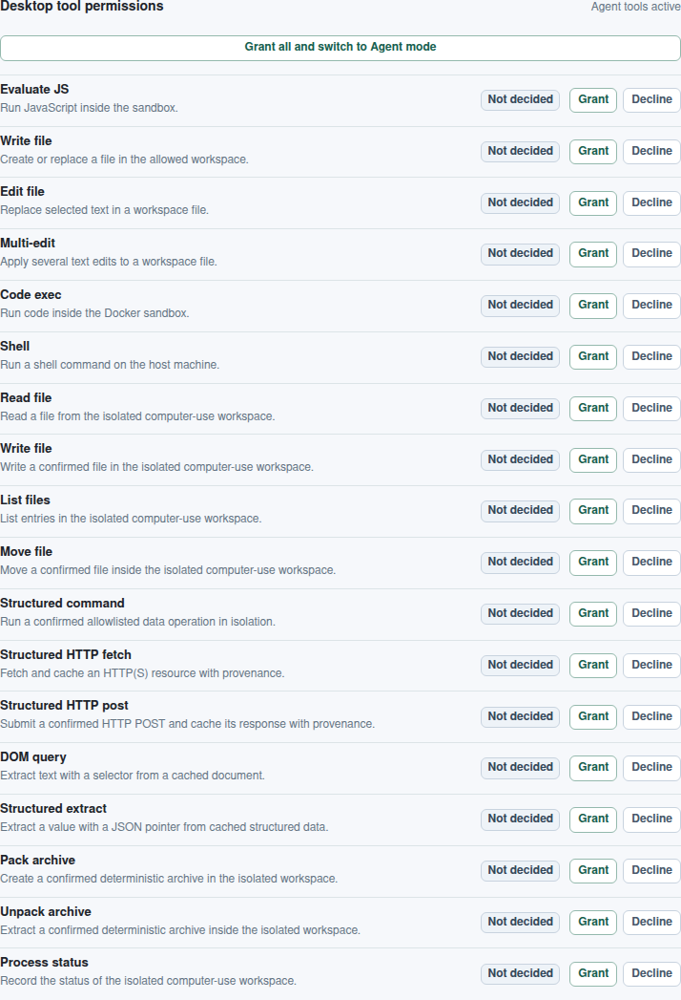

# Issue 707: verified computer use without vision

Issue [#707](https://github.com/link-assistant/formal-ai/issues/707) asks Formal
AI to perform general non-visual computer use through files, structured shell
operations, HTTP, DOM/JSON extraction, archives, and process status. Pull
request [#882](https://github.com/link-assistant/formal-ai/pull/882) delivers
the primitive layer, deterministic benchmark, cross-surface adapters, and
recorded external-Agent acceptance evidence.

## Root cause and boundary

Formal AI already exposed provider-specific file and command tools, but it did
not have one typed capability vocabulary shared by the universal planner, MCP,
CLI, and desktop. Consequently there was no closed loop joining a
natural-language request to permission checks, an isolated effect, independent
postcondition verification, and replayable provenance.

The implementation adds that loop without crossing the project's no-vision
boundary. It supports structured HTML and JSON. It does not render a page,
inspect pixels, or automate a GUI; those requests return the localized named
gap `gui_rendering`.

## Benchmark and licensing decision

The acceptance slice is ten self-authored tasks licensed under the repository's
Unlicense. No third-party benchmark prompt or answer was copied.

- [GAIA](https://huggingface.co/datasets/gaia-benchmark/GAIA) was excluded
  because access is gated and its dataset card did not provide a redistribution
  license at the time of review.
- [AgentBench](https://github.com/THUDM/AgentBench) is Apache-2.0 and its
  deterministic operating-system environment informed the test shape, but none
  of its task text was needed or reused.
- The wire and parsing boundaries follow the
  [MCP tools specification](https://modelcontextprotocol.io/specification/2025-06-18/server/tools),
  [WHATWG Fetch](https://fetch.spec.whatwg.org/),
  [WHATWG DOM](https://dom.spec.whatwg.org/), and the
  [W3C Selectors API](https://www.w3.org/TR/selectors-api/).

This decision keeps every committed fixture and expected answer freely
redistributable and makes the CI ratchet independent of live websites.

## Primitive and safety model

| Primitive family | Capabilities | Boundary |
| --- | --- | --- |
| Files | `fs.read/write/list/move` | Relative paths in native temporary or desktop per-plan workspaces; no absolute or parent traversal |
| Shell | `shell.run` | Structured allowlist only: line count, CSV filter, CSV unique |
| Web | `http.fetch/post` | Recorded fixtures in native CI; permission-gated HTTP(S) on desktop; cached SHA-256 provenance |
| Structured documents | `dom.query/extract` | Tag/id HTML query and JSON Pointer; no rendering |
| Archives | `archive.pack/unpack` | Deterministic `formal-ai-archive-v1`; confined entry paths |
| Process | `process.status` | Plan-local status only; no host process enumeration |

Every primitive has an isolation tag and a
`tool:computer:<primitive>` permission in seed data. Agent mode is required,
and each write, move, structured shell action, POST, pack, or unpack also
requires explicit confirmation. A step always emits exactly three events:
precondition, effect, and postcondition. A failed permission, input,
confirmation, effect, postcondition, or configured audit write makes the step
unverified.

## Ten-task ratchet

| Task | Plan |
| --- | --- |
| `active_customers` | write CSV → filter rows → read report |
| `first_open_order` | fetch JSON → JSON Pointer extract → read result |
| `page_title` | fetch HTML → query title → read result |
| `submit_form` | fetch HTML → query token → confirmed POST → read response |
| `count_lines` | write text → count lines → read report |
| `list_and_pack` | write two files → list → pack |
| `archive_round_trip` | write → pack → unpack → list restored files |
| `move_note` | write → move → list → read |
| `process_report` | record isolated status → read |
| `inventory_bundle` | fetch CSV → unique categories → pack → record status |

Each prompt exists in English, Russian, Hindi, and Chinese. The same seed parser
drives native orchestration and the agentic planner, so clients receive the same
primitive order and pre/postconditions.

## From ten recalled tasks to induced schemas

A ten-task ratchet proves the loop works; it does not prove the system *plans*.
Review of this pull request raised exactly that: an answer table that maps ten
prompts to ten plans is memorisation wearing a planner's clothes. So the ten
tasks were demoted from answers to evidence, and the plans are now induced from
them.

Induction (`src/computer_use/induction.rs`) partitions every recorded task into
a materialisation prefix, an operation body, and a verification suffix; the
partition follows from primitive kinds, never from the task id. It then
associates each seed operation cue with the step signature its examples share —
fields all examples agree on become constants, fields they differ on become
slots — and binds each resource to the steps that materialise it plus the
parameters that describe it. Two honesty rules govern the result: an operation
whose examples disagree on a signature is **rejected by name**, and a recorded
step no cue explains is reported as **unexplained residue**. The induced result
is committed at [`learned-schemas.lino`](learned-schemas.lino) and re-derived on
every CI run, so it cannot drift silently.

Synthesis (`src/computer_use/synthesis.rs`) then answers unseen requests by
chaining the learned schemas in the order the speaker named the operations,
binding each field from the source that owns it. Getting that binding wrong is
precisely how memorisation leaks back in, and four separate leaks were found
and closed while building the held-out slice:

| Leak | Symptom | Fix |
| --- | --- | --- |
| Operation constants carried resource state | `unique_values` learned `column = "category"` from the only inventory example and injected it into a customers plan | `selector`, `pointer`, `column`, and `equals` are resource-scoped: they come only from the resource binding, and a missing binding parameter yields no plan |
| Fields leaked across primitives | `archive.pack` carried a CSV `column`; `shell.run:count_lines` carried a filter it never applied | Two independent gates — the primitive's own advertised input schema must declare the field, *and* the learned operation schema must use it |
| Verification guessed a path it could not know | unpack verified `restored/out`, a path derived from the input rather than observed | An unpack observes its destination directory; entry paths inside an archive are not known before it is opened |
| Payload was read as instruction | a request to *write* a Links Notation record planned a computer-use run from an incidental `order "90"` and a quoted `list_files_arg` inside the content being written | Recognition runs over the instruction surface only: an indented line continues a structured block and a double-quoted span is a literal the speaker is quoting, so neither can name an operation. Both signals are structural, so no language is privileged |

The held-out ratchet
([`data/benchmarks/computer-use-generalization.lino`](../../../data/benchmarks/computer-use-generalization.lino))
is twelve requests × four languages, none of them in the recorded corpus. A test
asserts that absence directly, so the suite cannot decay into a second answer
table. Every case must synthesize (plan id prefixed `synthesized-`), the four
languages of a case must agree on one plan, and all 48 plans must execute in 48
distinct workspaces with every verification event passing. Widening this slice
is also what exposed the missing Russian locative and instrumental surfaces
(`заметках`, `клиентами`, `"страницы статуса"`): a real generalization gap in
the seed lexicon that ten fixed prompts could never have surfaced.

`cargo run --bin formal-ai -- computer-use --learn` prints the schemas, and
[`data/meta/computer-use-recipe.lino`](../../../data/meta/computer-use-recipe.lino)
records the ordered loop and the invariant each step preserves, grounded by
`tests/unit/specification/computer_use_meta_algorithm.rs`.

## Cross-surface evidence

| Requirement | Evidence |
| --- | --- |
| Seed taxonomy and environments | `data/seed/tools.lino`, `computer-use-tasks.lino`, and `environments.lino` |
| Native planner, isolation, execution, replay | `src/computer_use/` and `tests/issue_707_computer_use.rs` |
| MCP advertising and calls | `src/mcp.rs`, `tests/issue_707_mcp.rs`, and default-deny test |
| Universal chat/orchestrator plan | `src/agentic_coding/planner.rs` and planner parity test |
| Native CLI | `formal-ai computer-use` and its subprocess regression |
| Desktop | permission-gated per-plan workspace router, injected filesystem boundaries, UI tool options, and Node integration test |
| Four-language honest gap | seed responses plus exact locale regression |
| Ten real external-Agent record/replays | `agent-cli-evidence/computer-use/manifest.json`, phase JSONL, and the required release-workflow gate |
| Auto-learned schemas, no drift, no invention | `learned-schemas.lino` and `tests/issue_707_learning.rs` |
| Twelve held-out requests × four languages | `data/benchmarks/computer-use-generalization.lino` and `tests/issue_707_generalization.rs` |
| Held-out requests through the real external Agent CLI | `agent-cli-evidence/generalization/manifest.json` and its required release-workflow gate |
| Grounded meta-recipe | `data/meta/computer-use-recipe.lino` and `tests/unit/specification/computer_use_meta_algorithm.rs` |

The browser permission panel exposes the exact same twelve primitives as
individually grantable capabilities:



The external harness starts an agent-mode Formal AI server, configures the real
`@link-assistant/agent` 0.25.3 client as both OpenAI-compatible model client and
remote MCP client, and starts a fresh Agent session for each prompt. It then
restarts the server and repeats all ten. The verifier asserts:

1. each client stream has a native `ses_...` id and completion;
2. its exact MCP primitive sequence equals the seed plan;
3. every server-side step record is verified and has all three passing events;
4. record and replay sequences match; and
5. replay uses fresh external-client session ids.

Run it with:

```bash
cargo build --bin formal-ai
experiments/agent_cli_e2e/run_issue_707.sh
```

Focused deterministic checks are:

```bash
cargo test --test issue_707_seed_taxonomy
cargo test --test issue_707_computer_use
cargo test --test issue_707_mcp --test issue_707_mcp_denial
cargo test --test issue_707_learning
cargo test --test issue_707_generalization
node --test desktop/scripts/tool-router.test.mjs
```

## Timeline and authorship

- 2026-07-14: issue 707 defined the missing capability layer.
- 2026-07-30: issue/PR discussions and related work were reviewed; no issue
  comment or PR review changed the requirements.
- 2026-07-30: a real Agent CLI + Formal AI session authored the initial failing
  taxonomy regression before implementation.
- 2026-07-30: the primitive layer, ten-task ratchet, surfaces, localization, and
  real-Agent record/replay harness were implemented and verified.
- 2026-07-31: review asked for the ambitious reading of the issue — generalization
  rather than a ten-answer table. The recorded tasks were demoted to evidence,
  induction and synthesis were added, four memorisation leaks were found and
  closed, and a twelve-case held-out ratchet was added in four languages and
  through the external Agent CLI.

Self-authorship session `ses_04b692ed9ffeq4R6ehluc7r7nh` produced the original
test in
[`agent-cli-evidence/self-authorship`](agent-cli-evidence/self-authorship/).
The raw stream, generated file, plan, red test output, and Formal AI server log
are retained there. The initial test commit carries the matching
`Formal-AI-Session` and `Formal-AI-Evidence` trailers.

Source review metadata and research observations are preserved in
[`raw-data`](raw-data/).
