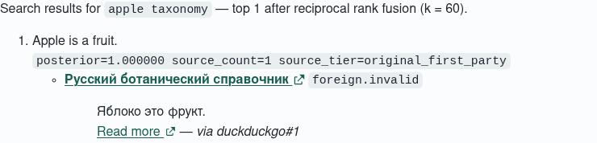

# Issue #709: Ranked Search Statements With Provenance

Issue [#709](https://github.com/link-assistant/formal-ai/issues/709) closes the
gap between search retrieval and an answer. Before this change, the Rust path
called `execute_source_research(..., 0)` and rendered one link per provider row;
it fetched no result pages, formalized no claims, and could neither merge a
Russian statement with its English equivalent nor expose a contradiction. The
browser had a separate RRF and entity-level URL deduplicator, but it likewise
presented opaque result snippets. Telegram merely escaped that Markdown. This
was the root cause behind the title-only result reported in related issue #827.

Issue #844 supplied the missing statement-level merge, evidence-weighted
ranking, source tiers, contradiction context, and exact-capture composition.
Issue #709 composes those pieces at the production search boundary and gives
the browser worker the equivalent data-driven cross-language operation.

## The operation

`execute_search_fusion` performs one inspectable sequence:

1. Search through the existing provider/RRF boundary and capture up to three
   exact result pages with `CachedSourceClient`.
2. Split every hit and page into statements. `formalize_prompt` records the
   source language and the complete subject/predicate/object Wikidata anchors;
   incomplete grounding deliberately falls back to conservative lexical terms.
3. Deformalize a completely grounded foreign statement from the same meaning
   lexicon into the query language. The source card keeps the original quote.
4. Feed role-qualified meaning links into #844's `merge_into_formal_context`.
   `OriginalFirstParty`, `IndependentCorroboration`, and `Unoriginal` use the
   relative-meta-logic weights; reposts are traced but add no evidence.
5. Select no more than three meanings. A contradiction is one meaning with two
   polarities, so both ranked sides remain visible with posteriors and
   `conflict:source_disagreement` evidence.
6. Project normalized source cards: URL, title, quote, read-more URL, language,
   tier, provider ranks, and exact-capture SHA-256.

CLI and HTTP call this Rust operation directly. Telegram converts the same
Markdown links, code spans, and quoted fragments to its safe HTML subset. The
browser sends its captured excerpts through an 18-line transport bridge to
`web_search_fusion_core`, compiled into the existing Rust→WASM worker. That
core consumes the same seed meaning anchors, function words, negation cues,
and source-tier slugs; no second JavaScript solver owns the projection.



## Reproduction and tests

The pre-fix reproduction is captured by the initial failing build in
`test-logs/red.txt`: the public fusion symbols did not exist. Run the focused
acceptance suite with:

```console
cargo test --test unit issue_709
cd tests/e2e
npx playwright test --config=playwright.local.config.js tests/issue-709.spec.js
```

The Rust fixture has three sources: an original English claim, independent
Russian corroboration, and a repost. Its second execution is offline and must
produce byte-identical presentation, trace, and learning proposal without any
new transport request. Separate fixtures pin a foreign-only decisive fact and
an original-versus-independent contradiction. The browser tests pin the same
two visible outcomes; the screenshot above is produced from the foreign-only
test when `ISSUE_709_SCREENSHOT=1`.

`examples/issue_709_formalization_probe.rs` is the minimum diagnostic used to
verify that English and Russian variants converge on `Q89/P31/Q3314483` before
the fusion code was written.

## Determinism, live access, and learning

No neural inference is used. Complete semantic keys are sorted, merged nodes
are content-addressed, rankings have stable tie-breaks, and the presented
meaning bound is constant. Exact search/page captures are content-addressed;
cache-hit state is omitted from the replay trace. Production traffic remains
behind `FORMAL_AI_LIVE_API`, while tests provide captured transports.

The generated `learning_proposal` contains every capture receipt and every
formalization, merge, and rank record. It is reviewable output only and is never
promoted to durable memory automatically.

## Traceability and authorship

[`requirements.md`](requirements.md) maps R709-01…R709-09 to named tests.
`raw-data/` preserves the issue, its cross-link comment, and all three GitHub PR
comment channels as read during implementation. The reviewed decomposition and
the real external Agent CLI transcript live under `self-hosting-authorship/`.
Four implementation leaves are Codex-authored; the small provenance invariant
is Agent-CLI-authored, so one of five reviewed leaves (20%) satisfies the
repository's self-authorship policy without misattributing the implementation.
The successful external Agent CLI run is session
`ses_043917171ffexOcBhxmOYVr3W8`; its transcript records the write and the
successful `cat` verification.
