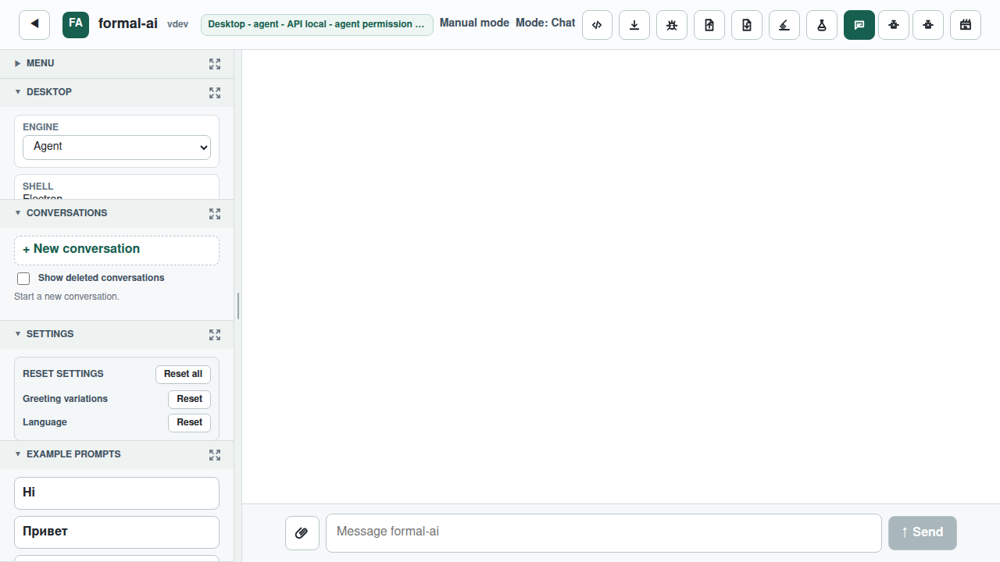

# Issue 759: Desktop engine selection

The desktop app now presents one engine selector for its native `out-of-box`
runtime and installed Agent, Codex, or Claude CLIs. An installed Agent is the
first-launch default; an explicit available selection is persisted between
launches.

## Reproduction

The first real Agent CLI run was driven through a local release-mode Formal AI
server. Its raw stream, stderr, server log, memory, prompt, and generated plan
are preserved under `red-test-agent-run/`. The regression test was then run and
failed because `desktop/lib/engine-manager.cjs` did not exist; the full TAP
failure is in `red-test-agent-run/red-test.log`.

## Verification

- `npm --prefix desktop test`: 118 passing tests.
- `tests/e2e/tests/issue-759.spec.js`: verifies detected choices, Agent default,
  real-time event rendering, and Agent → out-of-box routing in one proxy log.
- `experiments/issue_759_engine_roundtrip.mjs`: launches the installed Agent via
  the production JavaScript adapter, switches to native, and records both `ok`
  turns plus 96 streamed events in `live-roundtrip/proxy-log.json` against the
  same release server and memory file. The server uses the same explicit
  `--agent-mode` protocol opt-in as `formal-ai with`.
- `bun run build:web`: compiles the production browser bundle.

The Playwright fixture captures the selector in the actual shared chat UI:

