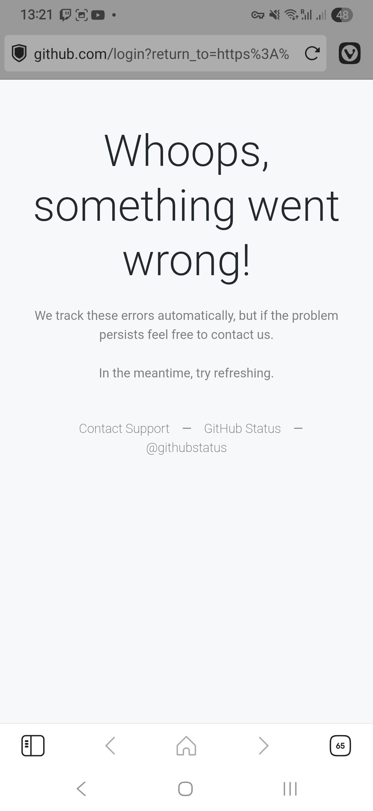
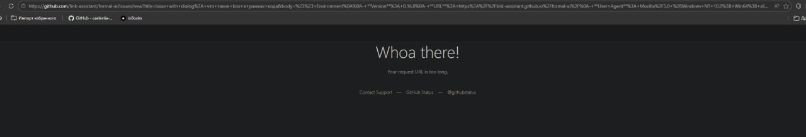

# Issue 78 Case Study: We need to make our issue reporting shorter

## Summary

Issue [#78](https://github.com/link-assistant/formal-ai/issues/78) reports
that the prefilled GitHub **Report issue** link generated by the web demo at
[https://link-assistant.github.io/formal-ai](https://link-assistant.github.io/formal-ai)
overflows the URL length that GitHub accepts for the `/issues/new?body=…`
endpoint. The reporter included two screenshots:

| | |
| --- | --- |
|  |  |

Two concrete asks fall out of the issue body:

1. **Move the long memory-upload instructions out of the prefilled body
   and into the repository.** The body should only need to carry a single
   link to a docs page that explains how to upload the full agent memory
   (GitHub Gist or `.zip`, redaction reminders, etc.) — instead of repeating
   those instructions per click.
2. **Record the dialog using a compact `U:` / `A:` code-block format**, not
   one Markdown subsection per message, so the encoded `body=` URL parameter
   stays comfortably below GitHub's request-URL limit. The reporter's
   example:

   ```
   where A = agent, and U = user
   U: Hi
   A: Hello
   U: 1+2
   A: 3
   ```

Both fixes ship in PR [#87](https://github.com/link-assistant/formal-ai/pull/87)
on branch `issue-78-0dcc7757ac84`.

## Collected Data

Fresh GitHub evidence lives in [`raw-data/`](./raw-data) so future analysts
can replay the investigation without re-querying the API:

- [`raw-data/issue-78.json`](./raw-data/issue-78.json) — full issue body and
  metadata captured with `gh issue view`.
- [`raw-data/issue-78-comments.json`](./raw-data/issue-78-comments.json) —
  conversation comments on the issue (empty at collection time; the request
  is entirely in the body).
- [`raw-data/pr-87.json`](./raw-data/pr-87.json) — pull request metadata for
  the draft that implements this case study.
- [`raw-data/pr-87-conversation-comments.json`](./raw-data/pr-87-conversation-comments.json),
  [`raw-data/pr-87-review-comments.json`](./raw-data/pr-87-review-comments.json),
  [`raw-data/pr-87-reviews.json`](./raw-data/pr-87-reviews.json) — PR review +
  discussion records.
- [`screenshots/issue-screenshot-1.jpg`](./screenshots/issue-screenshot-1.jpg)
  and [`screenshots/issue-screenshot-2.jpg`](./screenshots/issue-screenshot-2.jpg)
  — mirror of the two images the reporter attached to the issue (mobile
  "Whoops" page + desktop "Whoa there! Your request URL is too long" page),
  copied into the repository so the evidence survives even if the
  user-attachments CDN rotates.

## Prior Case Studies

This work builds directly on the **Report issue** scaffolding from earlier
issues; we extend it rather than replace it.

- [`../issue-10/README.md`](../issue-10/README.md) — introduced the original
  prefilled `Report issue` link with per-message Markdown subsections.
- [`../issue-18/README.md`](../issue-18/README.md) — added the verbose
  **Attach full memory (recommended)** block (`.zip` + redaction steps) that
  is the main culprit behind the URL overflow.
- [`../issue-44/README.md`](../issue-44/README.md) — added the "Unknown
  prompt: …" issue title.

## Timeline of Events

| Timestamp (UTC) | Event |
| --- | --- |
| 2026-05-15 12:30 | Issue #18 lands. The fix appends an `## Attach full memory (recommended)` block to `createIssueReportBody` with per-OS zip walkthroughs and a separate redaction paragraph. |
| 2026-05-16 ~10:21 | The reporter opens the demo on mobile, plays through a full session including a Wikipedia disambiguation turn, and taps **Report issue**. The phone browser navigates to `https://github.com/.../issues/new?title=…&body=…` and GitHub returns the **"Whoops, something went wrong!"** error page. |
| 2026-05-16 ~10:30 | The reporter retries on a desktop browser. The same URL hits Apache/GitHub's request-line cap and now shows **"Whoa there! Your request URL is too long."** (visible in `screenshots/issue-screenshot-2.jpg`, where the URL bar still has `+%23+%23+Environment` and `+%2A%2AVersion%2A%2A%3A+0.16.0` legible). |
| 2026-05-16 11:?? | The reporter files issue #78 asking for (a) the long upload instructions to move into the repo behind a single link, and (b) the dialog transcript to use a compact `U:` / `A:` code block. |
| 2026-05-16 14:34 | AI issue solver claims branch `issue-78-0dcc7757ac84` and opens draft PR #87. |
| 2026-05-16 14:36 | Investigation begins under `docs/case-studies/issue-78/`. |

## Reproducing the Bug

1. Visit [https://link-assistant.github.io/formal-ai](https://link-assistant.github.io/formal-ai).
2. Leave demo mode on (or send a handful of prompts manually) so the
   transcript grows to at least ~5 turns.
3. Click **Report issue** in the topbar.

**Expected**: GitHub renders the new-issue form with title and body
prefilled.

**Observed (before this PR)**: GitHub responds with
- mobile: a generic *"Whoops, something went wrong!"* error page, or
- desktop: *"Whoa there! Your request URL is too long."*

In both cases the user cannot file an issue.

## Root Cause Analysis

### 1. The `?body=` URL parameter outgrows GitHub's request-line limit

`createIssueUrl` in [`src/web/app.js`](../../../src/web/app.js) builds the
`/issues/new?…` URL by URL-encoding the entire issue body as a query
parameter. After issue #18 landed, the body contains:

- a `## Environment` section,
- one Markdown subsection **per chat message** (`### N. Author`,
  `- **Role**: …`, `- **Time**: …`, `- **Intent**: …`, a fenced code block
  for the message content, plus blank lines),
- a `## Reproduction Steps` section,
- and an `## Attach full memory (recommended)` block whose three paragraphs
  + per-OS bullet list run to ~700 characters even before URL-encoding.

GitHub fronts `/issues/new` with the same web tier that other repositories
have reported caps for. Apache's default `LimitRequestLine` is 8190 bytes;
GitHub's gateway is tuned similarly. Once a transcript reaches ~5–6 turns
the URL-encoded body crosses that ceiling and GitHub responds with the
generic error pages the user screenshotted.

### 2. The dialog recording is repetitive

Every message is a six-line Markdown subsection, even though the only
information that matters to a maintainer is *who said what*. With
URL-encoding, every newline costs three bytes (`%0A`), every space costs
one (`+`), and every backtick costs three (`%60`). A simple greeting +
hello-world session encodes to ~3.5 KB just for the transcript — leaving
very little budget for the Environment + Attach blocks.

### 3. The upload-memory instructions duplicate per-issue what should be a
   single shared doc

Issue #18 (R112) deliberately put the `.zip` workflow + redaction reminder
into the prefilled body so users would see it the moment they clicked the
link. That worked, but the instructions repeat every single time a user
reports something, and they push the URL over the ceiling. A single link
to a docs page in this repository is enough — GitHub renders Markdown
links inside the issue body, and a clickable destination is friendlier than
three paragraphs of inline instructions anyway.

## Requirements

Distilled from the issue body, extending the matrix tracked in
[REQUIREMENTS.md](../../../REQUIREMENTS.md).

| ID | Requirement |
| --- | --- |
| R115 | The prefilled `Report issue` body must keep the encoded `body=` query parameter under GitHub's request-line limit so the new-issue page actually opens for typical sessions (no more *"URL is too long"*). |
| R116 | The dialog transcript embedded in the prefilled body must use a single fenced code block with `U:` / `A:` line prefixes, instead of one Markdown subsection per message, while still preserving the focused-message marker and the assistant `intent` annotation. |
| R117 | The verbose upload-memory instructions (Gist / `.zip` / per-OS walkthroughs / redaction reminders) must live in a single page checked into the repository — [`docs/upload-memory.md`](../../upload-memory.md) — so the prefilled body only needs a one-line pointer with a link. |
| R118 | Documentation must explain that users can either upload the full memory export to a [GitHub Gist](https://gist.github.com) (no extension restrictions) or wrap it in a `.zip` (GitHub's issue uploader still rejects raw `.lino`). |
| R119 | The e2e regression suite must enforce all of the above: the prefilled body must contain `docs/upload-memory.md`, the dialog must use the `Legend: \`U\` = user, \`A\` = agent.` block, and the old verbose per-OS Compress / Send-to instructions must be absent. |

## Solution Plan

### R115 + R116 — compact dialog block

- Introduce `appendDialogBlock(lines, messages, effectiveFocus)` in
  [`src/web/app.js`](../../../src/web/app.js). It emits one short legend
  line, then a single fenced code block where each turn is
  `U:` / `A:` followed by the content. The fence picker (`pickDialogFence`)
  upgrades from triple backticks to four-or-more if any message content
  itself contains a triple backtick, so embedded code blocks stay
  unambiguous.
- Replace the per-message subsection loop in `createIssueReportBody` with
  a single `appendDialogBlock` call. Known-intent turns stay as plain
  `A: …` to match the issue example; only the `unknown` intent keeps the
  inline annotation (`A (intent: unknown, reported): …`) where the marker
  is needed to identify the missing rule, so the diagnostic information
  survives without the verbose `- **Role**: …` boilerplate.
- A smoke-test mirror lives at
  [`experiments/issue-78-dialog-format.mjs`](../../../experiments/issue-78-dialog-format.mjs)
  so the formatter can be exercised from Node without a bundler.

### R117 + R118 — docs/upload-memory.md

- Add [`docs/upload-memory.md`](../../upload-memory.md). It explains what
  *full memory* means (linking back to the issue-18 case study), walks
  through Export memory, redaction, and the two upload paths (Gist or
  `.zip`), and documents why `.lino` is not yet a native GitHub attachment
  type.
- In `createIssueReportBody`, replace the three-paragraph Attach block with
  a single line: *"Click **Export memory** in the topbar to save
  `formal-ai-memory.lino`, then attach it as a GitHub Gist or wrap it in a
  `.zip` first. Redact sensitive content before uploading. See the
  upload-memory guide for the full walkthrough."* — with the docs page
  linked.
- Shorten the topbar `title` tooltips for **Report issue** and **Export
  memory** to point at the same doc, instead of restating the workflow on
  every hover.

### R119 — regression coverage

- [`tests/e2e/tests/multilingual.spec.js`](../../../tests/e2e/tests/multilingual.spec.js)
  — the existing `Report issue link is present in the topbar` test now
  also asserts that the body contains `docs/upload-memory.md` and **does
  not** contain the long *Compress* / *Send to → Compressed (zipped)
  folder* phrases that used to live inline.
- [`tests/e2e/tests/demo.spec.js`](../../../tests/e2e/tests/demo.spec.js)
  — the *known assistant dialogs* and *unknown prompts* tests assert
  `Legend: \`U\` = user, \`A\` = agent.`, the `U: …` / `A: …` line shapes,
  and the absence of the old `### 1. …` / `- **Role**: …` subsections.
- The intent assertion moves to
  `expect(body).toMatch(/A \(intent: unknown[^)]*\):/)` so the unknown-rule
  flow still surfaces the intent in the compact format.

## Existing Components and Prior Art

- The `?body=` query-string flow is the GitHub-documented [URL parameters
  for creating issues / PRs](https://docs.github.com/en/issues/tracking-your-work-with-issues/using-issues/creating-an-issue#creating-an-issue-from-a-url-query)
  feature. The page warns that "the maximum size of a URL is 8192
  characters" — confirming the root cause for #78 and giving us the cap to
  design against.
- GitHub Gist accepts arbitrary file extensions, including `.lino`, so we
  add it as the recommended path for full memory uploads alongside the
  existing `.zip` workaround.
- The fenced-block fence-picker pattern (`appendCodeBlock`) was already in
  `src/web/app.js`; `pickDialogFence` simply scans all messages instead of
  a single content string.
- We deliberately do **not** further compress the body (zlib + base64,
  external paste-bin, etc.) — those would be opaque to the maintainer and
  pull in another dependency. A docs link + compact transcript is enough.

## Online Research

- [GitHub Docs — Creating an issue from a URL query](https://docs.github.com/en/issues/tracking-your-work-with-issues/using-issues/creating-an-issue#creating-an-issue-from-a-url-query)
  documents the `?title=` / `?body=` / `?labels=` parameters and notes the
  8192-character URL cap. This is the official upstream constraint that
  drives R115.
- [GitHub Docs — Attaching files](https://docs.github.com/en/get-started/writing-on-github/working-with-advanced-formatting/attaching-files)
  lists the file extensions allowed on issue/PR attachments. `.lino` is
  still absent; `.zip` and `.txt` are accepted; Gists carry no extension
  restriction.
- [Gist UI](https://gist.github.com) — verified manually that creating a
  Gist with the filename `formal-ai-memory.lino` works, and the resulting
  link can be pasted into a regular GitHub issue body. This is the path we
  recommend first in `docs/upload-memory.md`.

## Upstream Reports

The 8192-byte URL cap is a long-standing GitHub limitation rather than a
formal-ai bug, and it predates any open issue we can ping. We have left
the workaround documented in `docs/upload-memory.md` so the trail is
discoverable if GitHub later relaxes the limit (or adds `.lino` to the
attachment allow-list, which would let us drop the `.zip` recommendation
entirely).

## Verification

- Manual:
  1. Open the demo through a local web server (`scripts/sync-seed.sh &&
     npx serve src/web`), play through a 5+ turn session, click **Report
     issue**.
  2. Confirm the GitHub new-issue page renders (no *Whoa there!*) and that
     the body uses the compact `U:` / `A:` block.
  3. Confirm the body ends with a single line pointing to
     `docs/upload-memory.md`.
- Automated:
  - Playwright `Report issue link is present in the topbar and links to
    the upload-memory guide (R112 + issue #78)` in
    `tests/e2e/tests/multilingual.spec.js`.
  - Playwright `known assistant dialogs include a prefilled issue report
    link` and `unknown prompts include a prefilled missing-rule issue
    link` in `tests/e2e/tests/demo.spec.js`.
- Smoke: `node experiments/issue-78-dialog-format.mjs` prints the formatted
  blocks for a hand-crafted set of transcripts (empty, greeting, unknown,
  fenced code block, arithmetic dialogue).

## Status

Implemented in PR [#87](https://github.com/link-assistant/formal-ai/pull/87).
