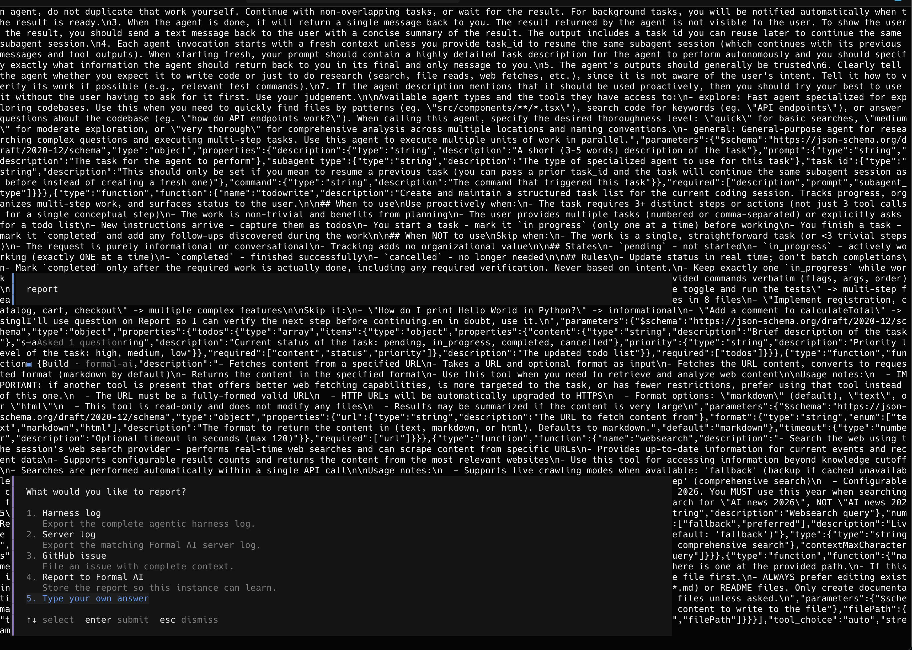
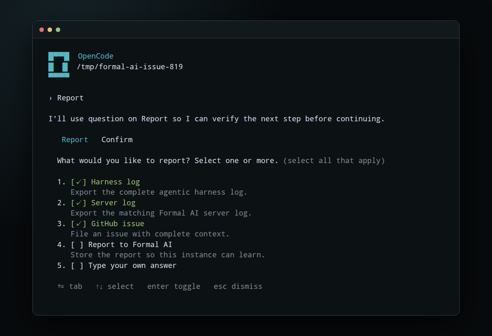

# Issue 819 follow-up: empty results, multi-select reports, and TUI isolation

The [issue #819 follow-up](https://github.com/link-assistant/formal-ai/issues/819#issuecomment-5055516309)
identified three related usability defects after local path discovery shipped:

1. a successful local `find` with no matches was presented as raw empty output;
2. the report confirmation accepted only one destination even when the user
   requested harness, server, and GitHub actions together;
3. a temporary Formal AI server inherited the fullscreen client's terminal
   streams, so request traces could be painted over OpenCode until a resize.

## Root causes and fixes

Tool results are normalized before Formal AI renders them. The empty-result
branch now detects local path-search intent and returns a beginner-oriented
explanation. Client transport sentinels such as OpenCode's `(no output)` are
normalized to the same empty payload as `{"output":""}`.

The report planner now emits a question with `multiple: true`, parses every
selected destination, infers the GitHub context choice from selected log
destinations, and combines every requested action into one fail-fast shell
step. OpenCode adds narration to assistant tool-call messages, so the state
machine explicitly keeps narrated tool calls active rather than mistaking them
for a completed report.

Temporary servers launched by `formal-ai with --start-server` now send both
`stdout` and `stderr` to a durable `temporary-server-<pid>-<port>.log`. The log
is included in the wrapper's session-file summary, but raw diagnostics never
share the wrapped TUI's PTY.

## Red/green evidence

The initial unit reproduction captured three failures: generic empty output, a
missing `multiple` flag, and execution of only the GitHub action. The PTY
reproduction independently showed a unique request-body marker leaking into
the terminal. Both are preserved under [`raw-data/`](raw-data/).

Real-client validation then found three client-specific shapes:

- OpenCode returns an empty command result as `(no output)`;
- OpenCode narrates its question tool call before the tool result;
- Claude Code returns the equivalent sentinel
  `(Bash completed with no output)`.

Each real-client failure was converted into a focused unit regression before
the compatibility fix. The corresponding red and green logs are:

- [`reproduction-before-fix-opencode-empty-sentinel.log`](raw-data/reproduction-before-fix-opencode-empty-sentinel.log)
- [`focused-unit-after-real-clients.log`](raw-data/focused-unit-after-real-clients.log)
- [`reproduction-before-fix-opencode-narration.log`](raw-data/reproduction-before-fix-opencode-narration.log)
- [`focused-opencode-narration.log`](raw-data/focused-opencode-narration.log)
- [`reproduction-before-fix-claude-sentinel.log`](raw-data/empty-result-clients/reproduction-before-fix-claude-sentinel.log)
- [`focused-after-claude-sentinel.log`](raw-data/empty-result-clients/focused-after-claude-sentinel.log)

## Real-client and TUI proof

The existing issue #819 harness can now run against an empty isolated desktop
with `EMPTY_RESULT=1`. It requires Agent CLI, OpenCode, Claude Code, Codex, and
the real OpenCode TUI to complete:

```text
user prompt → local find call → empty tool result → beginner-friendly final
```

The complete five-client run is preserved in
[`final-complete.log`](raw-data/empty-result-clients/final-complete.log), with
each raw dialog and terminal artifact under
[`final-complete/`](raw-data/empty-result-clients/final-complete/).

The report TUI harness launches real OpenCode through a PTY, streams its output
through the published `command-stream` package into `@xterm/headless`, and
sends the real selection keys only after the question is rendered:

```text
1 → 2 → 3 → Tab → Enter
```

It then requires all three selected commands to execute. The transcript and
captured invocations are under
[`raw-data/opencode-report-tui/`](raw-data/opencode-report-tui/).

| Before | After |
| --- | --- |
| Raw server request JSON overwrites the OpenCode frame. | The server stream is isolated and the real multi-select UI remains intact. |
|  |  |

The before image is the reporter's original reproduction. The after image was
rendered from the passing headless terminal frame and captured with Playwright.

The underlying OpenCode renderer behavior was reported upstream with the
independent sibling-process reproduction:
[anomalyco/opencode#31219 comment](https://github.com/anomalyco/opencode/issues/31219#issuecomment-5055921996).

## Self-authoring evidence

Formal AI drove a real Agent CLI session to create the initial follow-up
regression file, then read it back before completing. The successful native
stream, dialog log, Formal AI plan, and memory are retained under
[`raw-data/self-authoring/`](raw-data/self-authoring/).
