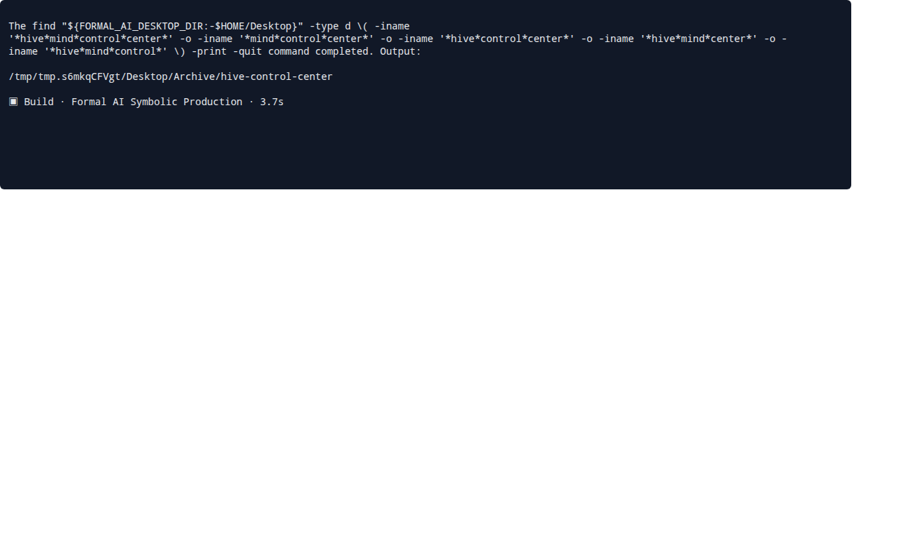
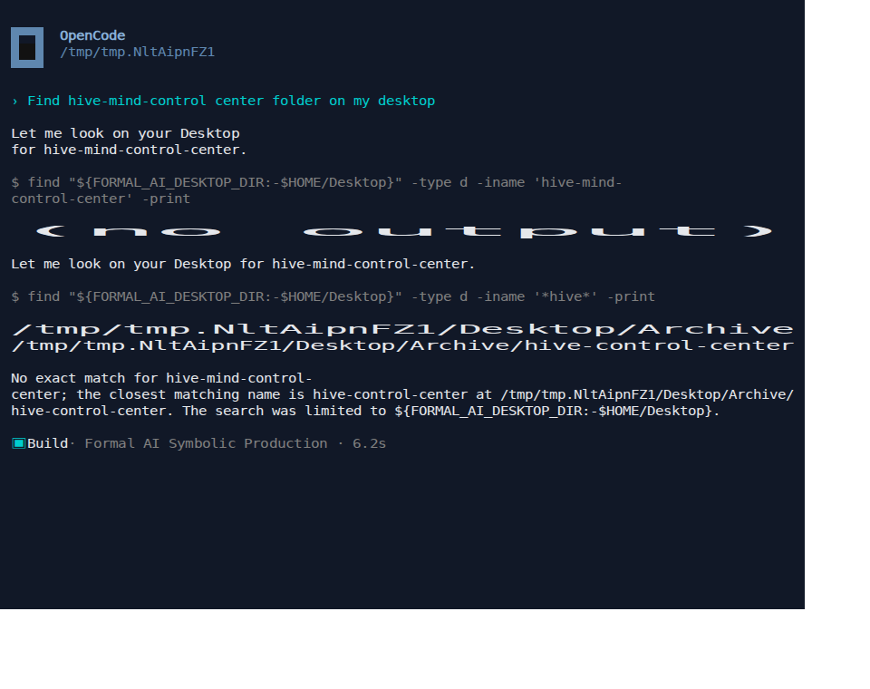
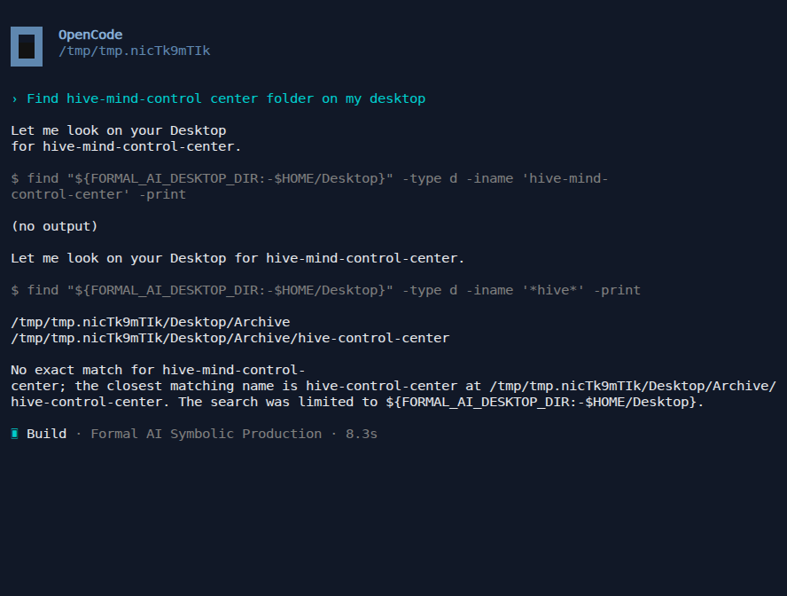
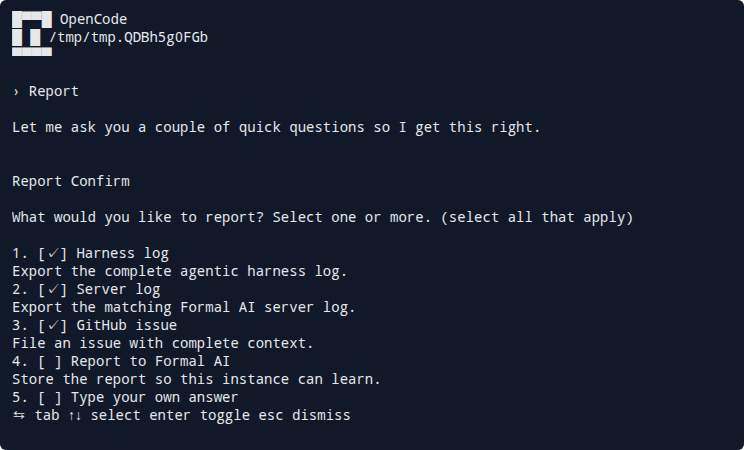

# Issue 841: terminal-visible agent CLI tests

Issue [#841](https://github.com/link-assistant/formal-ai/issues/841) asked
Formal AI's end-to-end tests to verify what users actually see in OpenCode,
Claude Code, and Codex. The existing tests asserted native JSON exchanges, so a
terminal repaint failure such as [#819](https://github.com/link-assistant/formal-ai/issues/819)
could remain invisible until a person resized the window.

## Outcome

The agent CLI matrix now runs all three interactive clients in real PTYs, at a
shared 80×30 (4:3) starting geometry, and stores six interoperable artifacts
for every run:

- a lossless, unrolled text transcript;
- ordered styled frames, including scrollback;
- an asciicast v2 recording;
- an exact-grid SVG snapshot;
- a CSS-keyframe SVG replay;
- a GIF89a fallback for renderers that do not animate SVG.

CI uploads the complete artifact tree with `if: always()`. The harness copies
partial captures out of its temporary workspace before returning a failure, so
the recording survives the exact case where it is most useful. The full frame
JSON is intentionally retained in CI rather than Git: the six real runs
produce roughly 106 MiB of styled cells, while the committed transcripts,
asciicasts, SVGs, GIFs, and dialog sequences are under 4 MiB.

Formal AI owns no PTY, VT parser, terminal emulator, or animation renderer. Its
test package depends only on published `agent-commander` and `command-stream`
packages.

## Upstream result

The reusable implementation was completed and released in both upstream
projects before Formal AI switched to it.

| Layer | JavaScript release | Rust release | Merged work |
| --- | --- | --- | --- |
| Generic PTY, resize, VT rendering, scrollback, unrolling, asciicast, faithful SVG/GIF, visible-text geometry, and timeout artifacts | [`command-stream` 0.17.2](https://github.com/link-foundation/command-stream/releases/tag/js-v0.17.2) | [`command-stream` 0.14.0](https://github.com/link-foundation/command-stream/releases/tag/rust-v0.14.0) | [#176](https://github.com/link-foundation/command-stream/pull/176), [#177](https://github.com/link-foundation/command-stream/pull/177), [#179](https://github.com/link-foundation/command-stream/pull/179), [#181](https://github.com/link-foundation/command-stream/pull/181), [#184](https://github.com/link-foundation/command-stream/pull/184), [#186](https://github.com/link-foundation/command-stream/pull/186) |
| Agent-specific executable/argument builders, startup interactions, semantic events, and 4:3 replay bundles | [`agent-commander` 0.10.0](https://github.com/link-assistant/agent-commander/releases/tag/js_0.10.0) | [`agent-commander` 0.2.7](https://github.com/link-assistant/agent-commander/releases/tag/rust_0.2.7) | [#44](https://github.com/link-assistant/agent-commander/pull/44), [#45](https://github.com/link-assistant/agent-commander/pull/45), [#47](https://github.com/link-assistant/agent-commander/pull/47) |

The JavaScript packages are also available from
[npm: command-stream 0.17.2](https://www.npmjs.com/package/command-stream/v/0.17.2)
and
[npm: agent-commander 0.10.0](https://www.npmjs.com/package/agent-commander/v/0.10.0);
the Rust packages are available from
[crates.io: command-stream 0.14.0](https://crates.io/crates/command-stream/0.14.0)
and
[crates.io: agent-commander 0.2.7](https://crates.io/crates/agent-commander/0.2.7).

The renderer follow-ups requested in
[`command-stream#180`](https://github.com/link-foundation/command-stream/issues/180)
and
[`agent-commander#46`](https://github.com/link-assistant/agent-commander/issues/46)
are therefore consumed here as published releases, not copied into Formal AI.
The replay preserves styled cells and whitespace, embeds a subset terminal
font, places glyphs on an integer cell grid, draws box characters as vectors,
uses timestamp-derived CSS keyframes, and renders a square terminal frame.
The final browser check exposed one more upstream defect: blank terminal cells
at the edges of a row were emitted inside visible SVG text runs, so Chromium
stretched short labels across the full row. The regression was reported as
[`command-stream#185`](https://github.com/link-foundation/command-stream/issues/185),
fixed in
[`command-stream#186`](https://github.com/link-foundation/command-stream/pull/186),
released as 0.17.2, and consumed here. Both the published-package unit test and
every real-client capture now reject leading or trailing row padding inside
SVG text elements.

### Browser-rendered progression

The same OpenCode result was rendered in Chromium at each stage:

| Lossy local prototype | Published 0.17.1 with padded text runs | Published 0.17.2 |
| --- | --- | --- |
|  |  |  |

## Why the original capture was insufficient

The local prototype ran `script -c`, fed raw bytes to xterm, and globally
deduplicated normalized lines. It could not provide a portable child PTY,
propagate `TIOCSWINSZ`, distinguish repeated states at different times, or
preserve the history that had scrolled out of the final viewport. Formal AI
also had to know OpenCode's command line directly.

The published stack instead separates responsibilities:

```text
Formal AI regression
  → agent-commander client builder and startup interaction
    → command-stream PTY and typed input/resize events
      → terminal emulator, settled frames, scrollback, and replay renderers
```

The old local capture module and its OpenCode-only wrapper were deleted after
the package releases were consumed.

## Dependency refresh

The review requested every dependency be brought current unless the upgrade
breaks the project. All direct Rust, web, desktop, VS Code, E2E, and TUI
dependencies were audited and upgraded to their latest compatible releases,
including `base64` 0.23, `link-calculator` 0.20.3, `meta-language` 0.54.0,
`thread-priority` 3.1.1, Electron 43.2.0, `agent-commander` 0.10.0, and its
resolved `command-stream` 0.17.2.

The supported Node 22 builds and tests pass. The remaining `npm audit`
advisories are transitive dependencies of the latest direct releases of
`@link-assistant/web-capture`, `serve`, and `electron-builder`; `npm audit
fix --force` proposes downgrading those direct packages, so no misleading
forced downgrade was committed.

## Acceptance proof

### #819: repaint, history, and explicit resize

The unit regression uses a two-row terminal so the first state must scroll out
of the viewport. It requires the unrolled transcript to contain the user,
tool, and result states once each and in order, while the final frame retains
the first state in `lines` but not in `screen`.

A second fixture accepts text (`123`), a control key (`Tab`), `Enter`, and an
explicit resize from 24×6 to 40×10. Its success state is emitted only after the
child PTY observes the new dimensions. The real #819 runs also resize each
client after the discovered path is rendered.

The complete live matrix passed. Each interactive client ran twice with
independently worded prompts:

```text
Agent direct
OpenCode direct
Claude Code direct
Codex direct
OpenCode TUI + replay × 2
Claude Code TUI + replay × 2
Codex TUI + replay × 2
```

Each TUI dialog log independently proves:

```text
user prompt → assistant find call → client tool result → assistant final path
```

Evidence:

- [OpenCode transcript](tui-artifacts/path-discovery/opencode/transcript.txt)
  with [SVG](tui-artifacts/path-discovery/opencode/recording.svg),
  [GIF](tui-artifacts/path-discovery/opencode/recording.gif), and
  [reworded GIF](tui-artifacts/path-discovery/opencode-reworded/recording.gif)
- [Claude Code transcript](tui-artifacts/path-discovery/claude/transcript.txt)
  with [SVG](tui-artifacts/path-discovery/claude/recording.svg),
  [GIF](tui-artifacts/path-discovery/claude/recording.gif), and
  [reworded GIF](tui-artifacts/path-discovery/claude-reworded/recording.gif)
- [Codex transcript](tui-artifacts/path-discovery/codex/transcript.txt)
  with [SVG](tui-artifacts/path-discovery/codex/recording.svg),
  [GIF](tui-artifacts/path-discovery/codex/recording.gif), and
  [reworded GIF](tui-artifacts/path-discovery/codex-reworded/recording.gif)
- [full matrix log](test-logs/full-client-matrix.log)

### #838: report multiselect and resulting issue body

The OpenCode test waits for each rendered selection before sending the next
input:

```text
[✓] Harness log
[✓] Server log
[✓] GitHub issue
```

It then asserts the review screen, submits the question, and requires all
three context export commands plus `gh issue create`. The captured
[resulting issue body](tui-artifacts/report-flow/issue-body.md) must contain
report provenance, the complete-context heading, and exported conversation
content.



Evidence: [transcript](tui-artifacts/report-flow/terminal/transcript.txt),
[animation](tui-artifacts/report-flow/terminal/recording.svg), and
[executed actions](tui-artifacts/report-flow/report-actions.log).

### #840: task ladder through the user interface

`experiments/issue_840_task_ladder/run_ladder.sh` retains its HTTP measurement
mode and adds `MODE=tui`. Every selected node can now run through OpenCode,
score the rendered transcript after removing only the exact user-prompt echo,
and save a separate replay bundle. `REQUIRE_ALL_PASS=1` turns a selected subset
into a CI gate.

CI runs the representative `838.L1` node. It found
`Desktop/Archive/hive-control-center`, did not leak the private-key decoy, and
passed 1/1 through the real TUI.

Evidence: [results](tui-artifacts/task-ladder/results.json),
[transcript](tui-artifacts/task-ladder/838.L1/transcript.txt), and
[animation](tui-artifacts/task-ladder/838.L1/recording.svg).

## Stable contract learning

Each of the six real TUI captures emits a normalized observation. Formal AI
groups observations by client and capability, then intersects facts across
distinct task wordings. A fact seen only once cannot become a proposal.
Generic, safe contract fields use the same path as previously learned delivery
and tool requirements:

```text
6 observations
  → 3 independently-worded client groups
    → stable intersection per field
      → 42 review proposals
        → awaiting_human_review
```

The stable facts cover the 80×30 initial geometry, all six output artifacts,
and seven renderer properties, including visible-text geometry. They are
proposals only: the learner cannot
mutate the seed registry. A second E2E asks Formal AI, through a real Agent CLI,
to execute the exact same `clients learn` task. The Agent-authored report must
byte-match the deterministic report.

Evidence: [observations](tui-contract-learning/observations.jsonl),
[learning report](tui-contract-learning/tui-contract-learning-report.lino),
[Agent-authored report](tui-contract-learning/agent-authored-tui-contract-learning-report.lino),
and [Agent plan](tui-contract-learning/general-change-plan.lino).

## Reproduce

Build Formal AI, then run:

```bash
cargo build --release

PORT=19500 \
ARTIFACT_DIR=/tmp/formal-ai-tui-artifacts/path-discovery \
experiments/agent_cli_e2e/run_issue_819.sh

PORT=19520 \
OUT=/tmp/formal-ai-tui-artifacts/tui-contract-learning \
OBSERVATIONS=/tmp/formal-ai-tui-artifacts/path-discovery/tui-contract-observations.jsonl \
GENERATE_EXPECTED=1 \
experiments/agent_cli_e2e/run_issue_841_tui_learning.sh

PORT=19600 \
ARTIFACT_DIR=/tmp/formal-ai-tui-artifacts/report-flow \
experiments/agent_cli_e2e/run_issue_819_report_tui.sh

PORT=19700 \
MODE=tui \
ONLY=838.L1 \
REQUIRE_ALL_PASS=1 \
OUT=/tmp/formal-ai-tui-artifacts/task-ladder-results.json \
TUI_ARTIFACT_DIR=/tmp/formal-ai-tui-artifacts/task-ladder \
experiments/issue_840_task_ladder/run_ladder.sh
```

The focused PTY regressions run with:

```bash
cd experiments/agent_cli_e2e/issue_819_tui
bun install --frozen-lockfile
bun test
```

## Self-hosting evidence

The release-gated proof under
[`tui-contract-learning/`](tui-contract-learning/) is the operative
self-hosting run: Formal AI planned the exact task, a real Agent CLI executed
it, and the resulting artifact was byte-verified. The earlier exploratory
source-link session remains under
[`self-hosting-evidence/`](self-hosting-evidence/) as provenance, but is not
used as acceptance evidence.
