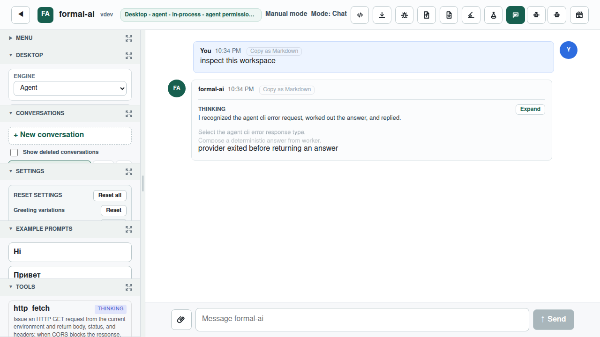
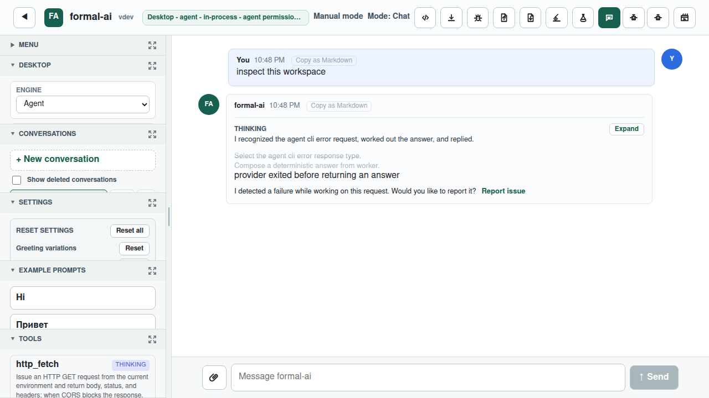

# Issue #864: proactive failure-report invitations

Issue [#864](https://github.com/link-assistant/formal-ai/issues/864) asks
Formal AI to take the initiative after failures it detects, in the UI and in
agentic coding harnesses, instead of waiting for the user to discover the
existing reporting command. The issue had no comments; PR
[#910](https://github.com/link-assistant/formal-ai/pull/910) also had no review,
review-comment, or conversation-comment feedback when implementation began.

## Root cause

Issue #839 had already made an explicit user-started `Report issue` action
produce one contextual six-section document on every surface. Four gaps kept
that action passive after a failure:

1. The unknown-reasoning answer only admitted uncertainty; it never invited a
   report.
2. Agentic tool-result rendering recognized structured `error` and exit fields,
   but the real Agent CLI shell adapter can return only plain process text.
3. The UI showed a report link only for the old `unknown` intent. It did not
   classify provider/tool failures or ask an active, localized question.
4. Browser persistence and multi-step Agent plans did not retain an explicit
   detected-failure bit, so a nested failure could disappear from the final
   rendered message.

The red Rust regression preserved the first two failures, and the red
Playwright run preserved the missing desktop-provider invitation. The live
Agent CLI replay then exposed the plain-text tool-result gap: the shell emitted
`/bin/sh: ... not found`, but Formal AI called the command successful.

## Resolution

The Rust core appends one seed-backed consent question after unknown reasoning
and detected tool failures in English, Russian, Hindi, Chinese, and Spanish.
The browser invitation covers its four currently published UI locales.
Structured
`ok: false`, `success: false`, non-zero exit, HTTP error, failure status, and
explicit error fields are failure signals. The existing multilingual failure
lexicon also recognizes observable plain shell failures emitted by agentic
harnesses.

The browser uses the same policy at the semantic boundary: explicit solver
intents and structured answer/tool results only. It records `detectedFailure`
on the assistant message, carries it across IndexedDB hydration, and aggregates
it across Agent-plan subanswers. The localized inline invitation links to the
existing #839 report builder, retaining the environment, user context, full
dialog reproduction, reasoning trace, description, and optional-memory
sections. Detection never clicks the link or files an issue.

## Semantic boundary

Refusal, denial, cancellation, abort, pending approval, and a missing grant are
expected stops, not Formal AI failures, even if a transport also says
`ok: false`. Conversely, arbitrary assistant prose containing words such as
"error" is not classified by the browser.

The Agent CLI currently serializes the silent command `false` as an empty tool
message without an exit code. Empty successful output and that failure are
indistinguishable to Formal AI, so the E2E does not make a false claim about
detecting it. It executes an exact nonexistent command instead, whose `not
found` payload is an observable failure signal.

## Browser evidence

The same intercepted desktop-provider failure was rendered before and after
the fix. The before image contains the provider failure but no active reporting
offer; the after image contains the localized consent question and contextual
`Report issue` action.

| Before | After |
| --- | --- |
|  |  |

## Real Agent CLI evidence

`experiments/agent_cli_e2e/run_issue_864.sh` starts a private live server and
invokes the installed `@link-assistant/agent` binary. The Agent asks Formal AI
to run the exact `issue_864_command_that_does_not_exist` command. Two real
OpenAI-compatible turns preserve the tool call, observable shell failure, final
opt-in invitation, and absence of any automatic `gh issue create`. Raw streams,
server trace, task, stderr classification, and final answer are retained in
[`failure-e2e/`](failure-e2e/). The dedicated GitHub Actions workflow reruns
this boundary.

Formal AI also drove the real Agent CLI to author and verify the concise policy
leaf [`proactive-failure-reporting.md`](agent-cli-evidence/proactive-failure-reporting.md).
The native Agent session was `ses_03b54b716ffe3E7D9TZMDg6Evs`; its raw client
and live-server logs are retained in [`agent-cli-evidence/`](agent-cli-evidence/).

## Reproduction and verification

The focused checks are:

```sh
cargo test --test unit issue_864 -- --nocapture
cargo test --test unit docs_requirements_issue_864 -- --nocapture
bun run build:web
cd tests/e2e && npx playwright test --config=playwright.local.config.js tests/issue-864.spec.js
BIN=target/debug/formal-ai OUT=/tmp/issue-864-evidence \
  experiments/agent_cli_e2e/run_issue_864.sh
```

[`requirements.md`](requirements.md) maps every acceptance property to code and
executable regressions. Authenticated snapshots of the issue, initial PR, and
all empty GitHub feedback collections are retained under [`raw-data/`](raw-data/).
