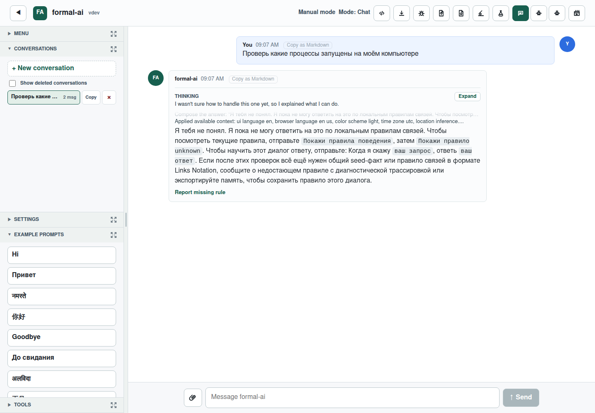
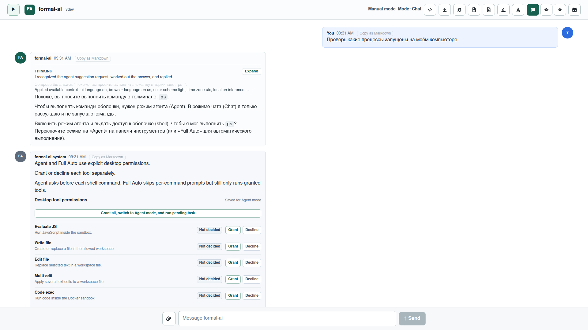

# Issue 870: semantic process requests reach Agent mode

## Result

The reported Russian request,
`Проверь какие процессы запущены на моём компьютере`, now resolves through the
shared semantic shell-intent table instead of the unknown fallback. Chat mode
names the portable `ps` intent and presents the existing permission onboarding.
After the user grants shell access, Electron and VS Code lower that intent to
Windows' read-only `tasklist` command before sending it to the desktop provider.
Nothing is executed before permission is granted.

The same route is covered in English, Russian, Hindi, and Chinese. A final
browser-only research pass also gives genuinely unknown requests a general
recovery path: configured trusted providers are queried, their normalized
results are deduplicated and reciprocal-rank fused, and a successful result is
stored as a stable `associative_research` Links record. Repeating the normalized
request recalls that association without another network request.

## Root cause

Two terminal classifiers had diverged:

1. the agentic planner already understood seed-backed semantic requests such as
   listing processes;
2. the interactive Rust and browser Chat solvers recognized only literal shell
   syntax or an explicit command token.

The reported request therefore had enough meaning for Agent mode's planner, but
Chat mode never reached the Agent permission handoff. The desktop status also
did not expose its platform, so the UI could not preserve one portable semantic
intent while selecting the native Windows command at execution time.

The generic unknown fallback had a separate limitation: it returned `unknown`
after its existing handlers and bare-term search failed. It did not perform the
maintainer-requested last pass over Stack Exchange, wikiHow, Wikifunctions,
Rosetta Code, Wikipedia, and the existing open-web sources, nor did it retain a
successful fused result.

## Implementation

- `shell-intents.lino` remains the source of truth for terminal semantics. The
  Rust interactive solver and browser worker now consume the same no-argument
  intents as the agentic planner.
- Electron and VS Code status include `process.platform`. Only the execution
  boundary maps exact `ps` to exact `tasklist` on `win32`; other platforms and
  commands are unchanged.
- Both commands are explicitly classified as read-only by the desktop
  provider.
- The unknown-intent pass extends the established provider, evidence,
  opt-out, fusion, and diagnostics machinery rather than adding a parallel
  search algorithm.
- Learned answers use a prompt-derived stable identifier, the fused answer, and
  deduplicated source URLs in Links Notation. Empty or failed research is never
  learned.
- The source registry records the live APIs, service toggles, and licenses for
  Wikifunctions and Rosetta Code. Runtime snippets remain external retrieval
  data and are not redistributed in this repository.

## Reproduction and self-authorship evidence

Before the implementation, the Agent CLI drove Formal AI session
`ses_06253e731ffe2sYwrHDdPi9Rfo` with the smallest regression-test leaf. It
created `tests/unit/issue_870.rs` byte-for-byte and ran the requested
verification. The new test then failed because the answer intent was
`unknown`; `agent-cli-evidence/red-regression.log` preserves that red run.
After preserving the red commit, the source was moved unchanged to
`agent-cli-evidence/issue_870.rs` so repository-wide rustfmt can format the
compiled companion regression without changing the session-authored bytes.

The real stream, raw stream, server output, stderr, and generated general-change
plan are preserved under `agent-cli-evidence/`. A companion unit test compares
the preserved source artifact byte-for-byte with the session-authored recipe.
Commit `58289b95` carries the matching `Formal-AI-Session` and
`Formal-AI-Evidence` trailers.

## Verification

The focused regressions cover each issue requirement and the complete
cross-surface journey:

- `cargo test --test unit issue_870` — the reported red regression,
  byte-exact self-authorship proof, and four-language Rust/planner matrix;
- `node --test desktop/scripts/agent-provider.test.mjs` — desktop permission
  provider and read-only command classification;
- `node --test vscode/scripts/config.test.mjs` — VS Code platform propagation;
- `bunx playwright test --config playwright.local.config.js
  tests/issue-870.spec.js` — Electron and VS Code permission gating, Windows
  `tasklist` lowering, trusted-source fusion, Links learning, and memory recall.

The Playwright suite passed all three whole-journey tests. The repository-wide
checks are recorded in PR #871.

## Before and after

Before, the exact prompt ended at the unknown response:

After, the same prompt names the process-list intent and opens the explicit
Agent permission flow:

