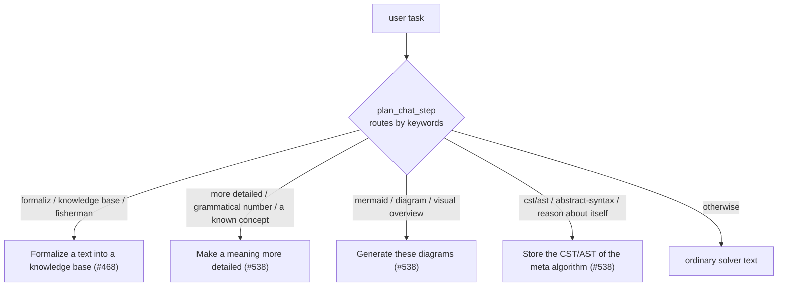
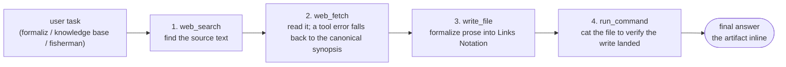
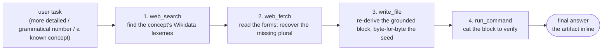
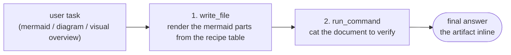
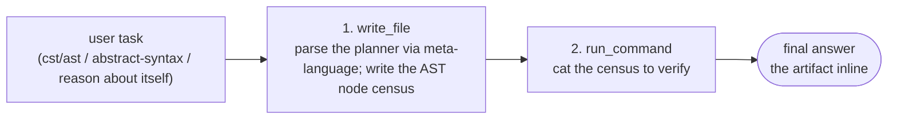

# Formal AI agentic recipes (generated)

<!-- Generated by the Formal AI Agent CLI (`formal-ai agent`) from the planner's own
     recipe table (src/agentic_coding/diagram.rs). Do not hand-edit; regenerate. -->

A high-level, split-into-parts visual overview of how Formal AI drives its own agentic
CLI to complete a task. Part 1 shows how a request is routed to a recipe; each later part
details what happens for input handled by that recipe — the deterministic
`search -> fetch -> write -> verify -> final` state machine in `src/agentic_coding/`.

## Part 1 — Overview: how a task is routed

## Part 2 — Recipe: Formalize a text into a knowledge base (#468)

## Part 3 — Recipe: Make a meaning more detailed (#538)

## Part 4 — Recipe: Generate these diagrams (#538)

## Part 5 — Recipe: Store the CST/AST of the meta algorithm (#538)

