# Formal AI CLI subcommands (generated)

<!-- Generated by `node scripts/generate-system-diagrams.mjs --write` (Rust twin: rust/src/agentic_coding/system_diagram.rs) from rust/src/main.rs. Do not hand-edit; CI fails when this file drifts from the generator. -->

Every subcommand of the `formal-ai` binary, in the order its clap `Command` enum declares them, with the first sentence of each one's documentation.

## Part 1 — `formal-ai` subcommands

```mermaid
flowchart LR
    cli(["formal-ai"])
    cli --> c_chat["chat"]
    cli --> c_dataset["dataset"]
    cli --> c_translate["translate"]
    cli --> c_coding["coding"]
    cli --> c_context["context"]
    cli --> c_report["report"]
    cli --> c_serve["serve"]
    cli --> c_connect["connect"]
    cli --> c_proxy["proxy"]
    cli --> c_memory["memory"]
    cli --> c_shared_dialog["shared-dialog"]
    cli --> c_bundle["bundle"]
    cli --> c_environments["environments"]
    cli --> c_clients["clients"]
    cli --> c_import["import"]
    cli --> c_github_logs["github-logs"]
    cli --> c_repository_history["repository-history"]
    cli --> c_benchmark["benchmark"]
    cli --> c_solve["solve"]
    cli --> c_statement_audit["statement-audit"]
    cli --> c_summarization["summarization"]
    cli --> c_file_legality["file-legality"]
    cli --> c_with["with"]
    cli --> c_procedure["procedure"]
    cli --> c_algorithm["algorithm"]
    cli --> c_computer_use["computer-use"]
    cli --> c_agent["agent"]
    cli --> c_telegram["telegram"]
    cli --> c_improve["improve"]
    cli --> c_learn["learn"]
    cli --> c_explain["explain"]
```

| Subcommand | Summary |
| --- | --- |
| `formal-ai chat` |  |
| `formal-ai dataset` |  |
| `formal-ai translate` | Translate a document between the source roots through the meta language (plan 16 L2): `--from`/`--to` one of rust\|js\|ts\|meta, `--input` the source file for a live leg, `--list` every direction and the leaf that owes the ones still pending, `--write` to write the mapped sibling-root file (or, without `--input`, the whole tree). |
| `formal-ai coding` | Forget or rediscover source-grounded coding fragments. |
| `formal-ai context` | Export complete conversations or convert arbitrary JSON to Links Notation. |
| `formal-ai report` | Build the issue-report document every Formal AI surface files (#839). |
| `formal-ai serve` | Serve the API; `--agent-mode` is equivalent to `FORMAL_AI_AGENT_MODE=1`. |
| `formal-ai connect` | Use the same binary as a WebSocket or WebRTC OpenAI-compatible client. |
| `formal-ai proxy` | Run a logging reverse proxy in front of a Formal AI HTTP server. |
| `formal-ai memory` | Export or import the agent's append-only memory log as a portable `demo_memory` Links Notation file. |
| `formal-ai shared-dialog` | Convert shared chat captures or compact transcripts into `demo_memory`. |
| `formal-ai bundle` | Export or import the full self-contained `formal_ai_bundle` (seed + memory). |
| `formal-ai environments` | Print the environment directory baked into the seed so users can see every interface the agent supports and how to migrate memory between them. |
| `formal-ai clients` | Print the seed-baked registry of external agentic CLI clients that `formal-ai with` can drive, including each client's protocols, endpoints, headless invocation, and persistent-config location. |
| `formal-ai import` | Import lexical semantics in bulk from external sources (issue #660, R378). |
| `formal-ai github-logs` | Plan or collect GitHub issue, PR, review, and Actions run evidence into a case-study directory. |
| `formal-ai repository-history` | Import or query the repository's formalized history (issue #1180). |
| `formal-ai benchmark` | Run real upstream benchmark suites (issue #698) and record honest `passed/total` scores in `data/benchmarks/external-results.lino`. |
| `formal-ai solve` | Solve one repository requirement in an isolated exact-commit clone. |
| `formal-ai statement-audit` | Weigh statement-bearing repository text against captured provenance. |
| `formal-ai summarization` | Validate repository-file summarization quality on seeded random files and enforce the published 80 percent ratchet (issue #893). |
| `formal-ai file-legality` | Assess file risk signals by legal category and jurisdiction. |
| `formal-ai with` | Run or permanently configure external CLIs against a local Formal AI server. |
| `formal-ai procedure` | Execute and inspect persisted natural-language procedure artifacts. |
| `formal-ai algorithm` | Inspect learned execution-algorithm proposals without approving them. |
| `formal-ai computer-use` | Execute a seeded natural-language computer-use plan inside a fresh, isolated workspace and emit its per-step verification record. |
| `formal-ai agent` | Drive the full agentic-coding loop offline (issue #468). |
| `formal-ai telegram` | Run the Telegram bot client (long polling by default; webhook server is opt-in). |
| `formal-ai improve` | Benchmark-gated promotion of self-improvement proposals (issue #656, E37). |
| `formal-ai learn` | Run the auto-learning adoption cycle over a recorded learning frontier (issue #701, E59). |
| `formal-ai explain` | Print the white-box derivation of a previously returned answer (issue #1184, E148): the search queries issued, the fetched URLs with their SHA-256 hashes and fetch timestamps, the formalized page fragments, the parts decomposed from retrieved examples, the recomposition, the rendering, and the verification output — read from the durable record keyed by the answer's `derivation_id`. |
