# Formal AI HTTP routes (generated)

<!-- Generated by `node scripts/generate-system-diagrams.mjs --write` (Rust twin: rust/src/agentic_coding/system_diagram.rs) from data/meta/server-routes.lino. Do not hand-edit; CI fails when this file drifts from the generator. -->

Every route of the route manifest, grouped by method. The JavaScript server routes from the manifest and the Rust server is held to it by rust/tests/unit/server_route_manifest.rs, so this view is both servers' surface. A solid edge needs the bearer token; a dotted edge is open.

## Part 1 — Routes by method

```mermaid
flowchart LR
    server(["HTTP server"])
    subgraph m_OPTIONS["OPTIONS"]
        r_options_preflight["options_preflight<br/>*"]
    end
    subgraph m_HEAD["HEAD"]
        r_head_probe["head_probe<br/>/<br/>/health"]
        r_head_probe_vendor["head_probe_vendor<br/>/api/anthropic<br/>/api/openai<br/>/api/gemini<br/>/api/formal-ai<br/>/api/vertex<br/>/api/hello<br/>/api/anthropic/api/hello"]
    end
    subgraph m_GET["GET"]
        r_api_hello["api_hello<br/>/api/hello<br/>/api/anthropic/api/hello"]
        r_health["health<br/>/health"]
        r_models["models<br/>/v1/models<br/>/api/openai/v1/models"]
        r_network["network<br/>/v1/network<br/>/api/formal-ai/v1/network"]
        r_network_graph_alias["network_graph_alias, deprecated<br/>/v1/graph<br/>/api/formal-ai/v1/graph"]
        r_bundle["bundle<br/>/v1/bundle<br/>/api/formal-ai/v1/bundle"]
        r_links["links<br/>/v1/links<br/>/api/formal-ai/v1/links"]
        r_memory["memory<br/>/v1/memory<br/>/api/formal-ai/v1/memory"]
        r_memory_since["memory_since<br/>/v1/memory/since<br/>/api/formal-ai/v1/memory/since"]
        r_mcp_stream["mcp_stream<br/>/mcp"]
        r_conversation_context["conversation_context<br/>/v1/conversations/{dialog_id}<br/>/api/formal-ai/v1/conversations/{dialog_id}"]
        r_gemini_models["gemini_models<br/>/api/gemini/v1beta/models"]
        r_gemini_model["gemini_model<br/>/api/gemini/v1beta/models/{model}"]
        r_vertex_models["vertex_models<br/>/api/vertex/v1/projects/{project}/locations/{location}/publishers/google/models"]
    end
    subgraph m_POST["POST"]
        r_links_query["links_query<br/>/v1/links/query<br/>/api/formal-ai/v1/links/query"]
        r_memory_import["memory_import<br/>/v1/memory/import<br/>/api/formal-ai/v1/memory/import"]
        r_anthropic_messages["anthropic_messages<br/>/v1/messages<br/>/api/anthropic/v1/messages"]
        r_chat_completions["chat_completions<br/>/v1/chat/completions<br/>/api/openai/v1/chat/completions"]
        r_responses["responses<br/>/v1/responses<br/>/api/openai/v1/responses"]
        r_mcp["mcp<br/>/mcp"]
        r_telegram_webhook["telegram_webhook<br/>/telegram/webhook"]
        r_conversation_learn["conversation_learn<br/>/v1/conversations/{dialog_id}/learn<br/>/api/formal-ai/v1/conversations/{dialog_id}/learn"]
        r_debug_session["debug_session<br/>/v1/debug/{action}"]
        r_gemini_generate_content["gemini_generate_content<br/>/api/gemini/v1beta/models/{model}:generateContent"]
        r_gemini_stream_generate_content["gemini_stream_generate_content<br/>/api/gemini/v1beta/models/{model}:streamGenerateContent"]
        r_vertex_generate_content["vertex_generate_content<br/>/api/vertex/v1/projects/{project}/locations/{location}/publishers/google/models/{model}:generateContent"]
        r_vertex_stream_generate_content["vertex_stream_generate_content<br/>/api/vertex/v1/projects/{project}/locations/{location}/publishers/google/models/{model}:streamGenerateContent"]
    end
    server -.->|"none"| r_options_preflight
    server -.->|"none"| r_head_probe
    server -->|"bearer"| r_head_probe_vendor
    server -->|"bearer"| r_api_hello
    server -.->|"none"| r_health
    server -->|"bearer"| r_models
    server -->|"bearer"| r_network
    server -->|"bearer"| r_network_graph_alias
    server -->|"bearer"| r_bundle
    server -->|"bearer"| r_links
    server -->|"bearer"| r_links_query
    server -->|"bearer"| r_memory
    server -->|"bearer"| r_memory_since
    server -->|"bearer"| r_memory_import
    server -->|"bearer"| r_anthropic_messages
    server -->|"bearer"| r_chat_completions
    server -->|"bearer"| r_responses
    server -->|"bearer"| r_mcp
    server -->|"bearer"| r_mcp_stream
    server -.->|"none"| r_telegram_webhook
    server -->|"bearer"| r_conversation_context
    server -->|"bearer"| r_conversation_learn
    server -->|"bearer"| r_debug_session
    server -->|"bearer"| r_gemini_models
    server -->|"bearer"| r_gemini_model
    server -->|"bearer"| r_gemini_generate_content
    server -->|"bearer"| r_gemini_stream_generate_content
    server -->|"bearer"| r_vertex_models
    server -->|"bearer"| r_vertex_generate_content
    server -->|"bearer"| r_vertex_stream_generate_content
```

| Route | Method | Paths | Auth |
| --- | --- | --- | --- |
| `options_preflight` | OPTIONS | `*` | none |
| `head_probe` | HEAD | `/`, `/health` | none |
| `head_probe_vendor` | HEAD | `/api/anthropic`, `/api/openai`, `/api/gemini`, `/api/formal-ai`, `/api/vertex`, `/api/hello`, `/api/anthropic/api/hello` | bearer |
| `api_hello` | GET | `/api/hello`, `/api/anthropic/api/hello` | bearer |
| `health` | GET | `/health` | none |
| `models` | GET | `/v1/models`, `/api/openai/v1/models` | bearer |
| `network` | GET | `/v1/network`, `/api/formal-ai/v1/network` | bearer |
| `network_graph_alias` | GET | `/v1/graph`, `/api/formal-ai/v1/graph` | bearer |
| `bundle` | GET | `/v1/bundle`, `/api/formal-ai/v1/bundle` | bearer |
| `links` | GET | `/v1/links`, `/api/formal-ai/v1/links` | bearer |
| `links_query` | POST | `/v1/links/query`, `/api/formal-ai/v1/links/query` | bearer |
| `memory` | GET | `/v1/memory`, `/api/formal-ai/v1/memory` | bearer |
| `memory_since` | GET | `/v1/memory/since`, `/api/formal-ai/v1/memory/since` | bearer |
| `memory_import` | POST | `/v1/memory/import`, `/api/formal-ai/v1/memory/import` | bearer |
| `anthropic_messages` | POST | `/v1/messages`, `/api/anthropic/v1/messages` | bearer |
| `chat_completions` | POST | `/v1/chat/completions`, `/api/openai/v1/chat/completions` | bearer |
| `responses` | POST | `/v1/responses`, `/api/openai/v1/responses` | bearer |
| `mcp` | POST | `/mcp` | bearer |
| `mcp_stream` | GET | `/mcp` | bearer |
| `telegram_webhook` | POST | `/telegram/webhook` | none |
| `conversation_context` | GET | `/v1/conversations/{dialog_id}`, `/api/formal-ai/v1/conversations/{dialog_id}` | bearer |
| `conversation_learn` | POST | `/v1/conversations/{dialog_id}/learn`, `/api/formal-ai/v1/conversations/{dialog_id}/learn` | bearer |
| `debug_session` | POST | `/v1/debug/{action}` | bearer |
| `gemini_models` | GET | `/api/gemini/v1beta/models` | bearer |
| `gemini_model` | GET | `/api/gemini/v1beta/models/{model}` | bearer |
| `gemini_generate_content` | POST | `/api/gemini/v1beta/models/{model}:generateContent` | bearer |
| `gemini_stream_generate_content` | POST | `/api/gemini/v1beta/models/{model}:streamGenerateContent` | bearer |
| `vertex_models` | GET | `/api/vertex/v1/projects/{project}/locations/{location}/publishers/google/models` | bearer |
| `vertex_generate_content` | POST | `/api/vertex/v1/projects/{project}/locations/{location}/publishers/google/models/{model}:generateContent` | bearer |
| `vertex_stream_generate_content` | POST | `/api/vertex/v1/projects/{project}/locations/{location}/publishers/google/models/{model}:streamGenerateContent` | bearer |
