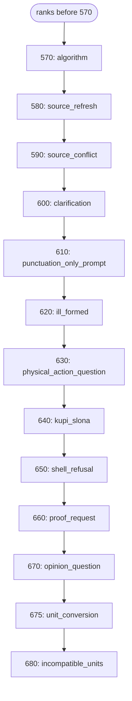

# Formal AI solver handler registry (generated)

<!-- Generated by `node scripts/generate-system-diagrams.mjs --write` (Rust twin: rust/src/agentic_coding/system_diagram.rs) from data/seed/handler-precedence.lino, data/seed/handler-promotions.lino. Do not hand-edit; CI fails when this file drifts from the generator. -->

The universal solver tries its specialized handlers first-match-wins. A promotion rule that fires for a prompt hoists its handler ahead of the precedence; every other handler is tried in ascending rank. Dashed nodes are rows marked `browser_only`, which only the browser worker runs.

## Part 1 — Promotions, in rank order

| Rank | Handler | Why the rule exists |
| --- | --- | --- |
| 10 | `conversation_control` | conversation preferences and action corrections must bind before ordinary task routing |
| 20 | `execution_failure` | an explicit execution failure must be explained before source text is treated as a new task; issue 1173 R3: a request whose program calls a function nothing defines (the undefined_call operand) fails the same way whatever the function is named |
| 30 | `calendar_create_event` | issue 869 and issue 595 — a date signal conjoined with a scheduling act, or an elliptical clock hour that only the calendar handler's entity context can ground |
| 40 | `program_synthesis` | issue 710: a structural coding task is resolved before arithmetic and concepts inside its examples |
| 50 | `web_search` | issue 745: an explicit search act, a news request, or a records request |
| 60 | `arithmetic` | a digit and an arithmetic operator form an executable arithmetic expression |
| 65 | `statistics` | issue 1176: a question naming a statistic over a stated list of values is computed from that list before a search or a measurement lookup reads the statistic as a term to look up |
| 70 | `task_decomposition` | issue 847: questions about task structure rank before a how-to reading of the same verbs |
| 80 | `procedural_how_to` | a seeded procedural request with a concrete action reaches procedure discovery |
| 90 | `proof_request` | an explicit request for proof reaches formal proof handling before opinion routing |
| 100 | `fact_checking` | a claim-check request is evaluated against the current dialogue |
| 110 | `world_state` | a remaining-goal question reads the dialogue world model when that mode is enabled; the cue lexicon holds the multilingual remaining-goal leads so this row cannot drift out of sync with recognition |
| 120 | `installation_conversion` | issue 932: guide-to-script conversion wins over generic script and project readings |
| 130 | `write_script` | a script authoring act paired with a script artifact reaches the minimal script route |
| 140 | `write_program` | a program request is parameterized from seeded task and language meanings |
| 150 | `text_manipulation` | text transformations are selected by their operation, while operands remain data |
| 160 | `software_project` | a software authoring action reaches project planning before a generic concept response |
| 170 | `meta_explanation` | a question about the assistant mechanism is answered from its architecture trace |
| 180 | `verifiable_task` | issues 531 and 1138: every seeded checkable expectation, the pattern expectation the data-gated pattern arm reads included, outranks generic retrieval; slot-backed paraphrases remain data and are interpreted by the shared rule grammar; the verifiable_spec claim still denies a pattern word with no run of atoms or grid, so a definition question falls through to concept_lookup |
| 190 | `concept_lookup` | a definition question opens with the pinned concept_lookup lead cues (data/meta/cue-lexicon.lino), so the cue class routes by prefix instead of an exact-route enumeration that cannot cover the open class |
| 200 | `document_generation_plan` | issue 425 and issue 1138: an authoring verb over a named document artifact is the document-generation recipe to plan. The mirrors are the recognizer in src/solver_handlers/document_request.rs until issue 1085 migrates that handler to rules, and the promotion exists because the capability table reads the output artifact as a workspace path and gaps it before rank 550 runs |

## Part 2 — Precedence, ranks 10 to 165

```mermaid
flowchart TD
    h_conversation_control["10: conversation_control"]
    h_conversation_control --> h_agentic_continuation["20: agentic_continuation"]
    h_agentic_continuation --> h_exact_memory_query["30: exact_memory_query"]
    h_exact_memory_query --> h_memory_program["40: memory_program"]
    h_memory_program --> h_memory_program_gap["50: memory_program_gap"]
    h_memory_program_gap --> h_current_dialogue_fact_checking["60: current_dialogue_fact_checking"]
    h_current_dialogue_fact_checking --> h_link_native_synthesis["70: link_native_synthesis"]
    h_link_native_synthesis --> h_historical["80: historical"]
    h_historical --> h_write_program_coreference["90: write_program_coreference"]
    h_write_program_coreference --> h_program_blueprint_from_prompt["100: program_blueprint_from_prompt"]
    h_program_blueprint_from_prompt --> h_write_program_concrete["110: write_program_concrete"]
    h_write_program_concrete --> h_software_project_request["120: software_project_request"]
    h_software_project_request --> h_legality_warning["125: legality_warning"]
    h_legality_warning --> h_page_query_text["127: page_query_text"]
    h_page_query_text --> h_http_fetch["130: http_fetch"]
    h_http_fetch --> h_url_navigate["140: url_navigate"]
    h_url_navigate --> h_github_repository_traffic["150: github_repository_traffic"]
    h_github_repository_traffic --> h_document_originality_check["160: document_originality_check"]
    h_document_originality_check --> h_repository_lineage["162: repository_lineage"]
    h_repository_lineage --> h_formalization_request["165: formalization_request"]
    h_formalization_request --> after_2(["ranks after 165"])
    classDef browserOnly stroke-dasharray: 5 5
    class h_exact_memory_query,h_memory_program,h_memory_program_gap,h_current_dialogue_fact_checking,h_link_native_synthesis,h_historical,h_write_program_coreference,h_program_blueprint_from_prompt,h_write_program_concrete,h_software_project_request browserOnly
```

| Rank | Handler | Runs on |
| --- | --- | --- |
| 10 | `conversation_control` | native and browser |
| 20 | `agentic_continuation` | native and browser |
| 30 | `exact_memory_query` | browser worker only |
| 40 | `memory_program` | browser worker only |
| 50 | `memory_program_gap` | browser worker only |
| 60 | `current_dialogue_fact_checking` | browser worker only |
| 70 | `link_native_synthesis` | browser worker only |
| 80 | `historical` | browser worker only |
| 90 | `write_program_coreference` | browser worker only |
| 100 | `program_blueprint_from_prompt` | browser worker only |
| 110 | `write_program_concrete` | browser worker only |
| 120 | `software_project_request` | browser worker only |
| 125 | `legality_warning` | native and browser |
| 127 | `page_query_text` | native and browser |
| 130 | `http_fetch` | native and browser |
| 140 | `url_navigate` | native and browser |
| 150 | `github_repository_traffic` | native and browser |
| 160 | `document_originality_check` | native and browser |
| 162 | `repository_lineage` | native and browser |
| 165 | `formalization_request` | native and browser |

## Part 3 — Precedence, ranks 167 to 310

```mermaid
flowchart TD
    before_3(["ranks before 167"])
    before_3 --> h_product_search["167: product_search"]
    h_product_search --> h_requirement_listing["168: requirement_listing"]
    h_requirement_listing --> h_web_search["170: web_search"]
    h_web_search --> h_learn_from_source["180: learn_from_source"]
    h_learn_from_source --> h_research_comparison_table["190: research_comparison_table"]
    h_research_comparison_table --> h_research_result_followup["200: research_result_followup"]
    h_research_result_followup --> h_docs_method_explanation["210: docs_method_explanation"]
    h_docs_method_explanation --> h_procedural_how_to["220: procedural_how_to"]
    h_procedural_how_to --> h_procedural_how_to_followup["230: procedural_how_to_followup"]
    h_procedural_how_to_followup --> h_conversation_memory["240: conversation_memory"]
    h_conversation_memory --> h_software_project_followup["250: software_project_followup"]
    h_software_project_followup --> h_summarization_text["259: summarization_text"]
    h_summarization_text --> h_summarization["260: summarization"]
    h_summarization --> h_verifiable_task["270: verifiable_task"]
    h_verifiable_task --> h_text_manipulation["280: text_manipulation"]
    h_text_manipulation --> h_brainstorm_composition["285: brainstorm_composition"]
    h_brainstorm_composition --> h_brainstorming["290: brainstorming"]
    h_brainstorming --> h_conversation_topic["300: conversation_topic"]
    h_conversation_topic --> h_advice_request["305: advice_request"]
    h_advice_request --> h_fact_lookup["310: fact_lookup"]
    h_fact_lookup --> after_3(["ranks after 310"])
```

| Rank | Handler | Runs on |
| --- | --- | --- |
| 167 | `product_search` | native and browser |
| 168 | `requirement_listing` | native and browser |
| 170 | `web_search` | native and browser |
| 180 | `learn_from_source` | native and browser |
| 190 | `research_comparison_table` | native and browser |
| 200 | `research_result_followup` | native and browser |
| 210 | `docs_method_explanation` | native and browser |
| 220 | `procedural_how_to` | native and browser |
| 230 | `procedural_how_to_followup` | native and browser |
| 240 | `conversation_memory` | native and browser |
| 250 | `software_project_followup` | native and browser |
| 259 | `summarization_text` | native and browser |
| 260 | `summarization` | native and browser |
| 270 | `verifiable_task` | native and browser |
| 280 | `text_manipulation` | native and browser |
| 285 | `brainstorm_composition` | native and browser |
| 290 | `brainstorming` | native and browser |
| 300 | `conversation_topic` | native and browser |
| 305 | `advice_request` | native and browser |
| 310 | `fact_lookup` | native and browser |

## Part 4 — Precedence, ranks 320 to 422

```mermaid
flowchart TD
    before_4(["ranks before 320"])
    before_4 --> h_coreference["320: coreference"]
    h_coreference --> h_roleplay["330: roleplay"]
    h_roleplay --> h_creative_writing["335: creative_writing"]
    h_creative_writing --> h_translation["340: translation"]
    h_translation --> h_text_rewrite["345: text_rewrite"]
    h_text_rewrite --> h_response_language_followup["350: response_language_followup"]
    h_response_language_followup --> h_capabilities["360: capabilities"]
    h_capabilities --> h_planning_request["365: planning_request"]
    h_planning_request --> h_calendar_reasoning["370: calendar_reasoning"]
    h_calendar_reasoning --> h_calendar_create_event["380: calendar_create_event"]
    h_calendar_create_event --> h_compound_interest["390: compound_interest"]
    h_compound_interest --> h_word_problem["396: word_problem"]
    h_word_problem --> h_numeric_list["400: numeric_list"]
    h_numeric_list --> h_shell_command_transform["410: shell_command_transform"]
    h_shell_command_transform --> h_code_debugging["412: code_debugging"]
    h_code_debugging --> h_regex_synthesis["414: regex_synthesis"]
    h_regex_synthesis --> h_sql_synthesis["416: sql_synthesis"]
    h_sql_synthesis --> h_shell_command_compose["418: shell_command_compose"]
    h_shell_command_compose --> h_number_constraint_reasoning["420: number_constraint_reasoning"]
    h_number_constraint_reasoning --> h_code_explanation["422: code_explanation"]
    h_code_explanation --> after_4(["ranks after 422"])
```

| Rank | Handler | Runs on |
| --- | --- | --- |
| 320 | `coreference` | native and browser |
| 330 | `roleplay` | native and browser |
| 335 | `creative_writing` | native and browser |
| 340 | `translation` | native and browser |
| 345 | `text_rewrite` | native and browser |
| 350 | `response_language_followup` | native and browser |
| 360 | `capabilities` | native and browser |
| 365 | `planning_request` | native and browser |
| 370 | `calendar_reasoning` | native and browser |
| 380 | `calendar_create_event` | native and browser |
| 390 | `compound_interest` | native and browser |
| 396 | `word_problem` | native and browser |
| 400 | `numeric_list` | native and browser |
| 410 | `shell_command_transform` | native and browser |
| 412 | `code_debugging` | native and browser |
| 414 | `regex_synthesis` | native and browser |
| 416 | `sql_synthesis` | native and browser |
| 418 | `shell_command_compose` | native and browser |
| 420 | `number_constraint_reasoning` | native and browser |
| 422 | `code_explanation` | native and browser |

## Part 5 — Precedence, ranks 424 to 560

```mermaid
flowchart TD
    before_5(["ranks before 424"])
    before_5 --> h_code_review["424: code_review"]
    h_code_review --> h_test_generation["426: test_generation"]
    h_test_generation --> h_code_refactoring["428: code_refactoring"]
    h_code_refactoring --> h_format_conversion["429: format_conversion"]
    h_format_conversion --> h_program_synthesis["430: program_synthesis"]
    h_program_synthesis --> h_arithmetic["440: arithmetic"]
    h_arithmetic --> h_statistics["445: statistics"]
    h_statistics --> h_javascript_execution["450: javascript_execution"]
    h_javascript_execution --> h_definition_merge["460: definition_merge"]
    h_definition_merge --> h_triz_resolution["465: triz_resolution"]
    h_triz_resolution --> h_concept_lookup["470: concept_lookup"]
    h_concept_lookup --> h_who_is["480: who_is"]
    h_who_is --> h_how_it_works["490: how_it_works"]
    h_how_it_works --> h_meta_explanation["500: meta_explanation"]
    h_meta_explanation --> h_network_query["510: network_query"]
    h_network_query --> h_execution_failure["520: execution_failure"]
    h_execution_failure --> h_installation_conversion["530: installation_conversion"]
    h_installation_conversion --> h_write_script["540: write_script"]
    h_write_script --> h_document_generation_plan["550: document_generation_plan"]
    h_document_generation_plan --> h_software_project["560: software_project"]
    h_software_project --> after_5(["ranks after 560"])
```

| Rank | Handler | Runs on |
| --- | --- | --- |
| 424 | `code_review` | native and browser |
| 426 | `test_generation` | native and browser |
| 428 | `code_refactoring` | native and browser |
| 429 | `format_conversion` | native and browser |
| 430 | `program_synthesis` | native and browser |
| 440 | `arithmetic` | native and browser |
| 445 | `statistics` | native and browser |
| 450 | `javascript_execution` | native and browser |
| 460 | `definition_merge` | native and browser |
| 465 | `triz_resolution` | native and browser |
| 470 | `concept_lookup` | native and browser |
| 480 | `who_is` | native and browser |
| 490 | `how_it_works` | native and browser |
| 500 | `meta_explanation` | native and browser |
| 510 | `network_query` | native and browser |
| 520 | `execution_failure` | native and browser |
| 530 | `installation_conversion` | native and browser |
| 540 | `write_script` | native and browser |
| 550 | `document_generation_plan` | native and browser |
| 560 | `software_project` | native and browser |

## Part 6 — Precedence, ranks 570 to 680

| Rank | Handler | Runs on |
| --- | --- | --- |
| 570 | `algorithm` | native and browser |
| 580 | `source_refresh` | native and browser |
| 590 | `source_conflict` | native and browser |
| 600 | `clarification` | native and browser |
| 610 | `punctuation_only_prompt` | native and browser |
| 620 | `ill_formed` | native and browser |
| 630 | `physical_action_question` | native and browser |
| 640 | `kupi_slona` | native and browser |
| 650 | `shell_refusal` | native and browser |
| 660 | `proof_request` | native and browser |
| 670 | `opinion_question` | native and browser |
| 675 | `unit_conversion` | native and browser |
| 680 | `incompatible_units` | native and browser |
