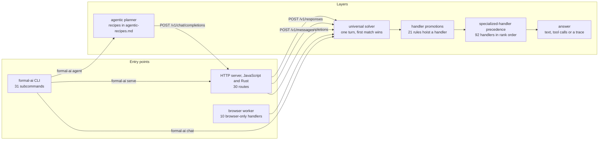

# Formal AI system overview (generated)

<!-- Generated by `node scripts/generate-system-diagrams.mjs --write` (Rust twin: rust/src/agentic_coding/system_diagram.rs) from data/seed/handler-precedence.lino, data/seed/handler-promotions.lino, rust/src/main.rs, data/meta/server-routes.lino. Do not hand-edit; CI fails when this file drifts from the generator. -->

A high-level view of where a request enters Formal AI and which layers it crosses, generated from the live sources each part names. The per-entry-point views:
- [Formal AI solver handler registry (generated)](solver-handlers.md)
- [Formal AI CLI subcommands (generated)](cli-subcommands.md)
- [Formal AI HTTP routes (generated)](http-routes.md)
- [Agent CLI recipes](agentic-recipes.md), generated by the Agent CLI itself

## Part 1 — Entry points to layers

